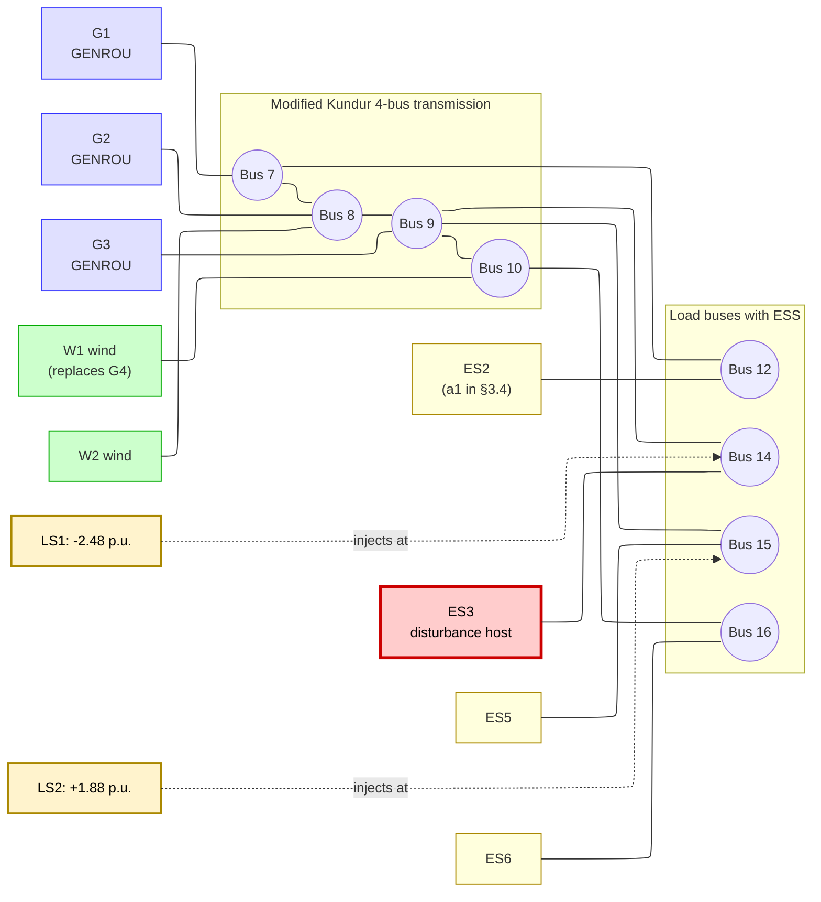

# Figure A — Modified Kundur 4-bus topology with 4 ESS and LS1/LS2 disturbance buses

Single-line diagram of the Stage 2 modified Kundur four-bus system. Three GENROU synchronous generators (G1@B7, G2@B8, G3@B9) and one wind unit replacing G4 (W1@B10), plus auxiliary wind W2@B8. Four ESS attached to load buses 12, 14, 15, 16. Disturbance scenarios LS1 (Bus 14, −2.48 p.u.) and LS2 (Bus 15, +1.88 p.u.) injected at their respective host buses. ES3@Bus 14 highlighted in red as the disturbance-host agent referenced in §3.9 failure clustering.

