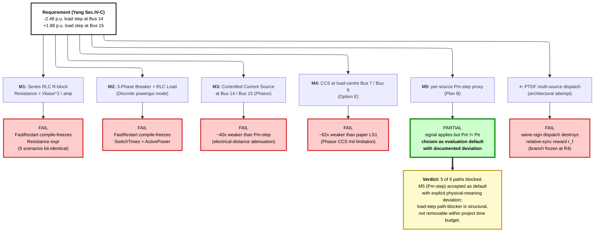

# Figure F — Six resolution paths for the Simulink Kundur load-step path-blocker

Six technical paths attempted on the Simulink Kundur backend to reproduce Yang Sec. IV-C's literal load-step disturbance specification (LS1 −2.48 p.u. at Bus 14, LS2 +1.88 p.u. at Bus 15). Five failed for individually-traceable reasons; only M5 (per-source Pm-step proxy, Plan B) survived as the project's evaluation default, accepted with an explicit physical-meaning deviation (Pm ≠ Pe). The PTDF dispatch attempt was an additional architectural attempt that also failed structurally because same-sign Pm dispatch destroys Yang's relative-synchronisation reward formula. This is the project's deepest engineering finding on the Simulink leg (§2.1.7).

