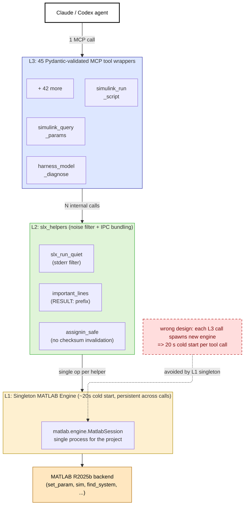

# Figure D — MCP Simulink Toolkit three-layer architecture (Asset 1)

The bespoke MCP toolkit is structured as three layers above a single persistent MATLAB engine. L3 exposes 45 Pydantic-validated tools; L2 provides noise filtering and IPC bundling helpers; L1 is a singleton MATLAB engine session that persists across all tool calls (~20s cold start, then reused). The dashed red anti-pattern node shows the design alternative explicitly avoided: spawning a new engine per L3 call would incur the 20s cold start on every tool invocation.

