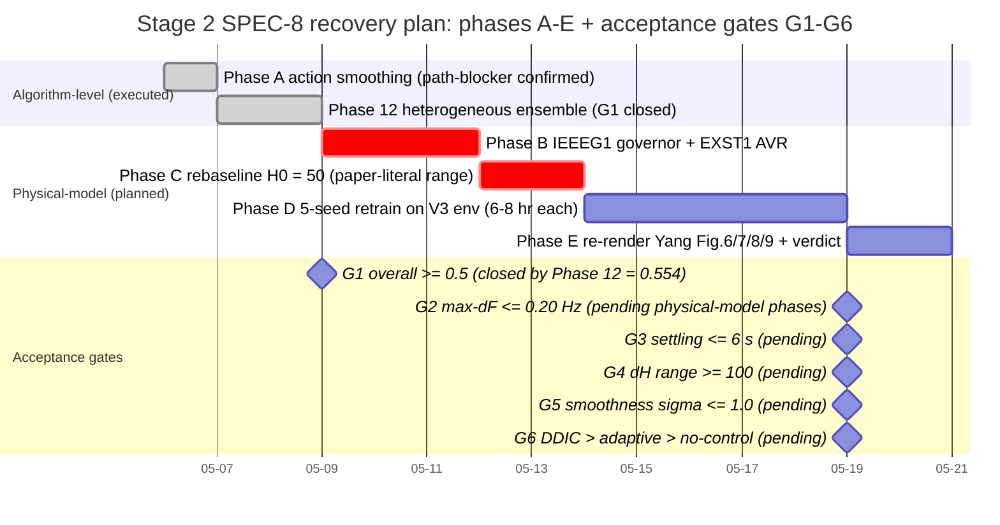

# Figure K — Stage 2 SPEC-8 recovery plan with acceptance gates G1–G6

Phase-level Gantt of the four-phase physical-model recovery plan (B–E), preceded by the algorithm-level interventions actually executed within the project's time budget (Phase A: action smoothing, confirmed as a path-blocker; Phase 12: heterogeneous-actor ensemble, which closed the overall G1 gate at 0.554). Acceptance gates G1–G6 are pre-registered (Section 4.4); G1 is shown closed, G2–G6 pending the planned physical-model interventions.

