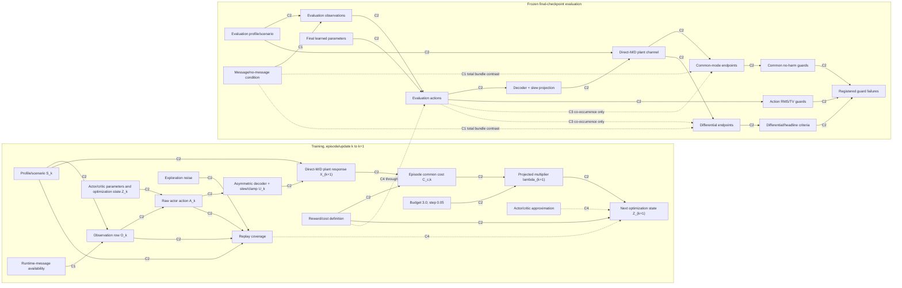

# R402 MARL Canary Failure: Independent Causal Audit

## 1. Executive verdict

**[REGISTERED-EMPIRICAL]** R402 的可辩护结论是一个边界明确的失败：九个训练运行完成冻结预算，全部 36 个学习 arm–seed–profile block 同时违反 common-mode no-harm 与 action-stress guard families；三个学习臂的两项种子中位数端点均在数值上大幅劣于确定性参考，消息臂在本 bundle 中没有正的中位数增量。正确评估口径是 **40 个文件、240 条轨迹（216 学习＋24 确定性）**。

**[PROVED-MATHEMATICALLY]** 最强的已建立诊断不是某个单一故障原因，而是训练目标与物理判据不完全一致：CD 目标没有显式动作 effort/RMS/TV/slew 惩罚，训练 costs 也不等于注册端点和全部 guards。保留尾部的 $\lambda$ 数值很小并触及零，但这不能推出 common term 在整个训练中被“删除”，更不能推出其 actor-gradient 贡献可忽略。

**[PLAUSIBLE-NOT-IDENTIFIED]** 动作正则缺失、优化不足、信息/credit assignment、decoder geometry、direct-M/D 的有限可学习增量 authority、强比较器与分布迁移均仍可解释结果；现有记录不能对它们作因果排序。

**[CONTRADICTED]** “direct M/D 无物理 authority”被 R399 确定性结果否定。**[UNAVAILABLE]** 能源端口成功不能证明 action-basis mismatch 导致 R402。论文应报告对 decoupling-oriented MARL objective 的失败审计，而非成功 MARL decoupling、一般不可能性或已识别的单一原因。

> 标签约定：由冻结方程、代码契约或确定性算术直接推出的事实归入 `PROVED-MATHEMATICALLY`；这不把代码事实提升为新的实验结果。

## 2. Data and provenance corrections

| Issue                                                      | Correct value                                                                                                                                                                                                          | Consequence                                                                                                                                                                                                 | Required repair                                                                                                                                    |
|:-----------------------------------------------------------|:-----------------------------------------------------------------------------------------------------------------------------------------------------------------------------------------------------------------------|:------------------------------------------------------------------------------------------------------------------------------------------------------------------------------------------------------------|:---------------------------------------------------------------------------------------------------------------------------------------------------|
| “264 evaluation records”                                   | `PROVED-MATHEMATICALLY` 40 JSON files and 240 trajectories: 216 learning + 24 deterministic.                                                                                                                           | `CONTRADICTED` The value 264 and the expansion “240 learning + 24 deterministic” are arithmetically wrong. Endpoints and CANARY-FAIL do not change.                                                         | Replace every 264 with 240; write “trajectory” rather than ambiguous “record”; preserve 40 as the file count.                                      |
| Learning-trajectory subtotal                               | `PROVED-MATHEMATICALLY` 3 arms × 3 seeds × 4 profiles × 6 trajectories = 216.                                                                                                                                          | `CONTRADICTED` 240 is not the learning subtotal.                                                                                                                                                            | Correct report, claim card, captions, and any derived metadata.                                                                                    |
| Unit called “evaluation record”                            | `PROVED-MATHEMATICALLY` One file contains six trajectories; one arm–seed–profile block is one file and six trajectories.                                                                                               | `PLAUSIBLE-NOT-IDENTIFIED` Ambiguity can propagate false sample sizes and independence claims.                                                                                                              | Use the hierarchy file → trajectory → time step → actor/action component explicitly.                                                               |
| `formal_manifest.json` count versus narrative report       | `PROVED-MATHEMATICALLY` The stated design and formal-manifest value agree at 240.                                                                                                                                      | `POST-HOC-DIAGNOSTIC` This is a reporting-QA defect, not an observed policy-failure mechanism.                                                                                                              | Make the manifest the canonical count source and regenerate narrative tables from it.                                                              |
| Missing `formal_execution.json`                            | `UNAVAILABLE` The execution-layer provenance object is absent.                                                                                                                                                         | `UNAVAILABLE` Invocation, environment, commit, command line, timing, and complete chain-of-custody cannot be independently reconstructed from the supplied package. No causal link to performance is shown. | Restore it if it exists; otherwise add an immutable provenance exception/sidecar listing the missing fields and why.                               |
| `formal_analysis.json#/round = R401` inside an R402 object | `PROVED-MATHEMATICALLY` The canonical round should be R402 if the file belongs to this experiment.                                                                                                                     | `PLAUSIBLE-NOT-IDENTIFIED` It may be a stale field or a wrong-round lineage error; the package does not establish artifact mixing. It lowers reporting confidence until reconciled.                         | Cross-check paths, hashes, timestamps, run IDs, and manifest references; issue an erratum/sidecar rather than silently altering a hashed artifact. |
| Source hashes                                              | `UNAVAILABLE` With only the Markdown package supplied, hashes are provenance metadata, not independently verified content.                                                                                             | `UNAVAILABLE` This audit verifies internal arithmetic, not repository integrity.                                                                                                                            | Supply the named artifacts and run a hash/manifest verification script before submission archival.                                                 |
| Snapshot serialization order                               | `PROVED-MATHEMATICALLY` Numeric order is 240, 480, 720, 960, 1200, 1440; lexicographic order is not chronological. The final checkpoint label 43,200 is an interaction-step count.                                     | `CONTRADICTED` The current serialized list cannot be interpreted as a learning trajectory in its stored order; final values remain readable.                                                                | Parse the numeric episode token, sort numerically, and store a separate `unit` field.                                                              |
| `convergence_diagnostics_valid=true`                       | `PROVED-MATHEMATICALLY` It certifies completion without a nonfinite-loss invalid reason, not optimization convergence.                                                                                                 | `CONTRADICTED` It cannot support “converged” or “failed to converge.”                                                                                                                                       | Rename/descriptively document the flag as execution-validity only.                                                                                 |
| Post-hoc differential-cost wording                         | `PROVED-MATHEMATICALLY` The reconstruction sets power to zero and omits the training term involving $T_dP_{es}$.                                                                                                       | `CONTRADICTED` It is not the complete CD differential objective.                                                                                                                                            | Use “frequency-only differential-cost reconstruction”; log $P_{es}$ prospectively.                                                                 |
| Saturation terminology                                     | `PROVED-MATHEMATICALLY` Registered physical-saturation ratio and post-hoc $\lvert a\rvert>0.999$ component count are different diagnostics.                                                                                       | `CONTRADICTED` Zero registered physical saturation does not imply no normalized actor components were near ±1.                                                                                              | Keep separate names, denominators, and guard status.                                                                                               |
| Independence/sample-size interpretation                    | `PROVED-MATHEMATICALLY` Endpoint medians have three seed-level values per arm; 36 blocks are nested in nine trained policies; 5,760 action components are dependent samples; 120 tail episodes are nested in six runs. | `CONTRADICTED` None of these lower-level counts is a population sample of independent trained policies.                                                                                                     | Report the hierarchical unit for every statistic and retain the bounded-descriptive interpretation.                                                |

### Arithmetic and consistency audit

| Item                                 | Status                  | Recomputation/check                                                                                             | Verdict                                                                                                                                       |
|:-------------------------------------|:------------------------|:----------------------------------------------------------------------------------------------------------------|:----------------------------------------------------------------------------------------------------------------------------------------------|
| Record count                         | `PROVED-MATHEMATICALLY` | 3×3×4×6 + 1×4×6 = 216 + 24 = **240 trajectories**; 36+4 = **40 files**.                                         | 264 is wrong.                                                                                                                                 |
| Training budget                      | `PROVED-MATHEMATICALLY` | 1,440×30 = 43,200 steps/run; 9×43,200 = **388,800**; 9×1,440 = **12,960 episodes**.                             | Consistent.                                                                                                                                   |
| Seed-median endpoint ratios          | `PROVED-MATHEMATICALLY` | Scalar 4.1153037/2.9154826; no-message 4.1620768/3.1262598; message 5.0916958/3.2992279.                        | All reported rounded ratios are correct.                                                                                                      |
| Message median increments            | `PROVED-MATHEMATICALLY` | Versus no-message: −22.3355% cross, −5.5327% differential. Versus scalar: −23.7259%, −13.1623%.                 | Reported −22.3/−5.5/−23.7/−13.2% are correct.                                                                                                 |
| Seedwise message/no-message signs    | `REGISTERED-EMPIRICAL`  | 401: −11.81/−27.66%; 402: −29.90/−15.26%; 403: +31.17/+24.21% (cross/differential).                             | The negative median increment is not uniform across seeds.                                                                                    |
| Displayed worst guard ratios         | `PROVED-MATHEMATICALLY` | Every one of the nine rows exceeds all five displayed ceilings; minimums are 1.145, 1.612, 1.461, 1.327, 2.060. | Consistent with per-run worst failures; the stronger all-36-block statement remains registered evidence, not derivable from worst rows alone. |
| Action-component sample count        | `PROVED-MATHEMATICALLY` | 4 profiles×6 trajectories×30 steps×4 actors×2 components = **5,760 per arm–seed**.                              | Correct; these are dependent samples.                                                                                                         |
| Action diagnostic values             | `UNAVAILABLE`           | Raw trajectories are not supplied here, so means/fractions cannot be independently regenerated.                 | Their arithmetic comparison with the deterministic values is reproducible from the table only.                                                |
| Frequency-cost reconstruction        | `PROVED-MATHEMATICALLY` | Every learning row exceeds the deterministic row in both reported reconstructed columns.                        | Qualitative statement is consistent; the differential column remains frequency-only.                                                          |
| Multiplier aggregate median 2.023668 | `UNAVAILABLE`           | The overall min/max are compatible with per-run extrema, but the 120 raw values are absent.                     | The aggregate median cannot be independently recomputed from six per-run min/median/max summaries.                                            |
| R399 reductions and oracle 0%        | `UNAVAILABLE`           | No raw R399 endpoint table is supplied in this package.                                                         | Treat 60.79%, 64.13%, and 0% as source-reported registered evidence.                                                                          |
| R408/R409 ratios                     | `PROVED-MATHEMATICALLY` | R408 implies 6.1053% differential and 46.0209% cross improvement; R409 implies 6.1782% and 20.6270%.            | Ratios are below one and consistent with positive improvement, but remain a separate object.                                                  |

**[POST-HOC-DIAGNOSTIC]** 计数冲突、R401 round 字段、缺失 `formal_execution.json` 和 snapshot 排序缺陷共同降低报告与 provenance 的可信度，足以要求投稿前修复。**[UNAVAILABLE]** 除非进一步证明它们导致错误 checkpoint、错误评估文件或错误结果混入，否则不能把这些缺陷当成策略失败机制。

**[PROVED-MATHEMATICALLY]** 统计单位必须保持分层：端点 arm-level 中位数的复制单位是 3 个 seeds；36 个 block 是 9 个训练策略在 4 个固定 profiles 上的重复条件；每 arm–seed 的 5,760 个 action-component samples 具有时间、actor 和 trajectory 依赖；final-20 的 120 个 episode samples 嵌套在 6 个 CD runs 中。任何把这些低层样本当作独立训练复制的推断都无效。

## 3. Causal DAG

边分类：`C1` = controlled intervention identified；`C2` = mechanically implied by code/equations；`C3` = association only；`C4` = plausible but not identified；`C5` = contradicted. 训练反馈环按 $k\rightarrow k+1$ 展开，因此下图是无环的动态 DAG。

### Directed-edge classification

| From                                                 | To                                             | Class   | Basis                                                                                                      |
|:-----------------------------------------------------|:-----------------------------------------------|:--------|:-----------------------------------------------------------------------------------------------------------|
| Profile/scenario $S_k$                               | observation values $O_k$                       | C2      | Operating point and disturbance determine measured local/neighbor signals.                                 |
| Runtime-message intervention $M$                     | message slots in $O_k$                         | C1      | Message/no-message is the closest matched controlled change.                                               |
| $O_k$                                                | raw actor action $A_k$                         | C2      | The actor consumes the seven-slot row.                                                                     |
| Actor/critic parameters and optimization state $Z_k$ | $A_k$                                          | C2      | Network parameters mechanically determine deterministic evaluation actions.                                |
| $A_k$                                                | decoder/slew/clamp output $U_k$                | C2      | Frozen asymmetric decoding and componentwise slew projection.                                              |
| $U_k$                                                | direct-M/D plant channel $X_{k+1}$             | C2      | Decoded M/D parameters enter the simulator.                                                                |
| $S_k$                                                | $X_{k+1}$                                      | C2      | Plant response depends on profile and disturbance.                                                         |
| $X_{k+1}$                                            | episode common cost $C_{c,k}$                  | C2      | Frequency/RoCoF enter the stated cost definition.                                                          |
| Reward/cost definition                               | $C_{c,k}$ and critic targets                   | C2      | The equations define training labels/objectives.                                                           |
| $C_{c,k}$                                            | $\lambda_{k+1}$                                | C2      | Projected update uses the episode common cost.                                                             |
| Budget 3.0 and step 0.05                             | $\lambda_{k+1}$                                | C2      | Both constants enter the update algebraically.                                                             |
| $\lambda_{k+1}$                                      | next actor update/optimization state $Z_{k+1}$ | C2      | The multiplier weights $Q_c$ in the actor objective.                                                       |
| Actor/critic approximation                           | optimization adequacy                          | C4      | Function class can matter, but its contribution is not isolated.                                           |
| Replay coverage                                      | optimization adequacy                          | C4      | Coverage insufficiency is plausible; no coverage diagnostic is stored.                                     |
| Exploration noise                                    | replay coverage                                | C2      | Noise changes sampled actions and hence replay support.                                                    |
| Exploration noise                                    | optimization adequacy                          | C4      | Its net benefit/harm is not identified.                                                                    |
| Training profile schedule                            | replay coverage                                | C2      | Only four development profiles generate training experience.                                               |
| Final $Z$                                            | evaluation action sequence                     | C2      | Final-checkpoint deterministic evaluation.                                                                 |
| Evaluation scenario                                  | common and differential endpoints              | C2      | Endpoint values are responses to fixed disturbances/operating points.                                      |
| Evaluation actions through direct M/D                | common and differential endpoints              | C2      | Closed-loop plant mechanics.                                                                               |
| Evaluation action magnitude/TV                       | action-stress guard result                     | C2      | Guard ratios are deterministic functions of stored actions and reference.                                  |
| Common/differential endpoints                        | physical guard/classification result           | C2      | Threshold logic is frozen and reward-independent.                                                          |
| Message availability                                 | endpoint total effect in this frozen bundle    | C1      | Matched arm contrast; observed median increment is non-positive, but n=3 and seed signs are heterogeneous. |
| Large actions/slew use                               | endpoint degradation                           | C3      | They co-occur in arm–seed aggregates; no intervention or valid mediation analysis isolates the arrow.      |
| Missing action-effort term                           | large actions/slew use                         | C4      | Objective omission makes the pattern plausible, but no penalty ablation identifies the realized effect.    |
| Small retained-tail $\lambda$                        | negligible common actor gradient               | C4      | Requires unavailable $Q$ action gradients and actor Jacobians.                                             |
| Direct-M/D channel                                   | zero physical authority                        | C5      | Contradicted by the strong deterministic direct-M/D result.                                                |
| Energy-port success                                  | R402 failure caused by action-basis mismatch   | C4      | Objects are unmatched in actuator, estimator, bank, window, and reference.                                 |

**[REGISTERED-EMPIRICAL]** 唯一最接近直接因果识别的算法对比是 message versus no-message 的 frozen-bundle total effect；它识别的是“在此架构、训练过程、profiles、seeds 和执行契约下启用邻居 slots 的增量”，不是“消息本身的普遍价值”。

**[CONTRADICTED]** 不应在 DAG 中加入“direct-M/D channel → zero authority”或“small tail $\lambda$ → common objective absent throughout training”作为成立边。前者被确定性结果否定，后者既与正的 final $\lambda$ 不符，也超出了 final-20 保存窗口。

## 4. Failure-mechanism classification

| Mechanism                                          | Evidence                                                                                                                                                                                           | Epistemic status                                                                                                                            | Alternative explanation                                                                                                                                                              | Manuscript-safe claim                                                                                                                                        |
|:---------------------------------------------------|:---------------------------------------------------------------------------------------------------------------------------------------------------------------------------------------------------|:--------------------------------------------------------------------------------------------------------------------------------------------|:-------------------------------------------------------------------------------------------------------------------------------------------------------------------------------------|:-------------------------------------------------------------------------------------------------------------------------------------------------------------|
| 1. Multiplier/budget calibration                   | Update is mechanically fixed; all final-20 traces lie between 0 and 0.2193, touch zero, and finish at 0.0043–0.1406; every per-run tail median $C_c<3$.                                            | `POST-HOC-DIAGNOSTIC` for a weak/intermittently zero tail weight; `PLAUSIBLE-NOT-IDENTIFIED` as a cause of endpoint failure.                | $Q_c$ or its action gradient may be much larger than $Q_d$; earlier training may have had material common weighting.                                                                 | The retained tail shows a numerically small projected multiplier, but the fraction of actor updates with negligible common-gradient contribution is unknown. |
| 2. Missing action-effort regularization            | No explicit magnitude, RMS, TV, or slew-use term in either CD channel; CD actions and slew-limit use exceed the deterministic reference.                                                           | `PROVED-MATHEMATICALLY` for the omission; `POST-HOC-DIAGNOSTIC` for action stress; `PLAUSIBLE-NOT-IDENTIFIED` for causation.                | Large actions may result from critic error, exploration/coverage, decoder geometry, or limited headroom; scalar TD3 also fails despite a different reward with action-related terms. | The action-stress pattern is consistent with an unpenalized-effort objective, but no causal effect on either physical endpoint is isolated.                  |
| 3. Objective/endpoint mismatch                     | Training costs differ from the signed off-diagonal and localized finite-window endpoints, and the CD objective does not encode all registered guard ceilings.                                      | `PROVED-MATHEMATICALLY` as a design mismatch; `PLAUSIBLE-NOT-IDENTIFIED` as the realized failure cause.                                     | A well-optimized surrogate can still correlate with the registered endpoints; failure could instead be optimization or authority-limited.                                            | The learned policy was optimized for a surrogate objective rather than the full physical decision contract.                                                  |
| 4. Optimization insufficiency                      | Only frozen budget completion and absence of nonfinite losses are known; losses, Bellman residuals, Q calibration, gradients, coverage, and full curves are missing.                               | `PLAUSIBLE-NOT-IDENTIFIED`.                                                                                                                 | The optimizer may have adequately minimized a misaligned objective, or the action channel/information pattern may limit attainable performance.                                      | Optimization adequacy cannot be determined from the retained diagnostics.                                                                                    |
| 5. Partial observability/information insufficiency | Each actor is memoryless and receives seven local/neighbor slots; no observability, state-reconstruction, or history-sufficiency test exists.                                                      | `PLAUSIBLE-NOT-IDENTIFIED`.                                                                                                                 | The slots may be sufficient, while approximation/optimization fails to exploit them.                                                                                                 | The experiment does not establish whether the actor observations are sufficient for the target response.                                                     |
| 6. Runtime-message value failure                   | Matched median message increments are −22.3% cross and −5.5% differential; seed 403 is positive on both metrics, while seeds 401/402 are negative. Cross-policy action correlations are near zero. | `REGISTERED-EMPIRICAL` for no positive median increment in this bundle; `PLAUSIBLE-NOT-IDENTIFIED` for redundancy or intrinsic uselessness. | Messages may be informative but poorly learned, normalized, explored, or used; separately trained policies can differ for many reasons.                                              | Enabling the registered neighbor slots produced no positive three-seed median increment under the frozen bundle.                                             |
| 7. Credit assignment/centralized-critic mismatch   | Four independently executed actors share a joint critic with global cost channels; no agent-wise advantage, gradient, or attribution logs exist.                                                   | `PLAUSIBLE-NOT-IDENTIFIED`.                                                                                                                 | Centralized training may be adequate; objective mismatch or plant authority can explain the same outcomes.                                                                           | The present logs cannot assess whether centralized-critic credit assignment limited learning.                                                                |
| 8. Action-decoder geometry                         | Piecewise slopes 200/600, nondifferentiability at zero, slew projection, and lower clamps alter the normalized-to-physical map; registered physical saturation is zero.                            | `PROVED-MATHEMATICALLY` for geometry; `PLAUSIBLE-NOT-IDENTIFIED` for its causal role.                                                       | The deterministic controller succeeds through the same broad direct-M/D object; lower clamps may not have activated.                                                                 | Decoder and slew geometry may condition learnability and reachability, but no matched decoder intervention isolates this effect.                             |
| 9. Direct-M/D physical authority                   | R399 deterministic direct-M/D reduces the two endpoints by 60.79% and 64.13% versus zero action and passes guards; finite-family oracle finds no additional improvement.                           | `CONTRADICTED` for “no authority”; `PLAUSIBLE-NOT-IDENTIFIED` for limited learnable incremental headroom.                                   | Arbitrary state-dependent direct-M/D trajectories may retain headroom beyond the nine-law family.                                                                                    | Direct M/D has nonzero finite-amplitude authority, while its local conditioning and residual headroom remain unquantified.                                   |
| 10. Strong-comparator headroom                     | The comparator is strong within a nine-law deterministic family and is oracle-selected on four R399 evaluation profiles.                                                                           | `REGISTERED-EMPIRICAL` within that finite family.                                                                                           | Global or trajectory-level direct-M/D optima may outperform it.                                                                                                                      | R402 compares against a strong finite-family reference, not a proven global optimum.                                                                         |
| 11. Distribution shift                             | Training uses four development profiles and final evaluation uses four disjoint profiles; no matched within-profile learning/evaluation decomposition is supplied.                                 | `PROVED-MATHEMATICALLY` for the split; `PLAUSIBLE-NOT-IDENTIFIED` for its contribution.                                                     | Policies may already be poor on development profiles, so held-out shift may be secondary.                                                                                            | Held-out-profile generalization is part of the frozen test, but its separate contribution is not identified.                                                 |
| 12. Action-basis alignment                         | The separate energy-port object passes R408/R409 with ratios below one, but differs in actuator, estimator, window, bank, and reference.                                                           | `REGISTERED-EMPIRICAL` for feasibility of that separate object; `PLAUSIBLE-NOT-IDENTIFIED` for causing R402.                                | Controller structure, estimator, feasible headroom, or comparator differences—not action basis alone—may explain success.                                                            | The energy-port result motivates, but does not identify, an action-basis hypothesis.                                                                         |
| 13. Implementation/accounting defects              | 240/264 conflict, missing execution provenance, stale R401 round field, and snapshot ordering defect.                                                                                              | `POST-HOC-DIAGNOSTIC` as reporting/provenance defects; `UNAVAILABLE` as policy-failure causes.                                              | The numerical endpoints may still be correct and tied to the intended runs.                                                                                                          | These defects reduce reporting confidence and must be repaired, but no causal link to controller performance is demonstrated.                                |

### Inference to the best explanation

| Explanation                                                                     | Scope       | Parsimony   | Fit to observations                                              | Discriminating prediction                                                                                                                           | Verdict                                                                                     |
|:--------------------------------------------------------------------------------|:------------|:------------|:-----------------------------------------------------------------|:----------------------------------------------------------------------------------------------------------------------------------------------------|:--------------------------------------------------------------------------------------------|
| Objective–physical-contract mismatch                                            | High        | High        | High                                                             | If causal, aligning effort/guards or surrogate endpoints should reduce stress and improve gate compliance; endpoint gains are not guaranteed.       | `PROVED-MATHEMATICALLY` as a design fact; causal effect remains `PLAUSIBLE-NOT-IDENTIFIED`. |
| Optimization/critic/replay insufficiency                                        | High        | Medium      | Compatible but untested                                          | Would predict nonstationary checkpoint behavior, Q miscalibration, large twin gaps, weak coverage, or non-negligible gradients at budget end.       | `PLAUSIBLE-NOT-IDENTIFIED`; strongest alternative because it can explain all learned arms.  |
| Limited/ill-conditioned direct-M/D incremental authority plus strong comparator | Medium–high | Medium      | Compatible with deterministic success and MARL underperformance  | Would predict small/ill-conditioned projected finite-horizon singular values and little constrained optimal-control headroom beyond the comparator. | `PLAUSIBLE-NOT-IDENTIFIED`; second strongest alternative.                                   |
| Observation/message/credit-assignment insufficiency                             | Medium      | Low–medium  | Compatible; message median is non-positive but seed signs differ | Would predict measurable policy sensitivity/information value under controlled message interventions or improved state reconstruction with history. | `PLAUSIBLE-NOT-IDENTIFIED`; no direct diagnostic.                                           |

**[PLAUSIBLE-NOT-IDENTIFIED]** 当前最简且覆盖面最大的解释是一个**复合设计诊断**：surrogate objective、common weighting 和注册 physical gate 未完全对齐，因此一个被优化的策略并不必然满足 action stress、common no-harm 和两项 headline endpoints。它能统一解释“为什么 reward-side progress 即使存在也不能救回 canary”，也与高动作 stress 相容；但没有 matched objective intervention，不能称其为观察到的失败原因。

**[PLAUSIBLE-NOT-IDENTIFIED]** 必须保留的第一强替代解释是 optimization/critic/replay insufficiency。它可以同时解释三个学习臂较差、消息使用不稳定和动作异常，但当前没有任何 Q calibration、Bellman residual、gradient 或 coverage 证据。

**[PLAUSIBLE-NOT-IDENTIFIED]** 必须保留的第二强替代解释是 direct-M/D 在该 decoder、slew、6-s window 和强比较器附近具有有限或病态的**可学习增量 authority**。R399 排除了零 authority，却没有给出局部 conditioning、约束可达集或任意轨迹 headroom。

**[REGISTERED-EMPIRICAL]** scalar TD3 使用不同且含 action-related terms 的 reward 仍失败，是反对“CD 动作 effort omission 单独解释整个 R402”的重要 counter-evidence；它不排除该 omission 对两个 CD arms 的 action stress 有贡献，因为奖励定义和尺度并不匹配。

## 5. Multiplier analysis

更新为

\[
\lambda_{k+1}=\Pi_{[0,10]}\left(\lambda_k+0.05(C_{c,k}-3)\right).
\]

### Exactly inferable from the retained tail

**[POST-HOC-DIAGNOSTIC]** 六个 CD runs 的 final-20 $\lambda$ 全部处于 $[0,0.2193]$，每条 trace 至少触及一次零，final values 为 0.0043–0.1406，均远小于初值 1.0。每个 run 的 final-20 $C_c$ median 都低于 3.0，因此在通常的 20 点 median 定义下，每个 run 至少有 10 个 tail costs 低于 budget；六个 runs 合计至少 60 个此类 tail samples。

**[PROVED-MATHEMATICALLY]** 在给定 tail extrema 下，未投影单步变化范围至少覆盖

\[
0.05(0.023645-3)=-0.14881775,
\qquad
0.05(6.380282-3)=+0.16901410.
\]

相对于观察到的尾部 $\lambda$，单个低-cost 或高-cost episode 足以产生很大的相对变化；下界投影使 final $\lambda$ 不能反推出累计 violation 或完整历史。

**[UNAVAILABLE]** 不能从 final-20 摘要推断：早期 1,420 episodes 的 $\lambda$；$\lambda=0$ 的 tail 占比；cost 与 multiplier 的精确前/后更新对齐；actor delay 下每次 actor update 实际使用的 $\lambda$；任何完整训练阶段的 time-at-zero。

### Is “the common constraint was deleted” justified?

**[CONTRADICTED]** 作为“整个 1,440 episodes 中 common objective 被删除”的陈述是错误的。final $\lambda$ 均为正，保留 tail 中也存在正值；只在某次 actor update 的 $\lambda=0$ 时，$\lambda Q_c$ 对该次 actor objective 的显式项才为零。即便如此，common critic 仍可能继续训练，不能说 common channel 从算法中被删除。

**[POST-HOC-DIAGNOSTIC]** 最强安全措辞是：*the projected multiplier reached zero and otherwise remained numerically small in the retained tail; actor-update-level common-gradient exposure was not logged.* 这只描述 tail multiplier，不声称某次 actor update 确实使用零权重，也不描述实际 gradient importance。

### Small multiplier versus small common contribution

令 actor 的 action-space 更新方向分解为

\[
g_a=\nabla_a Q_d+\lambda\nabla_a Q_c.
\]

对给定 tolerance $\varepsilon$，一个 action-space 充分条件是

\[
\lambda\|\nabla_a Q_c\|_2
\le
\varepsilon\|\nabla_a Q_d\|_2.
\]

定义

\[
r_a=\frac{\lambda\|\nabla_aQ_c\|_2}
{\|\nabla_aQ_d\|_2+\delta},
\]

则 $r_a\le\varepsilon$ 只说明 common term 在 action-gradient norm 上至多为 differential term 的 $\varepsilon$ 倍。**[PROVED-MATHEMATICALLY]** 小 $\lambda$ 单独不充分：若 $\|\nabla_aQ_c\|/\|\nabla_aQ_d\|$ 很大，common term 仍可主导。

对参数梯度，$J_\pi=\partial a/\partial\theta$，

\[
g_d^\theta=J_\pi^T\nabla_aQ_d,
\qquad
g_c^\theta=\lambda J_\pi^T\nabla_aQ_c.
\]

直接充分条件是

\[
\|g_c^\theta\|_2\le\varepsilon\|g_d^\theta\|_2.
\]

若 $J_\pi^T$ 在相关 action subspace 上满列秩，则更保守的 norm 条件为

\[
\lambda\,\kappa_2(J_\pi^T)
\frac{\|\nabla_aQ_c\|_2}{\|\nabla_aQ_d\|_2}
\le\varepsilon.
\]

**[UNAVAILABLE]** 当前没有 $Q$ action gradients、actor Jacobians、二者夹角或 actor-update-aligned $\lambda$，因此不能计算上述比值。即便 norm ratio 很小，若 $g_d^\theta$ 接近零或两项方向接近抵消，更新方向仍可能敏感。

### Minimum logs needed to bound negligible-update fraction

| Needed quantity                   | Exact log                                                                                               | What it would identify                                                    |
|:----------------------------------|:--------------------------------------------------------------------------------------------------------|:--------------------------------------------------------------------------|
| Chronological multiplier exposure | Every actor-update timestamp, the exact $\lambda$ used, episode/update alignment, and projection state. | Fraction of updates with $\lambda=0$ or below a numerical threshold.      |
| Action-space critic influence     | $\nabla_aQ_d$, $\nabla_aQ_c$, their norms and cosine on the actual actor minibatch.                     | Whether $\lambda\nabla_aQ_c$ was small, dominant, aligned, or cancelling. |
| Parameter-space influence         | Actor Jacobian $J_\pi$ or directly logged $J_\pi^T\nabla_aQ_d$ and $J_\pi^T\nabla_aQ_c$.                | Actual parameter-gradient contribution, not just critic-output scale.     |
| Critic scale/quality              | $Q_d,Q_c$, targets, normalization, held-out Bellman residuals and calibration.                          | Whether a small multiplier multiplied a large or unreliable critic.       |

一个可审计定义是

\[
\widehat p_\varepsilon
=\frac1N\sum_{u=1}^N
\mathbf 1\left[
\frac{\|\lambda_u J_{\pi,u}^T\nabla_aQ_{c,u}\|}
{\|J_{\pi,u}^T\nabla_aQ_{d,u}\|+\delta}
\le\varepsilon
\right].
\]

**[UNAVAILABLE]** 没有这些逐-update quantities，就无法给出“common term 可忽略的 actor updates 比例”的任何非平凡上界或下界。

## 6. Optimization/convergence analysis

**[UNAVAILABLE]** 当前诊断既不建立 convergence，也不建立 nonconvergence。`convergence_diagnostics_valid=true` 与达到 43,200 steps 只证明运行在冻结预算内完成且未触发已定义的 nonfinite/invalid reason；它不证明 objective stationarity、policy stability、critic accuracy、Bellman consistency、feasibility convergence 或 held-out performance plateau。

**[PROVED-MATHEMATICALLY]** 有限 critic loss 可以与系统性偏差、过估计、underfitting、oscillation 或错误但有界的 fixed point 共存。final-checkpoint deterministic evaluation 也不能说明早期 checkpoint 是否更好；注册结果仍必须使用 final checkpoint，任何 read-only checkpoint 诊断只能解释稳定性，不能事后替换决策规则。

| Failure mode                  | Minimum diagnostic logs                                                                                                   | Current status                            | What can be concluded                                                                                               |
|:------------------------------|:--------------------------------------------------------------------------------------------------------------------------|:------------------------------------------|:--------------------------------------------------------------------------------------------------------------------|
| Critic divergence/instability | Per-update twin losses, Q values/targets, parameter and gradient norms, held-out Bellman residuals                        | Missing                                   | Finite values alone do not establish stability or calibration.                                                      |
| Overestimation/bias           | Twin-Q gap, target-versus-realized return, clipped-target statistics, held-out Monte Carlo calibration                    | Missing                                   | Cannot tell whether actor follows biased Q gradients.                                                               |
| Actor collapse/saturation     | Pre-tanh logits, action distributions by checkpoint/state, actor gradient norms, parameter-update norms, policy Jacobians | Incomplete post-hoc actions only          | Large final actions do not reveal when or why collapse occurred.                                                    |
| Replay/support failure        | State-action visitation by scenario/time, replay composition, density/OOD distance, TD error by region                    | Missing                                   | Coverage insufficiency remains plausible.                                                                           |
| Premature budget termination  | Full learning curves, numerically ordered checkpoint metrics, stationarity/plateau criteria on development data           | Missing/incomplete                        | 43,200 steps may be too few, enough, or excessive; no direction is identified.                                      |
| Final-checkpoint instability  | Chronological checkpoint policies and pre-existing checkpoint evaluations; no best-checkpoint substitution                | Snapshots exist but helper order is wrong | Can diagnose instability without changing the registered final-checkpoint result if existing outputs are read only. |

**[PLAUSIBLE-NOT-IDENTIFIED]** “43,200 steps 不足”与“surrogate 已被充分优化但目标错误”都符合现有记录。要区分二者，至少需要完整 chronological curves、held-out critic calibration、actor/critic gradient dynamics 和 replay support；仅增加 seeds 会更精确地描述同一 opaque bundle 的变异性，却不会识别优化原因。

**[PROVED-MATHEMATICALLY]** 更多 seeds 不能替代 mechanism intervention：它们不改变 reward、budget、message pattern、decoder、critic architecture 或 observation sufficiency，因此无法阻断这些竞争路径。未来若做 successor study，fresh seeds 是重复性组成部分，而不是因果 estimand 本身。

## 7. Runtime-message identifiability analysis

对 lower-is-better endpoint $Y$，当前材料使用

\[
\Delta_m(Y)
=100\frac{\widetilde Y_{\rm no-msg}-\widetilde Y_{\rm msg}}
{\widetilde Y_{\rm no-msg}},
\]

其中 $\widetilde Y$ 是三种子 arm median；正值表示 message 改善。

**[REGISTERED-EMPIRICAL]** 该 estimand 为 cross −22.3355%、differential −5.5327%。它只回答：在冻结 CD-MATD3 bundle 中，允许注册邻居 slots 是否产生正的三种子 median increment。答案是否定的。

|   Seed |   Cross increment (%) |   Differential increment (%) |
|-------:|----------------------:|-----------------------------:|
|    401 |              -11.8086 |                     -27.655  |
|    402 |              -29.8967 |                     -15.2577 |
|    403 |               31.1733 |                      24.2051 |

**[REGISTERED-EMPIRICAL]** seedwise sign 异质：401、402 两个 seeds 变差，403 在两项端点均改善。因此“message arm 的 median 更差”不能改写为“每个 seed 都更差”，更不能外推为 intrinsic harm。

### What the near-zero cross-policy action correlations establish

**[POST-HOC-DIAGNOSTIC]** −0.1404、0.0373、0.1542 表明两个独立训练策略在 flattened evaluation actions 上并不相似。**[UNAVAILABLE]** 它们不测量 message policy 对自身 message inputs 的敏感性，也不区分消息冗余、噪声、normalization、探索不足、critic failure 或不同 local optimum。两个分别训练的网络即使都忽略消息，也可能因随机优化而低相关；反之，高相关也不能证明消息无价值。

### Defensible read-only policy-use test

设 $L_{it}$ 为 local slots，$M_{it}$ 为 neighbour slots，$\pi_i$ 为冻结 message policy。可计算

\[
U_i=
\mathbb E\left[
\|\pi_i(L_{it},M_{it})
-\pi_i(L_{it},\widetilde M_{it})\|_2^2
\right],
\]

其中 $\widetilde M\sim\widehat p(M\mid L,\text{profile},t)$，并同时报告 $\partial\pi_i/\partial M_i$ 与 conditional-information statistic $I(A_i;M_i\mid L_i,\text{profile},t)$。**[POST-HOC-DIAGNOSTIC]** 这可以测量 on-support policy use/sensitivity，但不能测量 plant outcome value，也不能克服 observational support 问题。

### Causal execution-time value-of-information test

对同一冻结 policy、同一 exogenous disturbance 和 fresh preregistered scenarios，随机分配 true、zero、conditionally permuted 或 delayed message channel，定义

\[
\mathrm{VOI}_Y
=
\mathbb E\left[
Y^{do(M=\widetilde M)}-Y^{do(M=M^*)}
\right].
\]

对 lower-is-better $Y$，正值表示 true messages 有价值。使用 common random numbers 和 sensor-channel randomization 可以识别**该冻结 policy 的 execution-time information value**；它仍不等于“消息是否有助于训练出更好的 policy”。

**[UNAVAILABLE]** 从当前供应的摘要不能完成上述测试。最少缺少：逐步七槽 pre-action observations；50→60 Hz conversion 后的确切值；local active power；message slots；pre-/post-slew actions；profile、time、disturbance 和 checkpoint IDs；用于 conditional permutation 的支持样本；以及任何 randomized message intervention 和相应 closed-loop outcomes。若这些 observations 能从 sealed artifacts 精确重建，可做 read-only sensitivity；因果 VOI 仍需要 fresh prospective intervention。

## 8. Direct-M/D versus energy-port mechanism boundary

### Reconciliation with the local multiplicative-authority lemma

**[PROVED-MATHEMATICALLY]** 平滑 zero-state ODE lemma 只说明在
$\dot x=A(\kappa(x))x+B_ww$ 中，policy slope 被 $x$ 相乘，不进入 $x=0$ 的一阶 state Jacobian。它不覆盖 finite-amplitude disturbances、nonsmooth asymmetric decoder、slew projection、lower clamps、nonzero trajectory linearization 或 DAE algebraic feedthrough。

**[PROVED-MATHEMATICALLY]** 对 index-1 DAE，

\[
A_r=f_x-f_yg_y^{-1}g_x,
\qquad
B_{u,r}=f_u-f_yg_y^{-1}g_u.
\]

若 action 进入 algebraic equations，则 $g_u\neq0$ 可使 direct M/D 在 reduced dynamics 中形成 additive first-order channel。当前没有项目 Jacobians，不能宣称 $B_{u,r}=0$ 或非零。

**[REGISTERED-EMPIRICAL]** R399 的强确定性 direct-M/D controller 在所述 development protocol 的 finite-amplitude、6-s trajectories 上在数值上改善两端点并通过 guards，因此“direct M/D 无 authority”被排除。**[PLAUSIBLE-NOT-IDENTIFIED]** 仍可能存在的是：在强比较器附近、给定 decoder/slew 和局部 observations 下，任意 learnable policy 的剩余 headroom 小、方向病态或需要优化器难以发现的轨迹。

### Boundary of the energy-port evidence

**[REGISTERED-EMPIRICAL]** R408/R409 表明一个不同的 frozen energy-port object 在各自 bank 上可同时得到 ratios below one 并通过 guards，因而注册 joint target 对该 object 非空。

**[UNAVAILABLE]** 该结果不能证明 action basis 导致 R402，因为 actuator、filter/estimator、feasible-headroom map、window、bank 和 reference 均不匹配。把两组数字 pooling、做 superiority test 或写成因果 mediation 都不成立。

### Smallest valid matched DAE/finite-horizon comparison

对每个相同 operating point 和 action object $j\in\{MD,EP\}$，先形成

\[
\delta\dot x=A_r\delta x+B_{u,r}^{(j)}\delta u_j+B_{w,r}\delta w,
\]

并对输出 $z$ 一致消元：

\[
C_r=h_x-h_yg_y^{-1}g_x,
\qquad
D_{u,r}^{(j)}=h_u^{(j)}-h_yg_y^{-1}g_u^{(j)}.
\]

以 $\Delta t=0.2$ s 做 exact ZOH：

\[
A_d=e^{A_r\Delta t},\qquad
B_d^{(j)}=\int_0^{\Delta t}e^{A_r\tau}B_{u,r}^{(j)}d\tau.
\]

在 $N=30$ steps 上构造 lifted map

\[
\mathbf z
=\mathcal T_{zw}\mathbf w+
\mathcal T_{zu}^{(j)}\mathbf u_j.
\]

令 $P_c,P_d$ 对 stacked outputs 取 common/differential coordinates，比较

\[
H_c^{(j)}=P_c\mathcal T_{zu}^{(j)},
\qquad
H_d^{(j)}=P_d\mathcal T_{zu}^{(j)},
\]

的 rank、singular values、condition number，以及相同 normalized effort metric $R_j$ 下的 finite-horizon Gramian

\[
W_u^{(j)}(N)
=\sum_{k=0}^{N-1}
A_d^kB_d^{(j)}R_j^{-1}
B_d^{(j)T}(A_d^T)^k.
\]

更直接的最小判别量是相同 disturbance 下的 constrained residual：

\[
J_j^*(w)=
\min_{\mathbf u_j\in\mathcal U_j}
\|H_d^{(j)}\mathbf u_j+d_d\|_2^2
+\rho\|H_c^{(j)}\mathbf u_j+d_c\|_2^2,
\]

其中 $\mathcal U_j$ 必须包含相同语义的 normalized magnitude、slew、clamp/headroom 和 causality constraints。报告 $J_j^*$ 的 profile/distribution，而不是只比较 $\|B\|$。

**[PROVED-MATHEMATICALLY]** direct-M/D decoder 在零点不可微，必须分别使用 200/600 的 one-sided Jacobian、Clarke interval $[200,600]$，或直接做 constrained finite-difference lifted map。energy-port 必须把 bandpass/estimator states 纳入 $A_r$，并纳入 feasible-headroom mapping derivative。配套实现见 `r402_authority_tools.py`。

**[UNAVAILABLE]** 在以下量提供前，该比较只是方法而非 plant evidence：每个 profile equilibrium/trajectory operating point 的 $f_x,f_y,g_x,g_y$；两种 action object 的 $f_u,g_u$；disturbance/output Jacobians；$g_y$ conditioning；decoder branch 与 clamp activity；energy-port filter/headroom Jacobians；相同 sample/hold、window、reference 和 input metric。

## 9. Minimum additional evidence matrix

评分均为 1–5，5 表示更高的当前必要性、因果识别价值、计算成本、不可比风险或期刊价值。

| Mechanism                            | Minimum evidence class                                                                                                            |   ICEMS necessity (1–5) |   Causal-ID value (1–5) |   Cost (1–5) |   Incomparability risk (1–5) |   Journal value (1–5) | Smallest discriminating request                                                                                                               |
|:-------------------------------------|:----------------------------------------------------------------------------------------------------------------------------------|------------------------:|------------------------:|-------------:|-----------------------------:|----------------------:|:----------------------------------------------------------------------------------------------------------------------------------------------|
| Multiplier/budget calibration        | Current paper: read-only reanalysis; causal claim: new prospective controlled experiment with full update logging                 |                       4 |                       4 |            3 |                            2 |                     4 | Log every actor-update $\lambda$, $Q$ gradients, and compare a preregistered budget/weight intervention on fresh banks.                       |
| Missing action-effort regularization | Current paper: no new work required; causal claim: new prospective controlled experiment                                          |                       4 |                       5 |            4 |                            2 |                     5 | Hold all else fixed and vary only a preregistered effort/TV term; fresh seeds and banks are part of the successor contract, not the estimand. |
| Objective/endpoint mismatch          | Current paper: no new work required; causal claim: new prospective controlled experiment                                          |                       5 |                       5 |            4 |                            2 |                     5 | Compare frozen surrogate versus gate-aligned objective under the same plant, action object, diagnostics, and fresh bank.                      |
| Optimization insufficiency           | Complete successor MARL study with fresh seeds/banks and diagnostic logging                                                       |                       5 |                       5 |            5 |                            2 |                     5 | Budget/checkpoint intervention plus Q calibration, gradients, replay coverage, and common random numbers.                                     |
| Partial observability                | New prospective non-training calculation, followed by a controlled experiment if outcome causality is claimed                     |                       2 |                       4 |            3 |                            2 |                     4 | Linear/nonlinear observability or state-reconstruction test; then change only history/state information.                                      |
| Runtime-message value                | Read-only sensitivity if exact input rows are reconstructible; otherwise new prospective controlled sensor-channel intervention   |                       4 |                       4 |            3 |                            2 |                     4 | Frozen-policy true/zero/conditionally permuted messages on fresh scenarios with common random numbers.                                        |
| Credit assignment                    | Additional logging only for diagnosis; new prospective controlled experiment for causality                                        |                       2 |                       4 |            4 |                            3 |                     4 | Agent-wise action gradients, critic attribution, counterfactual advantages; change only credit mechanism.                                     |
| Action-decoder geometry              | New prospective non-training calculation                                                                                          |                       3 |                       4 |            2 |                            1 |                     5 | One-sided decoder Jacobians, constrained lifted maps, slew/headroom reachable sets at all operating points.                                   |
| Direct-M/D physical authority        | No new work to reject zero authority; new prospective non-training calculation for limited authority                              |                       4 |                       4 |            3 |                            1 |                     5 | Actual reduced DAE Jacobians and finite-horizon projected authority/conditioning.                                                             |
| Strong-comparator headroom           | No new work for finite-family strength; new prospective non-training optimal-control calculation for broader headroom             |                       3 |                       3 |            3 |                            2 |                     4 | Constrained direct-M/D finite-horizon optimum under the identical physical gate.                                                              |
| Distribution shift                   | Read-only per-profile decomposition if existing artifacts contain it; causal claim requires new prospective controlled experiment |                       3 |                       4 |            4 |                            2 |                     4 | Same-profile versus held-out-profile evaluation under a fresh preregistered bank split.                                                       |
| Action-basis alignment               | New prospective controlled experiment; a full successor MARL study is required to attribute a learning failure                    |                       4 |                       5 |            5 |                            5 |                     5 | Match plant, estimator, window, bank, reference, effort metric, and change only the action object.                                            |
| Implementation/accounting defects    | Read-only reanalysis of existing artifacts                                                                                        |                       5 |                       1 |            1 |                            1 |                     2 | Verify hashes/lineage, correct count and round metadata, numeric-sort snapshots, document missing execution provenance.                       |

### Priority for the current conference paper

**[PROVED-MATHEMATICALLY]** 投稿前的必要工作不是 retraining：修正 240/264、核对 R401/R402 lineage、明确缺失 execution provenance、数值排序 snapshots、统一单位和 diagnostic names，并删除所有 convergence/sole-cause/action-basis-dominance wording。它们成本低、不可比风险低，且直接决定报告可信度。

**[POST-HOC-DIAGNOSTIC]** 若现有 artifacts 已保存七槽 observations、chronological checkpoint outputs 或 per-profile tables，可做只读 sensitivity/stability 分析；结果必须继续标作 post-hoc，不能改变注册 classification。

**[PLAUSIBLE-NOT-IDENTIFIED]** 期刊级机制识别应优先做两个小而 matched 的方向：一是实际 DAE/finite-horizon action-authority calculation；二是带完整 logging、fresh banks 和单因素 intervention 的 successor study。不要做 algorithm sweep，也不要用更多 seeds 替代 intervention。

## 10. Manuscript-ready English text

**Paper title (unchanged):** *Decoupling-Oriented Coordination of Paralleled  VSGs With Multi-Agent Reinforcement Learning*

### Scope framing sentence

**[REGISTERED-EMPIRICAL]**

> Consistent with the unchanged title, this study evaluates a decoupling-oriented multi-agent reinforcement-learning objective under a frozen physical canary and reports its bounded failure; it does not claim successful MARL-based decoupling.

### Results sentence

**[REGISTERED-EMPIRICAL]**

> Under the frozen R402 three-arm, three-seed canary, all 36 learning arm–seed–profile blocks violated both the common-mode no-harm and action-stress guard families, while the seed-median off-diagonal/differential-energy ratios relative to the deterministic reference were 4.115/2.915 for scalar TD3, 4.162/3.126 for message-free CD-MATD3, and 5.092/3.299 for message-enabled CD-MATD3; the experiment was therefore classified as CANARY-FAIL, a bounded result for this fixed configuration rather than a population-level or impossibility claim.

### Discussion paragraph

**[POST-HOC-DIAGNOSTIC]**

> Two design facts delimit the interpretation of the failure. First, the CD-MATD3 objective contained no explicit penalty on action magnitude, RMS, total variation, or slew-limit use; second, its common and differential training costs were not identical to the registered physical endpoints and guard families. The retained final-20 multiplier traces were numerically small and touched zero, and the learned CD policies exhibited substantially larger action magnitudes and more frequent slew-limit use than the deterministic reference. These observations are consistent with objective-to-gate misalignment and weak tail weighting of the common critic, but they do not isolate either mechanism as the cause of the endpoint degradation. In particular, the scalar TD3 arm also failed under a different reward containing action-related terms, and the available records do not distinguish critic/optimization error, replay insufficiency, partial observability, credit assignment, decoder conditioning, or limited incremental direct-M/D headroom.

### Limitations paragraph

**[UNAVAILABLE]**

> The causal diagnosis is limited by the retained logging contract. Only the final 20 episode-level common costs and multiplier values are available, whereas full return histories, actor and critic losses, Bellman residuals, gradient and parameter-update norms, replay-coverage diagnostics, and held-out critic calibration were not stored. The evaluation files also omit the power trajectories required to reconstruct the complete differential training cost, and no randomized or conditional-information intervention was performed for the runtime message slots. Accordingly, completion of 43,200 interaction steps with finite critic losses is an execution-validity check rather than a convergence certificate, and the three-seed results support only a bounded descriptive conclusion on one topology and one held-out profile bank.

### R402 versus energy-port sentence

**[REGISTERED-EMPIRICAL]**

> A separately frozen energy-port controller passed all guards with differential/cross ratios of 0.938947/0.539791 on R408 and 0.938218/0.793730 on the R409 unseen bank, demonstrating non-emptiness of the registered joint target for that distinct control object; because its actuator, estimator, feasible-headroom mapping, window, bank, and reference differ from R402, these results are not pooled and do not identify the direct-M/D action basis as the cause of the MARL failure.

### Replacement for “action/interface mismatch dominates optimization failure”

**[PLAUSIBLE-NOT-IDENTIFIED]**

> The R402 failure is most defensibly interpreted as an unresolved interaction among objective-to-gate misalignment, optimization uncertainty, information and credit-assignment limitations, and the conditioning and residual headroom of the direct-M/D action channel; the present evidence does not rank these mechanisms causally.

## 11. Forbidden claims

| Forbidden statement                                                                      | Status                     | Why forbidden                                                                                            | Safe replacement                                                                                                                   |
|:-----------------------------------------------------------------------------------------|:---------------------------|:---------------------------------------------------------------------------------------------------------|:-----------------------------------------------------------------------------------------------------------------------------------|
| “MARL cannot decouple paralleled VSGs.”                                                  | `UNAVAILABLE`              | One failed fixed canary does not establish a class impossibility.                                        | “The frozen R402 MARL configurations failed the registered canary.”                                                                |
| “Direct M/D control has no physical authority.”                                          | `CONTRADICTED`             | R399 deterministic direct-M/D improves both endpoints and passes guards.                                 | “Direct M/D has demonstrated finite-amplitude authority, but residual learnable headroom is unknown.”                              |
| “All finite-order LTI or all causal controllers are infeasible.”                         | `UNAVAILABLE`              | The ideal-model separation theorem has narrow assumptions and is not a plant-wide impossibility theorem. | State only the theorem under its stated reduced-model assumptions.                                                                 |
| “The energy-port result proves that the direct-M/D action basis caused R402.”            | `PLAUSIBLE-NOT-IDENTIFIED` | The two objects are unmatched.                                                                           | “The result motivates a matched action-basis study.”                                                                               |
| “The common constraint was absent throughout all 1,440 episodes.”                        | `CONTRADICTED`             | Only the final 20 episodes are retained, and final multipliers are positive.                             | “The multiplier was small and touched zero in the retained tail.”                                                                  |
| “The CD-MATD3 policies failed to converge.”                                              | `UNAVAILABLE`              | No convergence certificate or nonconvergence diagnostic exists.                                          | “Optimization adequacy is unresolved.”                                                                                             |
| “Runtime messages are intrinsically useless or harmful.”                                 | `UNAVAILABLE`              | The estimand is bundle-specific; seed 403 improves while two seeds degrade.                              | “No positive three-seed median increment was observed in this bundle.”                                                             |
| “More training would necessarily fix/fail to fix the result.”                            | `UNAVAILABLE`              | No budget intervention or full learning curve exists.                                                    | No directional claim about additional training.                                                                                    |
| “The action-effort omission is the sole cause of endpoint failure.”                      | `UNAVAILABLE`              | No matched penalty ablation; scalar TD3 is counter-evidence to a universal single-cause account.         | “The omission is a plausible contributor to action stress.”                                                                        |
| “The actual ANDES DAE has $B_{u,r}=0$ for direct M/D.”                                   | `UNAVAILABLE`              | Project Jacobians are not supplied.                                                                      | Request and evaluate the actual reduced DAE matrices.                                                                              |
| “One fixed topology and one held-out bank establish topology generalization.”            | `UNAVAILABLE`              | Only one topology is tested.                                                                             | “Generalization is limited to the stated held-out profiles on one topology.”                                                       |
| “The frequency-only reconstruction equals the complete training differential objective.” | `CONTRADICTED`             | The $T_dP_{es}$ term is omitted.                                                                         | Use the exact diagnostic name.                                                                                                     |
| “Action/interface mismatch dominates optimization failure.”                              | `UNAVAILABLE`              | Neither mechanism is isolated or ranked causally.                                                        | “The evidence does not identify the relative contribution of objective, optimization, information, and action-channel mechanisms.” |
| “264 evaluation records were verified.”                                                  | `CONTRADICTED`             | The exact design count is 240 trajectories.                                                              | Report 40 files/240 trajectories.                                                                                                  |
| “`convergence_diagnostics_valid=true` proves convergence.”                               | `CONTRADICTED`             | The flag only records valid completion without a nonfinite-loss invalid reason.                          | Describe it as execution validity.                                                                                                 |
| “The 36 blocks are 36 independent trained-policy replications.”                          | `CONTRADICTED`             | They are nested within nine trained policies and four fixed profiles.                                    | Use seed as the trained-policy replication unit.                                                                                   |

**[PROVED-MATHEMATICALLY]** 所有同义改写也应禁止，尤其是把 “consistent with” 写成 “caused by”，把 finite-family comparator 写成 global optimum，把 one-topology held-out profiles 写成 topology generalization，或把 post-hoc diagnostics 写成 preregistered causal estimands。

## 12. Unresolved inputs required for a stronger conclusion

| Required input/intervention                                                                                                                                                | Status        | Stronger conclusion enabled                                                                    |
|:---------------------------------------------------------------------------------------------------------------------------------------------------------------------------|:--------------|:-----------------------------------------------------------------------------------------------|
| Canonical execution provenance (`formal_execution.json` or an explicit absence record)                                                                                     | `UNAVAILABLE` | Independent execution/chain-of-custody statement                                               |
| Reconciled R401/R402 round identity with paths, hashes, run IDs, timestamps, and generation lineage                                                                        | `UNAVAILABLE` | Confidence that all formal outputs belong to the intended round                                |
| The named source artifacts, not only their hash strings                                                                                                                    | `UNAVAILABLE` | Independent hash verification and raw-result audit                                             |
| Full 1,440-episode chronological $C_c$, returns, and $\lambda$ with exact pre/post-update semantics                                                                        | `UNAVAILABLE` | Fraction of training or actor updates with low/zero common weighting                           |
| Every actor-update $Q_d,Q_c$, $\nabla_aQ_d$, $\nabla_aQ_c$, actor Jacobian/parameter gradients, and cosine                                                                 | `UNAVAILABLE` | Bound on the common term’s actual actor-gradient contribution                                  |
| Per-update twin critic losses, targets, Q gaps, held-out Bellman residuals, and Monte Carlo calibration                                                                    | `UNAVAILABLE` | Critic divergence, bias, or overestimation diagnosis                                           |
| Replay-buffer state/action/scenario/time coverage and exploration-action distributions                                                                                     | `UNAVAILABLE` | Coverage/exploration diagnosis                                                                 |
| Complete $P_{es}$ evaluation trajectories and exact cost-normalization implementation                                                                                      | `UNAVAILABLE` | Reconstruction of the complete CD differential training objective                              |
| Per-step seven-slot pre-action observations, normalization/conversion values, pre-slew and post-slew actions, and checkpoint ID                                            | `UNAVAILABLE` | Read-only message sensitivity and policy-use analysis                                          |
| Randomized true/zero/permuted/delayed message interventions with common exogenous disturbances on a fresh bank                                                             | `UNAVAILABLE` | Causal execution-time value of runtime messages                                                |
| Actual operating-point $f_x,f_y,f_u,g_x,g_y,g_u$, disturbance/output Jacobians, $g_y$ conditioning, decoder branch/clamp status, and energy-port filter/headroom Jacobians | `UNAVAILABLE` | Matched DAE and finite-horizon authority comparison                                            |
| Numerically ordered checkpoint diagnostics and pre-existing per-profile outputs, if they exist                                                                             | `UNAVAILABLE` | Final-checkpoint instability and development/evaluation decomposition without reopening a bank |
| Exact scalar-reward implementation and scale of its action-related terms relative to frequency terms                                                                       | `UNAVAILABLE` | Strength of the scalar-arm counter-evidence on effort regularization                           |
| A preregistered matched successor experiment with fresh banks for any claimed action-basis, objective, budget, information, or credit-assignment cause                     | `UNAVAILABLE` | Causal ranking rather than bounded diagnosis                                                   |

**[UNAVAILABLE]** 在这些 inputs/interventions 缺失时，最强终局结论仍是：R402 在冻结 physical canary 下失败；objective/gate mismatch、tail multiplier attenuation 和 action stress 已被机械或诊断性地描述；具体 failure mechanism 和其相对贡献尚未识别。

**[PROVED-MATHEMATICALLY]** 当前 ICEMS paper 不需要为了安全报告而补做算法 sweep、重开 consumed bank 或用更多 seeds 替代机制识别。需要的是 provenance 修复、严格降格因果措辞，以及把 matched DAE calculation 与 fully logged successor experiment 明确放入 future work。
