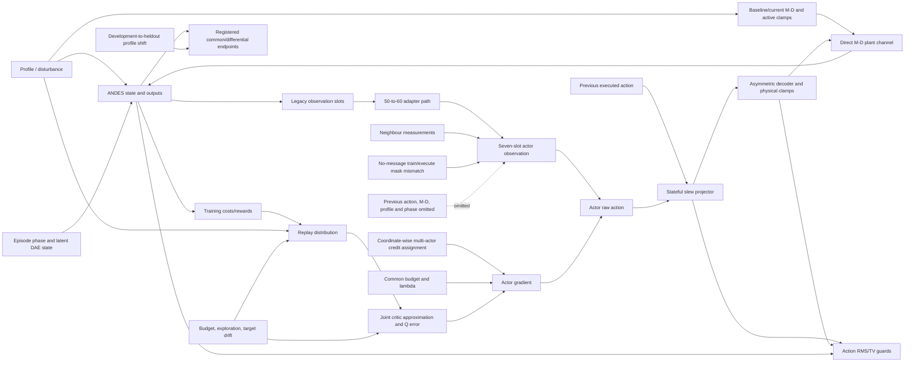

# R402 因果验证最终审计

## 历史证据、实现缺陷、根因边界与最小修复实验

**论文题目保持不变：** *Decoupling-Oriented Coordination of Paralleled VSGs With Multi-Agent Reinforcement Learning*  
**输入包：** `r402_causal_validation_v1.zip`  
**输入 ZIP SHA-256：** `3876b06d735d181e77105bfecdf0ed7d594c85251921f3fd5810965d32d84332`  
**审计对象：** 原 R402 Gate-A 历史记录、冻结源码、九个 final checkpoints、54 个周期 checkpoints、40 个评估 JSON，以及包内声明的未执行 P1/P2 项目。  
**结论标签：** `REGISTERED-EMPIRICAL`、`PROVED-MATHEMATICALLY`、`POST-HOC-DIAGNOSTIC`、`PLAUSIBLE-NOT-IDENTIFIED`、`CONTRADICTED`、`UNAVAILABLE`。本文把源代码可直接推出的事实写作 `PROVED-MATHEMATICALLY / CODE-MECHANICAL`，它表示实现语义已确定，不表示其物理结果贡献已经由干预识别。

---

## 1. Executive verdict

### 1.1 最终结论

这份数据包**完整复现了 R402 的历史失败，但没有完成此前要求的因果验证实验**。因此可以彻底解决“结果是否可复算、现有比较是否有效、实现接口是否一致、哪些主张必须撤回、下一次 ANDES 实验应如何最小化设计”这些问题；不能把未执行的干预伪装成“根因已经由实验确认”。

最重要的新结论不是乘子或通信本身，而是两个实现级接口缺陷：

1. **`cd_matd3_no_message` 不是有效的无消息消融。** 环境交互和最终执行前会把邻居槽清零，但 replay 保存未遮罩观测，online actor 和 target actor 的训练更新又读取完整邻居槽。因此该臂实际上是“训练时有消息、执行时无消息”。`PROVED-MATHEMATICALLY / CODE-MECHANICAL`。这使原 message-minus-no-message 数值不能解释为 runtime-message 的因果效应。
2. **所有三个学习臂都存在 stateful slew 与 TD3 学习接口不一致。** 实际执行动作依赖上一时刻动作，而七维 actor observation 不含上一动作；behavior path 经过 slew projector，actor/target optimization 却直接使用 raw tanh action。由此形成隐藏 projector state、非 Markov actor state，以及“critic 学执行动作、actor 优化不可直接执行动作”的接口错配。`PROVED-MATHEMATICALLY / CODE-MECHANICAL`。它是当前解释范围最广的共同实现候选，但其物理效应仍需 E2 配对实验识别。

此外还确定了五项高影响事实：学习臂与确定性比较器的 50→60 Hz observation adapter 路径不一致；冻结七槽 memoryless actor row 不含上一动作、当前/基线 M/D、profile identity 或显式 phase；scalar TD3 的动作项只惩罚跨机组全局均值，差分动作可相互抵消；注册 saturation 指标只检测 normalized action 的 ±1 边界，不能检测物理 M/D 下限 clamp；CD training cost 与 signed-pair physical gate 并非同一目标。

因此，当前最强科学结论是：**R402 的 `CANARY-FAIL` 成立，但原实验不能识别消息价值，也不能把失败归因于单一 multiplier、effort、optimization、partial-observation、distribution-shift、credit-assignment 或 action-basis 机制。** 最合理的解释排序以 slew/状态接口错配、objective–gate mismatch、componentwise effort/decoder/clamp 几何、乘子尾部弱化和未测量的 optimization insufficiency 为前列；更广义的信息状态、development-to-evaluation shift 与 credit assignment 保留为严肃替代解释。排序是 inference-to-the-best-explanation，不是因果效应估计。

### 1.2 当前论文与后续研究的分界

对 ICEMS 2026 当前论文，**无需为了保留 bounded negative result 而重训**；必须修正计数、披露无消息消融无效、删除消息有害/无用以及单一根因措辞，并把 R402 写成对 MARL objective/implementation contract 的负面审计。若要主张任何具体原因，则必须按本文 E0→E8 顺序使用 fresh paired seeds 和 fresh banks 重新执行。

---

## 2. 输入包到底提供了什么

### 2.1 完整性与可复算性

- ZIP CRC 检查通过；顶层 `SHA256SUMS` 中列出的 387 个条目全部匹配。
- 原始 40 个评估 JSON 恰好包含 240 条轨迹：216 条学习轨迹＋24 条确定性轨迹，每条 30 步。
- 独立实现从 raw JSON 复算两项注册 endpoint，与冻结 `endpoint_table.json` 的最大绝对误差小于 `2e-18`。
- 九个 `final.pt` 与各自 `episode1440.pt` 的 tensor 内容逐元素完全相同。
- 但包内实际有 399 个文件，manifest 只列 387 个；遗漏 12 个文件，包括九个 run `manifest.json`、根 manifest/SHA 文件和一个嵌套 SHA 文件。
- 复制的源码子集并非可独立 import：`andes_rl_kundur.agents.networks` 与 `andes_rl_kundur.scenarios.contract` 未包含在包中。因此它支持静态审计，但不是自执行历史复现实例。

### 2.2 因果证据覆盖

| 证据对象                                        | 状态         | 因果后果                                                              |
|:------------------------------------------------|:-------------|:----------------------------------------------------------------------|
| Registered R402 trajectories/endpoints/guards   | available    | Confirms CANARY-FAIL only                                             |
| Final and periodic checkpoints                  | available    | Supports coarse parameter/lambda diagnostics                          |
| Full 1440-episode cost/lambda history           | absent       | Cannot characterize whole-run multiplier exposure                     |
| Actor/critic update logs and Q calibration      | absent       | Optimization/convergence cause unavailable                            |
| Replay snapshots and support diagnostics        | absent       | Coverage/OOD cause unavailable                                        |
| Complete evaluation P_es and cost decomposition | absent       | Full differential training objective cannot be reconstructed          |
| Raw observation and pre-slew action chain       | absent       | Cannot replay exact actor inputs or projection counterfactuals        |
| Frozen-policy M0-M7 interventions               | not_executed | Runtime-message value remains unidentified                            |
| Successor S0-S5 paired training                 | not_executed | Multiplier/effort/alignment causal effects remain unidentified        |
| R402-specific DAE/LTV authority export          | absent       | Direct-M/D conditioning/headroom remains open                         |
| Copied source dependency closure                | partial      | Static audit possible; package not self-executing                     |
| Formal execution provenance                     | absent       | Reporting/provenance limitation; no demonstrated policy-outcome cause |
| Learned-checkpoint development-profile evaluation | absent     | Cannot separate training-distribution fit from held-out shift         |


结论很明确：这是一个质量较高的**历史归档和复算包**，不是已完成的 causal-validation package。原请求最关键的 update-level logs、message interventions、S0–S5、R402-specific DAE authority 均未执行。

---

## 3. 注册结果复算

### 3.1 轨迹与统计单位

- 文件数：40。
- 每文件注册轨迹：6。
- 总轨迹：240，不是 264。
- 学习轨迹：`3 arms × 3 seeds × 4 profiles × 6 trajectories = 216`。
- 确定性轨迹：`4 profiles × 6 trajectories = 24`。
- 独立 seed 是学习层面的主要统计单位；profile、trajectory、time step 和 action component 均是 seed 内重复测量。

### 3.2 两项 headline endpoints

确定性参考值为：

\[
E_{\mathrm{cross,det}}=3.4260449381761277\times 10^{-4},
\qquad
E_{\mathrm{diff,det}}=2.2148944818784584\times 10^{-3}.
\]

学习臂的三 seed 中位数如下：

| 学习臂              |   cross 中位数 | 相对确定性参考   |   differential 中位数 | 相对确定性参考（diff）   |
|:--------------------|---------------:|:-----------------|----------------------:|:-------------------------|
| scalar TD3          |     0.00140992 | 4.1153×          |            0.00645749 | 2.9155×                  |
| CD-MATD3 no-message |     0.00142595 | 4.1621×          |            0.00692434 | 3.1263×                  |
| CD-MATD3 message    |     0.00174444 | 5.0917×          |            0.00730744 | 3.2992×                  |


`REGISTERED-EMPIRICAL`：三个学习臂在两项 lower-is-better endpoint 上均显著劣于强确定性参考。该事实不依赖 reward curve、后验解释或最佳 checkpoint 选择。

### 3.3 注册 guards

全部 36 个 learning arm–seed–profile blocks 同时未通过 common no-harm family 和 action-stress family。各 run 的最坏 profile 比值如下；前三列阈值为 `1.03`，后两列阈值为 `1.10`。

| 臂            |   seed |   Common IAE |   峰值 |   RoCoF |   Action RMS |   Action TV |
|:--------------|-------:|-------------:|-------:|--------:|-------------:|------------:|
| CD message    |    401 |        1.361 |  2.214 |   5.495 |        4.545 |       8.354 |
| CD message    |    402 |        1.483 |  3.176 |   4.157 |        4.682 |       5.441 |
| CD message    |    403 |        1.171 |  1.737 |   4.186 |        4.373 |       8.234 |
| CD no-message |    401 |        1.2   |  1.735 |   2.681 |        3.583 |       3.594 |
| CD no-message |    402 |        1.233 |  1.612 |   4.288 |        3.659 |       4.805 |
| CD no-message |    403 |        1.145 |  2.363 |   7.381 |        5.759 |       5.036 |
| scalar TD3    |    401 |        1.304 |  1.761 |   2.119 |        1.327 |       2.06  |
| scalar TD3    |    402 |        1.375 |  2.094 |   4.906 |        2.627 |       3.524 |
| scalar TD3    |    403 |        1.3   |  1.694 |   1.461 |        3.033 |       7.165 |


`REGISTERED-EMPIRICAL`：`CANARY-FAIL` 无争议。后续源码缺陷不会把该历史分类“变成通过”；它们改变的是**失败能否被解释为某个干净因果对照的结果**。

---

## 4. 关键实现与信息合同问题

### 4.1 F1：no-message 训练—执行 masking 不一致

**证据状态：** `PROVED-MATHEMATICALLY / CODE-MECHANICAL`  
**严重度：** CRITICAL  
**受影响主张：** 所有 message-versus-no-message 因果解释。

历史 runner 的 behavior/evaluation path 是：

```python
joint = _joint_obs(observation)
actor_joint = _mask_actor_obs(arm_id, joint)
raw_action = agent.act(actor_joint, ...)
```

但 replay 中保存的是未遮罩的 `joint` 与 `next_joint`：

```python
agent.store(joint, executed_action, reward, next_joint, terminal)
```

随后 `_target_actions()`、baseline actors 和 online actor update 均直接读取：

```python
batch["next_obs"][:, i*OBS_DIM:(i+1)*OBS_DIM]
batch["obs"][:, i*OBS_DIM:(i+1)*OBS_DIM]
```

没有再次 mask slots 3–6。对应源码：

- `scripts/run_r402_cd_matd3_canary.py:280-283, 390-445, 580-583`
- `src/andes_rl_kundur/agents/cd_matd3.py:206-238, 298-322`

因此无消息臂的真实信息合同是：

\[
\text{actor update: full neighbour slots},
\qquad
\text{behavior/evaluation: neighbour slots}=0.
\]

这不是标准 centralized-training/decentralized-execution：critic 看到全局状态可以是设计选择，但**无消息 actor 自身的训练 forward 也看到了邻居槽**。最终 no-message actor 第一层邻居槽权重范数与本地槽权重范数之比均值为 `1.3147`，与 message arm 的 `1.3069` 接近；这只说明网络参数没有被结构性隔离，不能单独证明 endpoint effect。

#### 直接后果

1. 原 message/no-message arm 不是单因素干预。
2. 原中位数描述仍可报告：message 相对 no-message 的 cross 为 `22.3%` 更差、differential 为 `5.5%` 更差；但必须标成 bundle-level descriptive contrast。
3. seed 403 的方向相反：message 在两项指标上都优于 no-message，进一步反对“消息稳定有害”的措辞。
4. 在修复 F1 之前，M0–M7 frozen-policy sensitivity 也不能替代干净的训练消融；它们回答的是已训练 message policy 对输入扰动的敏感性，不是消息在学习合同中的增量。

#### 修复原则

no-message arm 必须在以下所有 actor paths 中使用同一 mask：

- behavior online actor；
- actor target；
- actor baseline joint action；
- 当前被更新 actor；
- checkpoint diagnostic actor；
- 任何 actor Jacobian/gradient probe。

centralized critic 可继续接收完整 joint observation。交付补丁：`reference_fixes/0001_fix_no_message_actor_training_mask.patch`。

### 4.2 F2：stateful slew projector 未进入 learner state 和 actor/target optimization

**证据状态：** `PROVED-MATHEMATICALLY / CODE-MECHANICAL`  
**严重度：** CRITICAL  
**受影响范围：** 三个学习臂全部受影响。

历史执行动作满足：

\[
a_t^{\mathrm{exec}}
=\Pi_{[-1,1]}
\left(a_{t-1}^{\mathrm{exec}}
+\operatorname{clip}
\left(a_t^{\mathrm{raw}}-a_{t-1}^{\mathrm{exec}},-0.25,0.25\right)
\right).
\]

`PerVSGMDActionProjector` 显式保存 `previous_action`，每个 episode 才 reset。源码：`control/per_vsg_md.py:63-103`。但历史 actor observation 只有七个槽，不含上一时刻执行动作；replay 存的是 post-slew executed action，而 actor/target actor 路径直接输出并优化 raw tanh action，再做 TD3 target noise 和 `[-1,1]` clamp，没有 slew map。

于是历史算法实际在混合三种不同 action semantics：

\[
\begin{aligned}
\text{behavior: }& a_t^{\mathrm{exec}}=\Pi(a_{t-1}^{\mathrm{exec}},\mu(o_t)+\epsilon_t),\\
\text{critic replay: }& Q(o_t,a_t^{\mathrm{exec}}),\\
\text{actor/target optimization: }& Q(o_t,\mu(o_t))\ \text{or}\ Q(o_{t+1},\mu^-(o_{t+1})+\epsilon^-).
\end{aligned}
\]

这导致两类明确错配：

1. **Markov state 缺失。** 对相同七槽 observation 和相同 raw actor output，不同 `a_{t-1}^{exec}` 会产生不同执行动作和下一状态；actor state 没有区分这两种情况。
2. **可执行动作错配。** critic 在历史数据上拟合 executed action，actor gradient 却查询可能在一个控制周期内不可到达的 raw action。

这不是“TD3 一定失败”的数学证明；它是一个必须先修复的学习—环境接口缺陷。其解释范围很强：它同时适用于 scalar 与两个 CD arms，并与大量 slew-limit 使用、action TV failure 和物理 clamp 活跃相吻合。

#### 修复原则

最小、可归因的 E2 合同应保留历史 actor 输出的**目标动作语义**，只把上一执行动作加入 learner state，并把冻结的 projector 显式放入所有学习路径：

\[
u_t=\tanh(\ell_t),
\qquad
a_t^{exec}=\operatorname{clip}\!\left[
 a_{t-1}^{exec}+\operatorname{clip}\left(u_t-a_{t-1}^{exec},-0.25,0.25\right),
 -1,1\right].
\]

behavior、target actor、online actor objective、critic action semantic 和 replay 必须使用同一个 target-to-executed 映射；下一个 state 的 projector memory 恰好是当前 sampled executed action。把 actor 重新参数化为增量命令会额外改变 command semantics，只能作为单独标记的 E2b，不能与最小 E2 捆绑。参考实现：`reference_fixes/slew_aware_td3_interface.py`。

> 不建议只把 external projector 去掉。那会改变物理合同并使历史 guard 不再可比。正确修复是让 learner 明确建模冻结的 slew channel。

### 4.3 F3：频率 observation adapter 路径不一致

**证据状态：** `PROVED-MATHEMATICALLY / CODE-MECHANICAL`  
**结果贡献：** `PLAUSIBLE-NOT-IDENTIFIED`

冻结 contract 声明 legacy 50-Hz frequency/RoCoF slots 应在任何 60-Hz consumer 前乘 `60/50`。确定性比较器 evaluation 调用了 `adapt_v4_observations_to_physical()`，学习臂 training/evaluation 却直接 `_joint_obs(observation)`。

这证明路径不一致，但不足以证明它导致失败：学习臂在 training 与 evaluation 中都看到同一 raw scale，MLP 可以在原则上吸收常数缩放。需要 E3 单因素 paired reproduction。交付补丁：`reference_fixes/0002_apply_frequency_adapter_consistently.patch`。

### 4.4 F8：更广义的状态与信息充分性仍未建立

**代码事实：** `PROVED-MATHEMATICALLY / CODE-MECHANICAL`  
**结果贡献：** `PLAUSIBLE-NOT-IDENTIFIED`

冻结 actor row 只有 local active power、local frequency/RoCoF 和两邻居 frequency/RoCoF。历史 V4 配置是 memoryless 七槽输入，不显式包含：

- 上一时刻 executed action；
- 当前或基线 `M_i,D_i`；
- profile identity、steady-load parameters 或 disturbance identity；
- episode phase/time；
- 其他 ANDES differential/algebraic states。

这件事在 direct-M/D object 上尤其重要：相同 normalized action 在不同 profile 的 baseline `M_0,D_0` 下映射到不同物理参数，lower-clamp active set 也不同；而当前动作又经过依赖历史的 slew projector。F2 已经证明其中“上一执行动作”是一个具体隐藏 action-channel state，但更广义的 profile/current-parameter/phase 信息是否足够，当前数据不能回答。

不能把这一点升级为不可实现性结论。强确定性 local-neighbour direct-M/D controller 在同一 object 上成功，是反对“七槽局部信息必然不足”的重要反证。合理结论仅是：**信息状态不足可能与 F2、profile heterogeneity 和 distribution shift 共同增加学习难度。** E0 应先把相同 checkpoints 同时评估在 development 与 fresh held-out banks；只有在修复 E2 后仍出现系统性缺口，才值得做单一、预注册的 state-augmentation intervention，而不是 observation sweep。

---

## 5. 动作、decoder 与物理 clamp

### 5.1 观测到的动作几何

| 臂            | seed   | mean |a|   | slew 命中率   | M 下限占比   | D 下限占比   | 差分动作能量占比   |
|:--------------|:-------|:-----------|:--------------|:-------------|:-------------|:-------------------|
| CD-msg        | 401    | 37.03%     | 19.11%        | 4.24%        | 23.47%       | 78.95%             |
| CD-msg        | 402    | 36.92%     | 12.50%        | 1.01%        | 24.90%       | 70.25%             |
| CD-msg        | 403    | 37.52%     | 16.30%        | 2.47%        | 22.40%       | 87.61%             |
| CD-no-msg     | 401    | 29.04%     | 6.35%         | 3.78%        | 12.36%       | 70.79%             |
| CD-no-msg     | 402    | 31.50%     | 10.16%        | 6.81%        | 17.99%       | 75.59%             |
| CD-no-msg     | 403    | 48.65%     | 15.21%        | 11.88%       | 13.02%       | 93.23%             |
| deterministic | —      | 7.91%      | 0.42%         | 0.00%        | 0.00%        | 7.67%              |
| scalar        | 401    | 10.18%     | 0.19%         | 0.00%        | 0.87%        | 85.95%             |
| scalar        | 402    | 17.97%     | 3.11%         | 1.08%        | 10.49%       | 80.67%             |
| scalar        | 403    | 19.51%     | 14.72%        | 5.49%        | 3.99%        | 88.66%             |


关键事实：

- 确定性参考的 `mean |a|=7.91%`、slew 命中 `0.42%`；CD arms 的 mean absolute action 和 slew 命中显著更高。
- 216 条学习轨迹中，179 条（`82.9%`）至少一次触发 M 或 D 物理下限 clamp。
- no-message 的 72 条学习轨迹全部至少一次触发物理下限；message 为 64/72，scalar 为 43/72。
- normalized boundary saturation 在全部 run 中仍为 0，因为注册 evaluator 只检测 `|a|≈1`，不检测 `M=20` 或 `D=10`。
- 151/216 条学习轨迹至少一次越过参考 paper box 的 `M>600` 或 `D>300`；冻结实现没有上限 clamp，因此这不是注册 violation，而是 decoder/plant operating-region 诊断。确定性参考也有少量 `D>300`，所以不能把该事件本身等同于失败。

`CONTRADICTED`：任何把 `action_saturation_fraction=0` 写成“物理 actuator 未触及 clamp/非线性区”的陈述都是错误的。

### 5.2 非对称 decoder 的系统性正偏置

冻结 decoder 为：

\[
\Delta q(a)=
\begin{cases}
600a,&a\ge 0,\\
200a,&a<0.
\end{cases}
\]

对任何关于零点对称、非退化的随机变量 \(A\)：

\[
\mathbb E[\Delta q(A)]
=600\mathbb E[A_+]+200\mathbb E[A_-]
=400\mathbb E[A_+]>0.
\]

因此 normalized action/exploration 即使均值为零，decoded \(\Delta M/\Delta D\) 也不是零均值。若 \(A\sim\mathcal N(0,0.1^2)\)，在 slew/clamp 前：

\[
\mathbb E[\Delta q(A)]
=\frac{400\cdot0.1}{\sqrt{2\pi}}
\approx 15.96.
\]

这不是 endpoint 失败的因果证明，但它说明 exploration、target noise、zero-centered actor 输出与 physical parameter space 之间存在确定的几何偏置；应把 branch、pre/post slew、pre/post clamp 全部写入后继日志。

### 5.3 scalar TD3 的“动作惩罚”不是 componentwise effort

历史 scalar reward 使用：

\[
r_H=-\left(\frac{\operatorname{mean}_i\Delta M_i}{2}\right)^2,
\qquad
r_D=-\left(\operatorname{mean}_i\Delta D_i\right)^2.
\]

它不是：

\[
\operatorname{mean}_i(\Delta M_i^2),\quad
\operatorname{mean}_i(\Delta D_i^2),\quad
\|a_t\|^2,\quad
\|a_t-a_{t-1}\|,
\]

因此大幅正负差分动作可以在全局均值中相消。scalar 三 seed 的诊断如下：

|   seed | 仅由跨机组抵消造成的 M 保留率   | 仅由跨机组抵消造成的 D 保留率   | 实际 M 均值平方项/逐分量平方   | 实际 D 均值平方项/逐分量平方   |
|-------:|:--------------------------------|:--------------------------------|:-------------------------------|:-------------------------------|
|    401 | 10.85%                          | 12.49%                          | 2.71%                          | 12.49%                         |
|    402 | 10.34%                          | 2.52%                           | 2.58%                          | 2.52%                          |
|    403 | 9.61%                           | 15.09%                          | 2.40%                          | 15.09%                         |


特别是 D 项仅覆盖对应逐分量平方量的 `2.5%–15.1%`；M 项在跨机组抵消外还因 `/2` 后平方再缩小四倍，只覆盖约 `2.4%–2.7%`。这意味着：

- `CONTRADICTED`：不能再把“scalar TD3 含 action-related terms 但仍失败”当作反驳 componentwise effort hypothesis 的强证据。
- 能成立的较弱陈述是：**全局均值平方形式的动作项不足以防止高差分 effort 和 TV**。
- 后继 E4 必须对 post-slew executed normalized components 直接惩罚 magnitude 与 increment，且 penalty scale 在 calibration bank 上预注册。参考实现：`reference_fixes/componentwise_effort_cost.py`。

---

## 6. Multiplier 分析

### 6.1 现有数据能支持什么

包内文档错误地说 CD 的 common-cost/lambda lists 为空。实际六个 CD run manifests 每个都保留 20 个 common costs 和 20 个 post-update lambda；另有 episodes 240、480、720、960、1200、1440 的 checkpoint lambda。

由更新式

\[
\lambda_{k+1}=\Pi_{[0,10]}
\left[\lambda_k+0.05(C_{c,k}-3)\right]
\]

可知，在 final-20 序列中，第 2–20 个 episode 实际使用的 \(\lambda\) 等于前一个 episode 记录的 post-update 值，因此可精确恢复 19 个 episode-use lambdas：

| 臂        |   seed |   final-tail λ 中位数 | λ=0 占比   | λ<0.05 占比   | λ<0.1 占比   |
|:----------|-------:|----------------------:|:-----------|:--------------|:-------------|
| CD-msg    |    401 |               0       | 57.9%      | 78.9%         | 94.7%        |
| CD-msg    |    402 |               0.03242 | 36.8%      | 52.6%         | 73.7%        |
| CD-msg    |    403 |               0       | 84.2%      | 100.0%        | 100.0%       |
| CD-no-msg |    401 |               0       | 89.5%      | 100.0%        | 100.0%       |
| CD-no-msg |    402 |               0       | 63.2%      | 84.2%         | 84.2%        |
| CD-no-msg |    403 |               0       | 73.7%      | 94.7%         | 100.0%       |


`POST-HOC-DIAGNOSTIC`：retained tail 中 common pressure 经常很弱。各 run 的 `λ=0` 占比为 `36.8%–89.5%`，`λ<0.1` 占比为 `73.7%–100%`。

但以下更强陈述仍不成立：

- “common constraint 在全部 1,440 episodes 被删除”；
- “小 lambda 必然意味着 common actor gradient 可忽略”；
- “乘子是 common guard failure 的唯一原因”。

六个周期 checkpoint 的 lambda 并非全部为零；例如 no-message seed 403 在 episode 480/720 为约 `0.199/0.204`。更重要的是，actor common contribution 还取决于 critic gradient 与 actor Jacobian。

### 6.2 可验证的梯度判据

令：

\[
g_d^\theta=J_\pi^\top\nabla_aQ_d,
\qquad
g_c^\theta=\lambda J_\pi^\top\nabla_aQ_c.
\]

可定义：

\[
r_\theta=
\frac{\|g_c^\theta\|_2}
{\|g_d^\theta\|_2+10^{-12}}.
\]

若对某个预注册阈值 \(\varepsilon_g\)，大量 actor updates 同时满足

\[
r_\theta\le\varepsilon_g,
\]

才可说 common term 在 parameter update 中近乎可忽略。当前缺少逐 update 的 \(Q_c,Q_d\)、action gradients、actor Jacobian/parameter-gradient decomposition，因此只能把 multiplier calibration 归为 `PLAUSIBLE-NOT-IDENTIFIED`。

---

## 7. Objective–gate mismatch

### 7.1 CD objective 与注册 endpoint 是不同对象

CD differential step cost 使用单轨迹绝对量：

\[
c_d=\frac13\left\|\frac{T_d\Delta f}{0.15}\right\|_2^2
+\frac13\left\|\frac{T_dP_{es}}{0.25}\right\|_2^2.
\]

注册 cross endpoint 则先组合同 profile 的正负 probe：

\[
y_{odd}=\tfrac12(y_+-y_-),
\]

再计算 common→differential 与 differential→common 的 finite-window energy；localized differential endpoint 也使用 signed-pair response。注册 guards 还是相对确定性参考的 ratio ceilings。

因此以下事实是确定的：

- per-trajectory squared state/power surrogate 不等于 signed odd-response endpoint；
- training objective 不显式包含 comparator-relative no-harm ratios；
- CD objective 没有 action RMS/TV/slew-use term；
- evaluation JSON 未保存 `P_es`，故现有后验 differential cost 只能重建 frequency component，不能判断训练时完整 \(c_d\) 是否被优化。

`PROVED-MATHEMATICALLY / CODE-MECHANICAL`：objective–gate mismatch 存在。  
`PLAUSIBLE-NOT-IDENTIFIED`：该 mismatch 对 endpoint failure 的因果贡献尚未隔离。

### 7.2 为什么这比“reward 没学好”更具体

训练 surrogate 可能下降而注册 endpoint 变差，原因不必是优化器失效；也可能是优化器忠实地优化了另一个量。要区分二者，E0 必须在固定 diagnostic bank 上逐 checkpoint 同时记录：完整 \(C_d/C_c\)、两项注册 endpoint、guards、actor/Q calibration。E6 才能只改变 objective alignment。

---

## 8. Optimization 与 convergence

### 8.1 现有证据

所有 run 到达 43,200 interaction steps，且 runtime 没发现 nonfinite critic loss；这只证明执行完成，不是 convergence certificate。

周期 checkpoint 的 coarse parameter displacement 在最后 240 episodes 仍明显：

| 臂        |   seed | actor 相对位移 1200→1440   | critic 相对位移 1200→1440   |
|:----------|-------:|:---------------------------|:----------------------------|
| CD-msg    |    401 | 26.1%                      | 17.9%                       |
| CD-msg    |    402 | 25.8%                      | 19.5%                       |
| CD-msg    |    403 | 29.9%                      | 19.2%                       |
| CD-no-msg |    401 | 25.4%                      | 20.9%                       |
| CD-no-msg |    402 | 32.0%                      | 18.3%                       |
| CD-no-msg |    403 | 25.3%                      | 19.9%                       |
| scalar    |    401 | 21.1%                      | 16.8%                       |
| scalar    |    402 | 21.2%                      | 16.6%                       |
| scalar    |    403 | 25.4%                      | 17.4%                       |


`POST-HOC-DIAGNOSTIC`：参数在训练末段仍有可观移动。  
`UNAVAILABLE`：不能据此断言“未收敛”，因为没有 checkpoint performance、actor/critic losses、Bellman residual、Q calibration、parameter update norm、replay support 或 stopping criterion。

### 8.2 识别 optimization cause 的最低日志

E0 至少保存：

1. 全 1,440 episodes 的 return、完整 cost 分解、lambda_pre/post、动作与 physical metrics；
2. 每次 critic update 的 twin-Q prediction/target/TD error、loss、gradient/update norm；
3. 每次 actor update 的 \(Q_d/Q_c\)、\(g_d^\theta/g_c^\theta\)、cosine、action/logit distribution；
4. checkpoint held-out Q-to-realized-return calibration；
5. replay state/action/profile/time coverage 与 evaluation OOD score；
6. 每个 checkpoint 在固定 diagnostic bank 上的 endpoints/guards。

更多 seeds 不能替代这些机制日志。

### 8.3 Credit assignment 与 distribution shift

**Credit assignment：** 四个独立 actor 共享一个 joint critic 和 global cost channels；每次 actor update 固定其余 actor 的 baseline actions，仅替换当前 actor row。该计算路径是确定的，但它究竟提供了足够的 per-agent credit，还是被 critic error、joint-action OOD 或 actor interaction 污染，当前没有 counterfactual values、per-agent gradient decomposition、held-out Q calibration 或匹配的替代 estimator，因此状态是 `UNAVAILABLE`。不能把“centralized critic”本身写成失败原因，也不能把它当作已经解决 credit assignment 的证书。

**Distribution shift：** 训练使用四个 development profiles，注册评估使用四个不同 evaluation profiles；但包内没有 final 或 periodic learned checkpoint 在 development profiles 上的注册 endpoint/guard evaluation。因此无法区分：

1. policy 在训练分布上也没有学会；
2. policy 在 development 上有效但发生 held-out shift；
3. 两者同时存在。

E0 必须对相同 frozen checkpoints 同时报告 development、fresh diagnostic、heldout-primary 和 heldout-replication banks。只有该对比才能把 optimization/fit 与 generalization shift 分开。

---

## 9. Runtime message 的可识别性

### 9.1 原结果还能怎么写

原三 seed endpoint 数值仍是历史描述，但 F1 使其不再是干净 estimand：

\[
\text{observed arm contrast}
\ne
\text{causal effect of runtime messages}.
\]

原因是 no-message arm 同时改变了：

- actor training information pattern；
- actor execution information pattern；
- train/execution distribution alignment。

而且这三项没有按预期保持一致。

### 9.2 当前不能接受的结论

- Runtime messages are useless.
- Runtime messages are harmful.
- Near-zero cross-policy action correlation proves message redundancy.
- R404 one-seed disclosed-development result proves message harm.

R404 只显示在一个 seed、1,200 steps、disclosed development bank、bundled fixed common weight＋effort repair下：no-message arm 通过、message arm common ratio 仍失败。它是开发阶段风险信号，不是一般通信机制结论；当前还不知道 R404 是否修复了 F1。

### 9.3 正确实验

先执行 E1，恢复 clean no-message actor training contract；之后：

- paired message-on/off training；
- 对 corrected message checkpoints 执行 M0–M7；
- 保存 actor-only counterfactual 与 closed-loop outcome contrast；
- 使用 common random numbers；
- 将 seed 作为统计单位。

---

## 10. Direct M/D 与 energy-port 的机制边界

### 10.1 已确定

`CONTRADICTED`：direct M/D 没有物理 authority。强确定性 `local_neighbour_md_km2_kd2` 在相同 direct-M/D object 上显著改善 endpoint 并通过 guards，证明 finite-amplitude authority 非零。

### 10.2 仍开放

`PLAUSIBLE-NOT-IDENTIFIED`：在强确定性 comparator 附近，direct M/D 的可学习增量 headroom 可能有限、条件数差或受 slew/decoder/clamp 约束。当前没有 R402-specific \(f_x,f_y,g_x,g_y,f_u,g_u\)、30-step lifted map、奇异值、受约束 reachable set 或 comparator-local optimization。

包内 R405 matrices 来自另一个 registered object；energy-port R408/R409 也改变 actuator、estimator、feasible mapping、window/bank/reference。它们不能证明 action-basis mismatch 导致 R402。

---

## 11. 更新后的因果 DAG



### 已识别边与未识别边

- code-mechanical：`Prev→Slew`、`Slew→executed action`、`MaskBug→actor information pattern`、`adapter path→actor input scale`、`decoder branch→ΔM/ΔD`。
- registered empirical：learned policies→worse endpoints/guard failures。
- post-hoc association：高 slew/clamp、尾部小 lambda、late parameter drift 与失败共同出现。
- 未识别：F2、effort、multiplier、objective mismatch、optimization、broader state sufficiency、credit assignment、development-to-heldout shift、message information、authority conditioning 对最终 endpoint 的单独因果效应。

---

## 12. 根因解释排序

下表按 explanatory scope、与全部观察的一致性、替代解释数量和可检验预测排序；它不是 effect-size estimate。

| 排序 | 候选解释 | 覆盖范围 | 证据状态 | 判别实验 |
|---:|---|---|---|---|
| 1 | Stateful slew/hidden-action learner-interface mismatch | 三个学习臂 | code fact 已确定；outcome contribution 未识别 | E2 |
| 2 | Training-objective versus physical-gate mismatch | 全部学习臂，具体形式不同 | mismatch 已确定；效应未识别 | E6 |
| 3 | Componentwise effort omission/cancellation＋decoder/clamp geometry | CD arms；scalar 只有弱全局均值项 | post-hoc support；未识别 | E4 |
| 4 | Multiplier/budget calibration | CD arms | 尾部诊断支持；未识别 | E5 |
| 5 | Optimization/critic/replay insufficiency | 三个学习臂 | `UNAVAILABLE` | E0 |
| 6 | Broader partial observation of profile/current M-D/phase | 三个学习臂 | omitted fields 已确定；效应未识别 | E0 后按需做单一 state intervention |
| 7 | Development-to-evaluation distribution shift | 三个学习臂 | `PLAUSIBLE-NOT-IDENTIFIED` | E0 development-versus-heldout evaluation |
| 8 | Centralized-critic credit assignment insufficiency | 三个学习臂 | `UNAVAILABLE` | E0 gradient/Q diagnostics |
| 9 | Frequency-adapter path asymmetry | 学习臂 versus deterministic | path difference 已确定；效应未识别 | E3 |
| 10 | No-message actor masking defect | no-message 与 message contrast | defect 已确定；endpoint effect 未识别 | E1 |
| 11 | Limited direct-M/D incremental authority/headroom | direct-M/D object | `PLAUSIBLE-NOT-IDENTIFIED` | E8 |

### 为什么 F2 排第一

- 覆盖 scalar、CD-no-message、CD-message 三个失败臂；
- 同时连接 action TV、slew hit、clamp、critic replay semantics、target action 和 partial observability；
- 是确定的代码事实，不依赖后验 reward interpretation；
- 有明确反事实预测：E2 应显著降低 pre-slew/post-slew gap、改善 Q calibration，并可能降低 action stress；若这些 manipulation checks 发生但 endpoint 不改善，则 F2 不是主要 endpoint cause。

### 为什么不能把 F2 写成已确认主因

没有任何 corrected paired ANDES run。一个实现缺陷可以存在但对某个 outcome 影响很小；只有 E2 的单因素干预能估计贡献。

---

## 13. 最小后继实验：必须先修代码有效性

原 S0–S5 方案把 multiplier、effort、alignment 放在前面，但源码审计后顺序必须调整。否则会在无效 no-message 消融和 hidden-slew interface 上继续投入计算。

| 编号   | 实验                                      | 唯一变化                                                                                                                   | 回答的问题                                                                            | 优先级   |
|:-------|:------------------------------------------|:---------------------------------------------------------------------------------------------------------------------------|:--------------------------------------------------------------------------------------|:---------|
| E0     | Instrumented frozen-code reproduction     | Historical code unchanged; add complete logs and evaluate fixed checkpoints on development, diagnostic and fresh held-out banks | Separates logging absence, optimization/credit failure and fit-versus-shift; baseline for all interventions | P0       |
| E1     | No-message mask-consistency fix           | Mask neighbour slots in all actor and target-actor forwards; critic may retain full centralized state                      | Identifies effect of F1 and restores valid message/no-message estimand                | P0       |
| E2     | Slew-aware Markov action interface        | Preserve actor target-action semantics; augment state with previous executed action; project behavior/target/online actor actions through the same frozen slew map | Identifies effect of F2 on action stress/endpoints | P0       |
| E3     | Uniform frequency adapter                 | Apply the sealed 50-to-60 conversion consistently to every actor arm, or formally reseal legacy scale for all comparators  | Resolves F3 contract/comparator asymmetry                                             | P1       |
| E4     | Effort-only intervention                  | Add componentwise executed-action magnitude and increment penalty; keep common weight/endpoint objective fixed             | Identifies action-effort effect without bundling multiplier repair                    | P1       |
| E5     | Multiplier-only intervention              | Fixed common weight versus projected multiplier; no effort change                                                          | Identifies multiplier calibration effect                                              | P1       |
| E6     | Objective-alignment intervention          | Baseline-subtracted/signed-pair-compatible differential target; log full P_es                                              | Identifies objective–gate mismatch, including absolute P_es term                      | P1       |
| E7     | Frozen-policy message interventions M0–M7 | True/zero/delay/permutation/swap/noise/slot perturbations                                                                  | Value-of-information and sensitivity; not a substitute for E1                         | P1       |
| E8     | R402-specific DAE/LTV authority export    | Actual f_x,f_y,g_x,g_y,f_u,g_u and constrained 30-step maps at all profiles                                                | Bounds direct-M/D authority and conditioning                                          | P2       |


### 13.1 Phase 0：E0 instrumented frozen-code reproduction

唯一变化是增加日志，不改历史算法。目的不是“救算法”，而是建立可解释 baseline：

- 至少 6 个 fresh paired seeds；
- fresh training/diagnostic/heldout-primary/heldout-replication banks；
- common random numbers；
- 全量 update logs、replay snapshots、Q calibration、完整 `P_es`、raw/converted observation、pre/post slew action；
- 相同 periodic/final checkpoints 在 development、fresh diagnostic、heldout-primary 与 heldout-replication banks 上的 endpoints/guards。

### 13.2 Phase 1：代码有效性三项单因素干预

- **E1**：只修 no-message actor/target mask；
- **E2**：只修 slew-aware Markov action interface；
- **E3**：只统一 frequency adapter。

每项先分别对 E0 做 paired contrast；通过 manipulation checks 后，再形成 `E1+E2+E3` corrected baseline。不要一次把三项合并后声称知道哪项起作用。

### 13.3 Phase 2：机制识别

- **E4 effort-only**：对 executed normalized action 的 magnitude/increment 直接加预注册 penalty；
- **E5 multiplier-only**：历史 `[0,10]`、fixed weight 1、`[1,10]` 三个预注册规则；
- **E6 objective-only**：对齐 signed-pair physical target，并保存完整 `P_es`；
- **E7 message value**：corrected message/no-message paired training＋M0–M7；
- **E8 authority**：非训练 DAE/LTV/constrained-headroom 导出。

### 13.4 因果通过标准

某机制只有同时满足以下条件才能写成 verified contribution：

1. manipulation check 证明该机制真的被改变，例如 E1 的 actor message-slot gradient 必须严格为零；
2. paired seed physical endpoints/guards 方向一致；
3. heldout primary 与 independent replication bank 一致；
4. 主要替代解释没有给出同样好的解释；
5. 不把 profile/time/action rows 当独立 seeds。

完整机器可读合同见 `reference_fixes/prospective_successor_contract.yaml`。

---

## 14. 可直接应用的代码修复

### 14.1 `0001_fix_no_message_actor_training_mask.patch`

作用：把 no-message mask 移入 learner contract，使 online actor、target actor、baseline actors、updated actor 和 runtime actor 一致；critic 仍可看完整 centralized observation。

应用方式：

```bash
cd <repository-root>
patch -p1 < 0001_fix_no_message_actor_training_mask.patch
```

### 14.2 `0002_apply_frequency_adapter_consistently.patch`

作用：引入 `_physical_joint_obs()`，保证所有学习臂与确定性 controller 均按冻结 contract 做一次 50→60 conversion。

```bash
patch -p1 < 0002_apply_frequency_adapter_consistently.patch
```

### 14.3 `slew_aware_td3_interface.py`

提供：

- 七槽 observation＋上一 executed own action 的九槽 actor state；
- NumPy behavior map；
- PyTorch almost-everywhere differentiable target/actor map；
- replay transition validation；
- next-state projector memory 语义。

这不是可以直接回写历史结果的“修复后结论”，而是 E2 prospective intervention 的 reference implementation。

### 14.4 `componentwise_effort_cost.py`

提供 post-slew executed action 的：

- mean squared magnitude；
- RMS；
- mean absolute increment；
- total variation；
- PyTorch normalized effort loss。

penalty normalization 必须在 calibration bank 上冻结，不能看 heldout outcome 后调整。

---

## 15. 数据与 provenance 修正

| 问题 | 正确值 | 科学影响 | 必须修复 |
|---|---|---|---|
| “264 records” | 240 total = 216 learning + 24 deterministic | 不改变 endpoint/classification；降低报告完整性信心 | 全文、claim card、decision tree 统一改为 240 |
| `formal_execution.json` 缺失 | 历史上从未生成 | provenance 缺口，不是 policy failure cause | 明确声明不存在，禁止补造历史文件 |
| `formal_analysis.round=R401` | R402 execution 绑定 R401 seal | 可解释的 seal provenance，但命名易混淆 | 在 lineage 中明确 seal round 与 execution round |
| snapshot 字典序 | 必须按 episode 数值排序 | 旧 serialized order 不能作训练轨迹证据 | 使用数值字段排序 |
| README 说 lambda/common lists 为空 | 六个 CD manifests 各有 20+20 | 错误丢弃可用尾部证据 | 更正 availability/README |
| manifest 387 vs actual 399 | 12 个文件未列入 | inventory 不完整；列出条目 hash 仍通过 | 重新生成 manifest/SHA |
| copied source 不闭包 | 缺 `networks.py`、`scenarios/contract.py` | 无法从包独立 import/运行 | 补齐源码或把状态改为 partial |

---

## 16. Manuscript-ready English

### 16.1 Results

> Across three fixed training seeds and four held-out canary profiles, all three learned direct-inertia/direct-damping controllers underperformed the deterministic local-neighbour reference on both registered endpoints, and every one of the 36 arm–seed–profile blocks violated both the common-mode no-harm and action-stress guard families; the registered outcome was therefore CANARY-FAIL.

### 16.2 Implementation-audit disclosure

> A post hoc source-code audit identified that the nominal no-message arm masked neighbour observations during environment interaction and final evaluation, but not during online-actor or target-actor updates from replay. Consequently, the recorded message-versus-no-message contrast is not a clean intervention on runtime communication and is reported only as a bundle-level descriptive comparison.

### 16.3 Discussion

> The failure is consistent with several non-exclusive mechanisms rather than a uniquely identified cause. The training objectives were not identical to the signed-pair physical endpoints and reference-relative guards, the CD objectives contained no componentwise action-magnitude or variation penalty, and the retained multiplier tail frequently assigned little or no weight to the common critic. In addition, the executed action was generated by a stateful slew projector whose memory was absent from the seven-slot actor observation, whereas the actor and target updates optimized unslewed actions. These are established design or implementation facts, but their individual contributions to the physical endpoint degradation were not isolated by the historical experiment.

### 16.4 Limitations

> The historical logs do not include full episode histories, actor- or critic-update diagnostics, Bellman calibration, replay-coverage measures, complete evaluation power trajectories, learned-checkpoint evaluations on the development profiles, or R402-specific DAE input Jacobians. The seven-slot memoryless actor state also omits the previous executed action, current or baseline M/D parameters, profile identity, and explicit episode phase. Moreover, no corrected paired intervention was performed for the actor masking, slew-aware state, frequency conversion, action-effort term, multiplier rule, objective alignment, or information state. The data therefore establish the bounded canary failure but do not identify optimization non-convergence, credit-assignment insufficiency, development-to-evaluation shift, communication value, or a dominant actuator-interface mechanism.

### 16.5 Energy-port boundary

> The separate energy-port experiment shows that the registered joint target is attainable for a different actuator–estimator object, but it does not identify the direct-M/D action basis as the cause of the R402 learning failure.

### 16.6 Replacement for an overstrong causal sentence

Replace:

> Action/interface mismatch dominates optimization failure.

with:

> The available evidence identifies several objective and action-interface mismatches, including a stateful slew channel not represented in the actor state, but does not determine whether these factors or unresolved optimization limitations made the dominant contribution to the R402 failure.

### 16.7 Title boundary

The title may remain unchanged only if the abstract, Results, Discussion and Conclusion make clear that the study **investigates a decoupling-oriented MARL formulation and reports a failed canary**, rather than claiming successful MARL decoupling.

---

## 17. 禁止性主张

在 E0–E8 相应证据完成前，不得写：

1. MARL cannot decouple paralleled VSGs.
2. Direct M/D control has no physical authority.
3. Runtime messages are intrinsically useless or harmful.
4. The no-message arm is a clean communication ablation.
5. The common constraint was absent throughout all 1,440 episodes.
6. The CD-MATD3 policies failed to converge.
7. More training would necessarily fix, or necessarily fail to fix, the result.
8. Missing action-effort regularization is the sole cause of endpoint failure.
9. The scalar TD3 result disproves the componentwise-effort hypothesis.
10. Zero registered action saturation means that physical M/D clamps were inactive.
11. The energy-port result proves that action-basis mismatch caused R402.
12. The R405 matrices establish R402-specific direct-M/D authority or conditioning.
13. A mathematical reduced-model result is new ANDES plant evidence.
14. One fixed topology and one bank establish topology generalization.
15. The post-hoc frequency-only reconstruction equals the complete CD differential objective.
16. The failure is purely a development-to-evaluation generalization failure.
17. The centralized critic either solved or caused credit assignment.
18. The seven-slot observation makes the target physically impossible.

---

## 18. 最终回答

### 已彻底解决的部分

- 历史计数、endpoint、guards 和 final-checkpoint identity 已独立复算；
- 原 message/no-message 估计量被证明无效；
- 共享 slew/hidden-state learner-interface defect 被证明存在；
- frequency adapter、scalar action penalty、physical clamp 与 objective–gate semantics 已厘清；
- multiplier tail 的可用证据已从包内错误文档中恢复；
- optimization、broader partial observation、credit assignment、distribution shift、message、authority 和单一根因的不可识别边界已精确划定；
- 两个可应用补丁、slew-aware reference code、componentwise effort code、测试、机器可读数据和后继实验合同已交付。

### 尚不能诚实宣称已解决的部分

**哪一个机制对 endpoint failure 的因果贡献最大**仍未由 ANDES 配对干预识别，因为本次上传包明确没有执行 M0–M7、S0–S5、完整 update logging、development-profile learned-checkpoint evaluation 或 R402-specific DAE authority export。当前最强结论是机制排序和精确判别实验，不是虚构的最终因果比例。

下一次 Codex/ANDES 运行应从 E0、E1、E2、E3 开始；在这四项完成前，不应继续解释 multiplier、communication 或 action-basis 的“主导性”。
