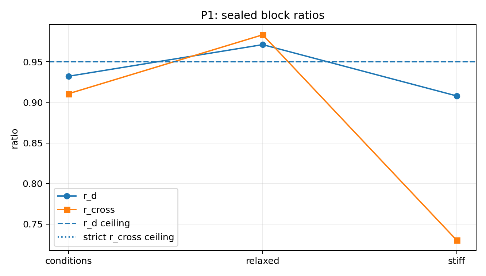
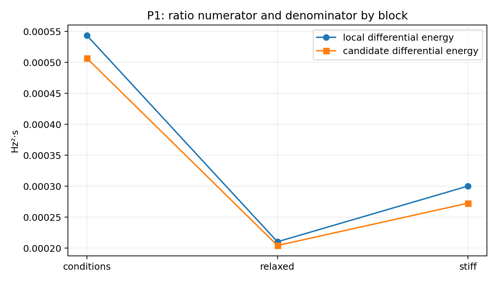
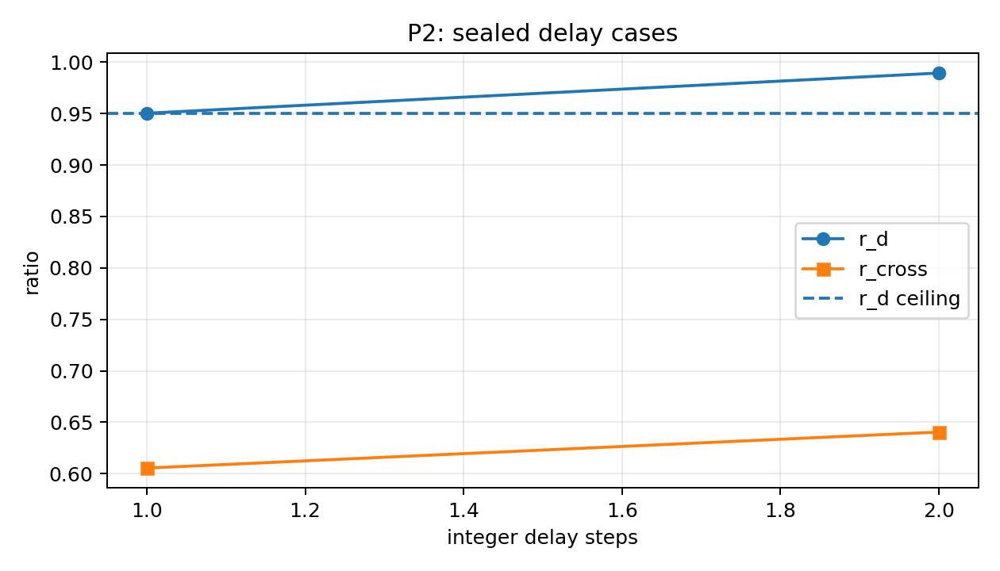
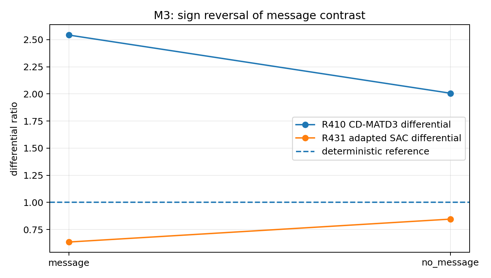
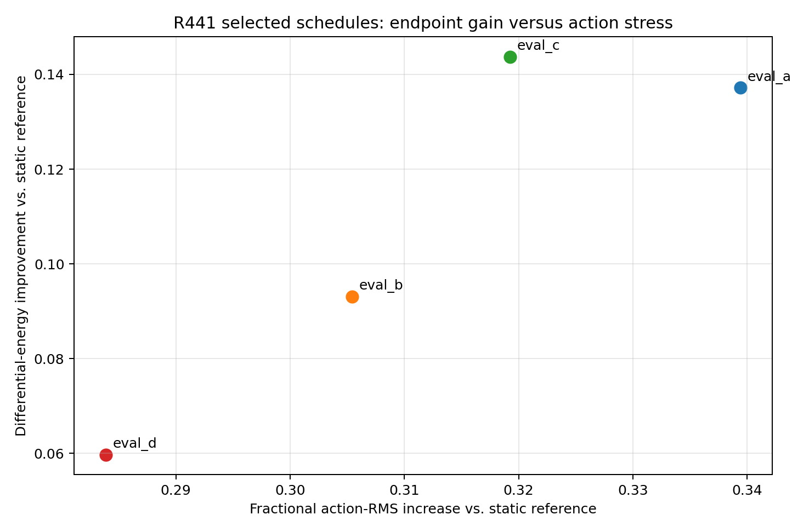

# Mathematical Advisory on Failure Mechanisms and Certifiable Claims

**Project:** Multi-agent reinforcement learning for paralleled virtual synchronous generators  
**Frozen evidence source:** `gpt_pro_math_pack_20260820.zip`  
**Governing brief:** `paper/yang_md_decoupling_marl/working/gpt_pro_failure_math_brief_2026-08-21.md`  
**Priority order:** P1, P2, P3, M3, M5, M4, M1, M2, C1  
**Camera-ready date supplied by the brief:** 2026-09-07  
**Artifact assembly date:** 2026-08-20

## Executive conclusion

The package supports three immediate, bounded paper-grade contributions. First, P1 yields an exact decomposition of the differential endpoint into candidate-response and local-reference sensitivities; it does **not** identify a gain-margin or phase-margin cause from the sealed spectra. Second, P2 yields an exact discrete-delay sensitivity law, while the sealed one- and two-step records establish endpoint failure with physical guards intact rather than instability. Third, P3 yields the exact index-1 DAE action channel $B_{u,r}=f_u-f_yg_y^{-1}g_u$ and a zero-channel condition at synchronous balance, but the implemented object remains unclassified until its Jacobians or centered finite differences are measured.

The mechanism items are deliberately predictive rather than causal conclusions. M3 localizes the message-sign puzzle to finite learning or non-nested implementation; M5 shows that the selected schedules are constant gain extensions rather than evidence for temporal scheduling; M4 gives the derivative conditions required for identity residual optimality; M1 explains multiplier pinning exactly at the update level; and M2 rules out a generic optimistic-bias story for twin-min targets while leaving critic instability as a testable contributor. C1 specifies the rigorous FIR-Youla/SLS route to a controller-class certificate, but the shipped solver explicitly lacks a formal dual certificate.

## Evidence discipline

Every experimental number in this report carries an evidence identifier such as `[P1-E19]` or `[M5-D01]`. The complete mapping is in `evidence/evidence_register.csv` and `evidence/evidence_register.json`, where each sealed value points to a source path and JSON Pointer and each derived value records its formula or source roots. `SEALED_JSON` means copied from a shipped JSON field; `DERIVED_FROM_SEALED_JSON` means mechanically computed from sealed values; `PACKAGE_SOURCE_CODE` means a package source excerpt; and `HYPOTHETICAL` means a proposed quantity or design not supplied by the package. The original source hashes were checked against the package manifest; the check log is `evidence/source_hash_verification.txt`.

Hard facts and interpretation are separated inside every problem. Mathematical assumptions are not empirical facts. A proposition remains conditional until the project executes its verification plan.

## Reading map

- The report body follows the brief's priority order exactly.
- `report/paper_ready_paragraphs_P1_P3.md` isolates the three bounded publication paragraphs.
- `report/one_page_summary.md` is the compact decision table reproduced at the end of this report.
- `report/limitations_and_missing_quantities.md` collects the minimum missing measurements.
- `verification/` contains executable checking recipes and the machine-readable mechanism-observable matrix.
- `evidence/json_pointer_catalog.tsv.gz` is the complete leaf-field catalog for the shipped JSON files.

## Evidence figures

{width=82%}

{width=82%}

{width=78%}

{width=82%}

{width=82%}

---

## P1 — Relaxed-plant failure block: what is and is not identified

**Type label: (P)**

### Headline result

The sealed evidence supports a paper-grade **ratio-sensitivity decomposition**, not a gain-margin or phase-margin diagnosis. The relaxed block fails because the fixed candidate achieves only a small reduction relative to that block's local reference; the package does not identify whether this comes from plant-loop sensitivity, movement of the local-reference denominator, or both. The channel-detuning explanation is separately refuted by R437.

### Hard facts

The constructive arm is `bandpass_k3p5` [P1-E01]. It records $r_d=0.9389467910702068$ and $r_{\mathrm{cross}}=0.5397906554502304$ in R408 [P1-E02–P1-E03], and $r_d=0.9382180713649944$ and $r_{\mathrm{cross}}=0.7937304481638234$ in the R409 held-out gate [P1-E04–P1-E05]. The R415 ceilings are $r_d\le 0.95$, $r_{\mathrm{cross}}\le 1.1$, with a strict cross ceiling of $0.95$ [P1-E06–P1-E08].

| R415 block | sealed $(M,D_i)$ | $r_d$ | local $E_d$ | candidate $E_d=r_dE_{d,L}$ | relative reduction $1-r_d$ | outcome |
|---|---:|---:|---:|---:|---:|---|
| conditions | $(200,100)$ [P1-E09–P1-E10] | 0.9322838738147555 [P1-E11] | 0.0005433139119660554 [P1-E13] | 0.0005065227985451632 [P1-D01] | 0.06771612618524447 [P1-D03] | pass [P1-E16] |
| relaxed | $(170,115)$ [P1-E17–P1-E18] | 0.9712251032133927 [P1-E19] | 0.00021018948180799598 [P1-E21] | 0.00020414130116334044 [P1-D04] | 0.028774896786607274 [P1-D06] | fail [P1-E24] |
| stiff | $(230,85)$ [P1-E25–P1-E26] | 0.907962726673478 [P1-E27] | 0.00030010287872978 [P1-E29] | 0.0002724822280540511 [P1-D07] | 0.092037273326522 [P1-D09] | pass [P1-E32] |

All three candidate guard bundles pass [P1-E15, P1-E23, P1-E31]. The three blocks do **not** use a matched disturbance/probe bank: their `condition_id` values differ under `results/research_loop/r415_energy_port_extra_banks/formal_analysis.json#/blocks/<block>/block/disturbance_conditions` and `#/probe_condition`. Consequently, differences across these rows are not finite differences with respect to $M$ or $D$.

R437 reports a relaxed-block peak at $0.44921875\,\mathrm{Hz}$ and a spectral-window fraction of $0.5866071101135871$ [P1-E34–P1-E35], versus passing-block peak frequencies $[0.33203125,0.390625]\,\mathrm{Hz}$ and window fractions $[0.5288535035245917,0.5034156773618179]$ [P1-E36–P1-E37]. Its registered mechanism verdict is `REFUTED` [P1-E38], with the stated reason that the relaxed spectrum remains inside the tested window in the same sense as the passing blocks [P1-E39].

### Assumption set

Let $\rho$ denote a scalar plant parameter or a differentiable path through $(M,D)$. Assume:

1. For a fixed disturbance/probe ensemble, the candidate and local-reference differential output maps $G_K(\mathrm{j}\omega;\rho)$ and $G_L(\mathrm{j}\omega;\rho)$ are differentiable in $\rho$.
2. The weighted energies $E_K(\rho)=\lVert G_K(\rho)\rVert_W^2$ and $E_L(\rho)=\lVert G_L(\rho)\rVert_W^2$ are positive, with the same nonnegative weighting operator $W$ and the same excitation ensemble.
3. The reported endpoint is $r_d(\rho)=E_K(\rho)/E_L(\rho)$.
4. The scalar-loop specialization below is used only when the measured candidate channel can be written as $G_K=P/(1+PK)$ with fixed $K$ and a well-posed loop.
5. The second-order swing transfer used later is **HYPOTHETICAL** until a reduced-model identification or Jacobian export is sealed.

### Proposition P1.1 — exact log-sensitivity decomposition

Under Assumptions 1–3,

$$
\frac{\partial \log r_d}{\partial \rho}
=
2\,\operatorname{Re}\frac{\langle G_K,\partial_\rho G_K\rangle_W}{\lVert G_K\rVert_W^2}
-
2\,\operatorname{Re}\frac{\langle G_L,\partial_\rho G_L\rangle_W}{\lVert G_L\rVert_W^2}.
$$

Equivalently,

$$
\partial_\rho r_d
=
\frac{\partial_\rho E_K}{E_L}
-r_d\frac{\partial_\rho E_L}{E_L}.
$$

#### Proof

Differentiate $r_d=E_K/E_L$ by the quotient rule. For $E(\rho)=\langle G(\rho),G(\rho)\rangle_W$, differentiability and Hermitian symmetry give $\partial_\rho E=2\operatorname{Re}\langle G,\partial_\rho G\rangle_W$. Dividing by $E_K$ and $E_L$ yields the log form. No control-specific approximation is used.

### Corollary P1.2 — fixed-controller scalar-loop contribution

Under Assumption 4, define $L=PK$ and $S=(1+L)^{-1}$. Then

$$
\partial_\rho\log G_K(\mathrm{j}\omega;\rho)
=S(\mathrm{j}\omega;\rho)\,\partial_\rho\log P(\mathrm{j}\omega;\rho).
$$

Thus the candidate-energy term in Proposition P1.1 is a weighted real projection of plant log-sensitivity through the **complex** sensitivity $S$; magnitude-only spectra do not determine it.

#### Proof

From $G_K=P(1+PK)^{-1}$ with fixed $K$,

$$
\partial_\rho\log G_K
=\partial_\rho\log P-\frac{PK}{1+PK}\partial_\rho\log P
=\frac{1}{1+PK}\partial_\rho\log P.
$$

### HYPOTHETICAL reduced-swing specialization

For the **HYPOTHETICAL** channel

$$
P_d(s;M,D)=\frac{b s}{M s^2+D s+\kappa},
$$

the logarithmic parameter derivatives are

$$
\frac{\partial\log P_d}{\partial\log M}
=-\frac{M s^2}{M s^2+D s+\kappa},\qquad
\frac{\partial\log P_d}{\partial\log D}
=-\frac{D s}{M s^2+D s+\kappa}.
$$

Inserted into Corollary P1.2, these expressions predict the frequency-resolved sign and strength of $M$/$D$ detuning **only after** the complex $S(\mathrm{j}\omega)$ and the matched local-reference sensitivity are measured.

### Interpretation, kept separate from fact

The sealed relaxed row is a **relative-performance** failure: its candidate differential energy is lower than the absolute candidate energies in the other two R415 rows [P1-D01, P1-D04, P1-D07], yet it is closer to its own local-reference energy and therefore exceeds the ratio ceiling. This does not prove that the local denominator caused the failure, because the disturbance/probe identities change with the block. It does prove that “the candidate's absolute differential energy became large” is not a valid description of the three-row table.

R437 removes one proposed explanation—coarse channel-frequency detuning within the registered spectral test—but it does not identify loop phase, gain crossover, Nyquist distance, or sensitivity peak. A PSD peak is not a stability-margin certificate.

### Evidence binding

All sealed and derived values used above are indexed in `evidence/evidence_register.csv`. The numerator reconstructions [P1-D01, P1-D04, P1-D07] are exact products of the corresponding sealed ratio and local energy. No value is back-filled across blocks. The swing transfer and its coefficients are explicitly marked **HYPOTHETICAL**.

### Verification plan

1. Re-run nominal, relaxed, and stiff $(M,D)$ settings on one **identical** signed disturbance/probe bank and one fixed simulation horizon. Preserve the same local-reference controller and normalization.
2. Export complex empirical frequency responses $G_K(\mathrm{j}\omega)$ and $G_L(\mathrm{j}\omega)$, not only PSD magnitudes. If the loop break is well-defined, also export $L(\mathrm{j}\omega)$.
3. Use central differences in $M$ and $D$ with a geometrically decreasing perturbation $h$ (**HYPOTHETICAL numerical design**) and verify convergence of both sides of Proposition P1.1.
4. Decompose the measured derivative into candidate and denominator terms. A candidate-loop mechanism is supported when the first term dominates reproducibly; a reference-normalization mechanism is supported when the second term dominates. Mixed dominance is admissible.
5. Compute phase margin or Nyquist distance only from a verified loop definition. Refute a claimed margin mechanism if the measured margin change has the wrong sign or cannot reproduce the endpoint derivative within uncertainty.

### Missing quantity and minimal experiment

The package lacks: (i) matched-block complex $G_K$ and $G_L$; (ii) a loop-broken complex $L$; (iii) matched finite differences in $M$ and $D$; and (iv) uncertainty estimates. The minimal experiment is a matched nominal/relaxed/stiff small-amplitude signed-probe sweep with complex response estimation for both the candidate and local reference. Without it, a margin-level causal explanation is not solvable from the shipped data.

### Paper-ready wording

For the fixed `bandpass_k3p5` controller, the relaxed R415 block is rigorously characterized as a relative-energy failure rather than an identified stability-margin failure. Writing the registered differential endpoint as $r_d=E_K/E_L$, where $E_K$ and $E_L$ are candidate and local-reference energies under a common excitation and weighting, gives the exact sensitivity identity $\partial_\rho\log r_d=2\operatorname{Re}\langle G_K,\partial_\rho G_K\rangle_W/\lVert G_K\rVert_W^2-2\operatorname{Re}\langle G_L,\partial_\rho G_L\rangle_W/\lVert G_L\rVert_W^2$. In the sealed relaxed block, $r_d=0.9712251032133927$ [P1-E19], while the reconstructed candidate and local energies are $0.00020414130116334044$ and $0.00021018948180799598\,\mathrm{Hz}^2\mathrm{s}$ [P1-D04, P1-E21], respectively; hence the controller supplies only a $0.028774896786607274$ relative reduction [P1-D06], below that required by the registered $0.95$ ceiling [P1-E06]. R437 separately refutes the registered spectral-detuning explanation [P1-E38]. Because the R415 blocks use different disturbance and probe identities and the package contains no complex loop response, these results do not identify an $M$/$D$ derivative, gain margin, phase margin, or universal robustness boundary; those require a matched complex-response finite-difference experiment.

---

## P2 — Discrete controller-delay boundary

**Type label: (P)**

### Headline result

A pure integer delay admits an exact phase-loss and sensitivity-amplification formula. The sealed R440 data establish only that the tested one-step and two-step implementations violate the differential endpoint while retaining the registered guards. They do not provide the complex nominal loop, crossover frequency, or a same-bank zero-delay case, so neither an analytic time-delay margin nor a causal phase-margin explanation can be numerically identified from the package.

### Hard facts

The differential ceiling is $0.95$ [P1-E06]. R440 records:

| delay | $r_d$ | excess above ceiling | $r_{\mathrm{cross}}$ | candidate/local $E_d$ | guards | unit outcome |
|---:|---:|---:|---:|---:|---|---|
| 1 step [P2-E01] | 0.9502787849106537 [P2-E02] | 0.0002787849106536955 [P2-D01] | 0.6055328645068879 [P2-E03] | 0.00039037026048215306 / 0.0004107955125177883 [P2-E06–P2-E07] | pass [P2-E04] | fail [P2-E05] |
| 2 steps [P2-E10] | 0.9893270595363578 [P2-E11] | 0.039327059536357845 [P2-D02] | 0.6405191344833928 [P2-E12] | 0.0004438716827728703 / 0.0004486602064446596 [P2-E15–P2-E16] | pass [P2-E13] | fail [P2-E14] |

The overall registered verdict is `BOUNDED-FAILURE` [P2-E19]. The physical duration represented by one step is not a sealed scalar in the R440 JSON files; any conversion from steps to seconds in this report would therefore be **HYPOTHETICAL** under the intake contract.

### Assumption set

Assume:

1. A scalar, well-posed, discrete-time negative-feedback loop has nominal complex loop transfer $L_0(e^{\mathrm{j}\Omega})$.
2. An integer computational delay of $n$ samples enters only as the multiplicative factor $e^{-\mathrm{j}n\Omega}$ in that loop; plant, controller coefficients, sampling, excitation, and endpoint denominator are otherwise unchanged.
3. The output channel of interest has a numerator unaffected by the delay, so its delay dependence is carried by the sensitivity denominator.
4. For the phase-margin corollary, a regular unit-gain crossover $\Omega_c$ and a locally dominant crossover exist. This is a local statement, not a global Nyquist certificate.
5. Converting sample delay to physical time requires a verified sample period; no numerical period is assumed here.

### Proposition P2.1 — exact integer-delay sensitivity ratio

Let

$$
S_n(e^{\mathrm{j}\Omega})
=\frac{1}{1+L_0(e^{\mathrm{j}\Omega})e^{-\mathrm{j}n\Omega}},
\qquad
L_0(e^{\mathrm{j}\Omega})=\ell(\Omega)e^{\mathrm{j}\phi(\Omega)}.
$$

Then, at every frequency where the loop is well posed,

$$
\frac{|S_n|^2}{|S_0|^2}
=
\frac{|1+L_0|^2}{|1+L_0e^{-\mathrm{j}n\Omega}|^2}
=
\frac{1+\ell^2+2\ell\cos\phi}
{1+\ell^2+2\ell\cos(\phi-n\Omega)}.
$$

If the measured output channel is $G_n=N S_n$ with delay-independent numerator $N$, the same identity holds for $|G_n/G_0|^2$.

#### Proof

Substitute the delayed loop into the sensitivity definition, take the squared modulus, and use $|1+\ell e^{\mathrm{j}\psi}|^2=1+\ell^2+2\ell\cos\psi$.

### Corollary P2.2 — infinitesimal delay direction

For a continuous delay parameter $\tau$ in $L_\tau(\mathrm{j}\omega)=L_0(\mathrm{j}\omega)e^{-\mathrm{j}\omega\tau}$,

$$
\frac{\partial}{\partial\tau}\log|S_\tau(\mathrm{j}\omega)|^2
=
-\frac{2\ell\omega\sin(\phi-\omega\tau)}
{1+\ell^2+2\ell\cos(\phi-\omega\tau)}.
$$

The sign is frequency- and phase-dependent. Delay is therefore not guaranteed to increase every weighted output energy monotonically, even though it reduces phase at each positive frequency.

### Corollary P2.3 — local phase-margin loss at a regular crossover

At a nominal unit-gain crossover $\Omega_c$, write the nominal loop phase as $-\pi+\mathrm{PM}_0$. The delayed local phase margin is

$$
\mathrm{PM}_n=\mathrm{PM}_0-n\Omega_c,
$$

and

$$
|S_n(e^{\mathrm{j}\Omega_c})|
=\frac{1}{2|\sin(\mathrm{PM}_n/2)|}.
$$

Under the additional single-crossover regularity assumptions, the local phase-margin boundary is $n=\mathrm{PM}_0/\Omega_c$. This is **not** the registered endpoint boundary: a weighted energy ratio may cross its ceiling while the loop remains stable, exactly as the R440 guard-passing rows allow.

### Endpoint-level consequence

For a fixed excitation weighting $W$ and a fixed local-reference denominator $E_L$, the delayed differential endpoint can be written

$$
r_d(n)=\frac{\lVert N S_n\rVert_W^2}{E_L}.
$$

Proposition P2.1 therefore converts a measured complex loop $L_0$ into a predicted endpoint curve. Without $L_0$, only the two sealed endpoint samples are known. In particular, comparing R440 to R408 would mix experiment banks and cannot supply the missing zero-delay value for this curve.

### Interpretation, kept separate from fact

The one-step result is a narrowly missed endpoint, not evidence of instability: the differential ratio exceeds the ceiling by the sealed amount [P2-D01] while all registered guards pass [P2-E04]. The two-step case moves farther above the ceiling [P2-D02], which is directionally consistent with phase loss but does not establish phase loss as the causal mechanism. The cross endpoint remains below its strict ceiling in both cases [P2-E03, P2-E12, P1-E08], so the observed boundary is differential-channel specific within this test.

### Evidence binding

All numerical statements are linked to `evidence/evidence_register.csv`. The excess values [P2-D01–P2-D02] are exact subtractions from the sealed $0.95$ ceiling. No zero-delay value, sample period, gain crossover, phase margin, or loop transfer is inferred. Any future physical-time conversion is **HYPOTHETICAL** until its timing field is sealed.

### Verification plan

1. Add a same-bank zero-delay record with the identical disturbances, probes, local reference, horizon, and endpoint code used by `delay_1.json` and `delay_2.json`.
2. Record the exact control sample period and the location of the delay in the signal path.
3. Break or identify the loop and export $L_0(e^{\mathrm{j}\Omega})$ as a complex array over the endpoint-relevant band.
4. Compute $S_n$ from Proposition P2.1 for each tested integer $n$, propagate it through the measured numerator, and predict $r_d(n)$ with no fitted phase offset.
5. Support the phase-loss mechanism if the predicted endpoint curve and measured same-bank curve agree within registered uncertainty and the inferred crossover phase decreases by $n\Omega_c$. Refute it if the complex-loop prediction has the wrong endpoint direction or cannot explain the measured change.
6. Report separately: endpoint boundary, local phase-margin boundary, and nonlinear/guard boundary. Do not substitute one for another.

### Missing quantity and minimal experiment

The missing quantities are the same-bank $n=0$ endpoint, the exact sample period, the complex nominal loop $L_0$, the output numerator/weighting map, and uncertainty across repeated runs. The minimal experiment is a registered integer-delay sweep including zero delay, accompanied by one complex loop-identification export. Without those quantities, the package supports an exact symbolic delay law and two bounded failure observations, but no numerical analytic delay margin.

### Paper-ready wording

For a fixed discrete-time feedback loop with nominal complex loop transfer $L_0(e^{\mathrm{j}\Omega})$, an integer delay of $n$ samples changes the sensitivity exactly to $S_n=(1+L_0e^{-\mathrm{j}n\Omega})^{-1}$, giving $|S_n/S_0|^2=(1+\ell^2+2\ell\cos\phi)/(1+\ell^2+2\ell\cos(\phi-n\Omega))$ for $L_0=\ell e^{\mathrm{j}\phi}$. At a regular unit-gain crossover, this corresponds locally to the phase-margin loss $\mathrm{PM}_n=\mathrm{PM}_0-n\Omega_c$; however, the registered energy endpoint may fail before any stability boundary is reached. In R440, the one-step and two-step cases yield $r_d=0.9502787849106537$ and $0.9893270595363578$ [P2-E02, P2-E11], respectively, both above the registered $0.95$ ceiling [P1-E06], while their no-harm guards remain satisfied [P2-E04, P2-E13]. These observations establish a bounded controller-delay failure of the differential endpoint, not an instability claim. Because the sealed files omit a same-bank zero-delay case, the physical sample period, and the complex loop response, they do not identify a numerical delay margin or prove that phase loss is the sole mechanism; those claims require the registered complex-response delay sweep specified here.

---

## P3 — First-order authority of multiplicative M/D feedback in the index-1 DAE

**Type label: (P)**

### Headline result

For a semi-explicit index-1 DAE, the effective first-order action channel is exactly

$$
B_{u,r}=f_u-f_y g_y^{-1}g_u.
$$

For the usual swing-equation structure at a synchronous power-balanced equilibrium, the direct derivatives with respect to inertia and damping vanish. If $M$ and $D$ also do not enter the algebraic equations, then $g_u=0$ and therefore $B_{u,r}=0$: algebraic elimination does not create first-order authority by itself. The package does not contain the actual ANDES DAE Jacobians or a finite-difference measurement, so whether the implemented Object A satisfies these conditions remains unresolved. The correct contribution is a conditional lemma plus an executable measurement recipe, not a claim that the channel is active or absent in the project plant.

### Hard facts

The environment interpolates the action-selected $M$ and $D$ values and writes them to `GENCLS` before each TDS substep [P3-S01]. Its diagnostic state derivative uses the package-source swing form

$$
\dot\omega_i=\frac{P_{m,i}-P_{e,i}-D_i(\omega_i-1)}{M_i}
$$

with a numerical denominator guard in code [P3-S02]. The imported theory audit states the reduced DAE channel $B_{u,r}=f_u-f_yg_y^{-1}g_u$ and explicitly records that the actual reduced/DAE Jacobians are not supplied [P3-S03]. These are package facts. No numerical value of $B_{u,r}$ is sealed.

### Assumption set

Let the local plant be represented near a registered equilibrium by

$$
\dot x=f(x,y,u),\qquad 0=g(x,y,u),
$$

where $x$ contains differential states, $y$ contains algebraic network variables after fixing the angle-reference gauge, and $u$ contains the multiplicative $M/D$ command coordinates. Assume:

1. $f$ and $g$ are continuously differentiable in a neighborhood of $(x_\star,y_\star,u_\star)$.
2. The gauge-fixed algebraic Jacobian $g_y(x_\star,y_\star,u_\star)$ is nonsingular; equivalently, the local DAE is index one on the selected active mode.
3. The controlled swing rows have the form
   $$
   f_{\omega_i}=\frac{P_{m,i}-P_{e,i}(x,y,u)-D_i(u)(\omega_i-\omega_s)}{M_i(u)}.
   $$
4. The equilibrium is synchronous and power balanced on those rows: $\omega_i=\omega_s$ and $P_{m,i}=P_{e,i}$.
5. Any projection, saturation, limiter, or feasibility map has one fixed differentiable active mode locally. If the active mode changes under the perturbation, the classical Jacobian proposition does not apply.

### Proposition P3.1 — index-1 Schur input channel

Under Assumptions 1–2, the locally reduced ODE obtained by eliminating $y$ has Jacobians

$$
A_r=f_x-f_y g_y^{-1}g_x,
\qquad
B_{u,r}=f_u-f_y g_y^{-1}g_u.
$$

#### Proof

By the implicit-function theorem, $g(x,h(x,u),u)=0$ defines $y=h(x,u)$ locally, with

$$
h_x=-g_y^{-1}g_x,\qquad h_u=-g_y^{-1}g_u.
$$

The reduced vector field is $F(x,u)=f(x,h(x,u),u)$. Applying the chain rule gives

$$
F_x=f_x+f_yh_x=f_x-f_yg_y^{-1}g_x,
$$

and

$$
F_u=f_u+f_yh_u=f_u-f_yg_y^{-1}g_u.
$$

### Proposition P3.2 — conditional zero first-order M/D authority

Under Assumptions 1–5, additionally suppose that:

- $M_i$ and $D_i$ enter no algebraic equation directly, so $g_u=0$ at the equilibrium; and
- $P_{m,i}$ and $P_{e,i}$ have no direct dependence on the $M/D$ command at fixed $(x,y)$.

Then the reduced first-order channel from the $M/D$ command is zero at the synchronous equilibrium:

$$
B_{u,r}=0.
$$

#### Proof

For each controlled swing row,

$$
\frac{\partial f_{\omega_i}}{\partial M_i}
=-\frac{P_{m,i}-P_{e,i}-D_i(\omega_i-\omega_s)}{M_i^2},
\qquad
\frac{\partial f_{\omega_i}}{\partial D_i}
=-\frac{\omega_i-\omega_s}{M_i}.
$$

Both derivatives vanish under Assumption 4. By the additional structural hypothesis, the remaining entries of $f_u$ vanish, and $g_u=0$. Proposition P3.1 then gives $B_{u,r}=0$.

### Exact routes by which $B_{u,r}$ can be nonzero

The proposition identifies the complete local routes:

1. **Direct differential route:** $f_u\ne0$. This occurs away from power balance, away from synchronous speed, when the action directly changes mechanical/electrical power, or when another differential row contains an additive action term.
2. **Algebraic Schur route:** $g_u\ne0$ and $f_yg_y^{-1}g_u\ne0$. This requires the action to enter algebraic power/current balance, a static converter relation, an active limiter equation, or another algebraic constitutive law. Merely having $f_y\ne0$ through electrical-power sensitivity is insufficient when $g_u=0$.
3. **Nonsmooth route:** an active-set change can produce a directional or generalized derivative even when the smooth-mode Jacobian is zero. That is a separate piecewise-smooth statement and must not be reported as the classical $B_{u,r}$.
4. **Gauge or singularity artifact:** using an unfixed angle gauge can make $g_y$ singular and the Schur expression undefined. A slack/reference condition or a projection to the balanced subspace is required before interpretation.

### Interpretation, kept separate from fact

The source structure makes a zero smooth channel plausible, because the action is written as $M/D$ parameters and the diagnostic swing derivative has the multiplicative form [P3-S01–P3-S02]. It is nevertheless not a measurement of the actual DAE Jacobian. In particular, the package does not expose the internal `GENCLS` algebraic residuals, network Jacobians, active-set derivatives, or the derivative of the feasibility-native action map. The correct current answer to “is $B_{u,r}$ nonzero for Object A?” is therefore **not identified from the shipped evidence**.

If Proposition P3.2 is verified, the local policy slope cannot create an additive first-order plant-state channel at the synchronous equilibrium through $M/D$ modulation; its leading effect is state-dependent/bilinear or higher order. If the finite-difference measurement instead finds a stable nonzero $B_{u,r}$ and the Schur reconstruction agrees, the project has identified the precise algebraic or direct route that completes the limitation in the ODE lemma.

### Finite-difference DAE verification plan

Let $e_j$ be one action coordinate and let $h$ be a decreasing perturbation magnitude (**HYPOTHETICAL numerical design**, to be registered against solver tolerance).

#### Direct reduced-channel measurement

For each $j$:

1. Freeze $x=x_\star$ and set $u_\pm=u_\star\pm he_j$.
2. Starting from $y_\star$, re-solve the algebraic equations $g(x_\star,y_\pm,u_\pm)=0$ with the same angle gauge and the same active mode.
3. Evaluate the differential residuals $f_\pm=f(x_\star,y_\pm,u_\pm)$ without advancing time.
4. Form
   $$
   \widehat B^{\mathrm{FD}}_{u,r}(:,j)=\frac{f_+-f_-}{2h}.
   $$
5. Repeat over a geometric $h$ sequence. A classical derivative is supported only if the estimate converges before solver noise dominates.

#### Independent Schur reconstruction

Measure $f_u,f_y,g_u,g_y$ by centered differences at the same equilibrium and form

$$
\widehat B^{\mathrm{Schur}}_{u,r}
=
\widehat f_u-
\widehat f_y\widehat g_y^{-1}\widehat g_u.
$$

Record the condition number and residual of the $g_y$ solves; never explicitly invert a poorly conditioned matrix. Compare $\widehat B^{\mathrm{FD}}_{u,r}$ with $\widehat B^{\mathrm{Schur}}_{u,r}$ column by column. Log action projection, saturation, limiter status, and algebraic active-set identity for every perturbation.

#### Decision rule

A nonzero smooth channel is supported when: (i) the centered derivative is stable over the registered $h$ range; (ii) it exceeds a preregistered numerical/noise bound; (iii) the Schur and direct estimates agree; and (iv) the active mode remains unchanged. It is refuted at the tested equilibrium when a registered upper confidence bound on every relevant entry or induced norm lies below the project’s materiality threshold. Both the numerical noise bound and materiality threshold are currently **HYPOTHETICAL** because no sealed values are provided.

### Reduced-model identifiability

Consider the deviation model

$$
\dot\theta=\omega,\qquad
M\dot\omega+D\omega+L\theta=B_w w+e.
$$

#### What is identifiable in principle

- With calibrated $w$, measured $(\theta,\omega,\dot\omega)$, known $M,D$, and persistently exciting probes, $L$ is identifiable on the angle-balanced subspace. The common angle is a gauge: $\theta$ and $\theta+c\mathbf 1$ are observationally equivalent when $L\mathbf 1=0$.
- Joint recovery of diagonal $M,D$ and $L$ is possible only if the stacked regressor has full column rank after imposing the gauge and structural constraints. Collinearity between $\dot\omega$, $\omega$, and $\theta$ destroys uniqueness.
- Symmetry $L=L^\top$, balance $L\mathbf 1=0$, and Laplacian sign structure are testable model restrictions, not facts to impose silently. Uncalibrated input scale creates an additional scaling ambiguity.

#### Residuals that should be reported

For an estimate $(\widehat M,\widehat D,\widehat L)$, report at least

$$
e_{\mathrm{dyn}}=B_ww-\widehat M\dot\omega-\widehat D\omega-\widehat L\theta,
$$

$$
e_{\mathrm{sym}}=\widehat L-\widehat L^\top,
\qquad
e_{\mathrm{bal}}=\widehat L\mathbf 1,
$$

plus out-of-sample trajectory prediction error and the smallest singular value of the constrained regressor. A claim that the exact-Laplacian premise is consistent with the plant should use a preregistered confidence set and model-error tolerance; small in-sample least-squares residual alone is not enough. Exact equality cannot be certified from noisy trajectories without a structural model or interval error bounds.

### Evidence binding

No experimental scalar is asserted for $B_{u,r}$ or the recovered $L$. The only implementation facts used are the package-source records [P3-S01–P3-S03]. All finite-difference step sizes, numerical tolerances, materiality thresholds, excitation amplitudes, and model-order choices are **HYPOTHETICAL** until registered and sealed.

### Missing quantity and minimal experiment

The package lacks the equilibrium residual vectors, $f_x,f_y,f_u,g_x,g_y,g_u$, algebraic conditioning, action-map derivative, active-mode log, and signed-probe trajectories with calibrated inputs. The minimal authority experiment is the equilibrium re-solve/centered-difference procedure above. The minimal identifiability experiment is a persistently exciting signed-probe record containing synchronized $w$, $\theta$, $\omega$, $\dot\omega$, operating-point metadata, and active-mode status, followed by constrained identification with held-out prediction.

### Paper-ready wording

For a continuously differentiable semi-explicit index-1 DAE $\dot x=f(x,y,u)$, $0=g(x,y,u)$ with nonsingular gauge-fixed $g_y$, algebraic elimination gives the exact reduced input Jacobian $B_{u,r}=f_u-f_yg_y^{-1}g_u$. For swing rows of the form $[P_m-P_e-D(\omega-\omega_s)]/M$, the direct derivatives with respect to $M$ and $D$ vanish at a synchronous power-balanced equilibrium. Hence, if the $M/D$ command does not enter the algebraic equations or any other differential residual directly, then $g_u=0$, $f_u=0$, and multiplicative $M/D$ feedback has no additive first-order reduced-state authority at that equilibrium. A nonzero first-order channel can arise only through direct action dependence, action-dependent algebraic balance, or a nonsmooth active-mode change. The present package confirms that the implementation updates live `GENCLS` $M/D$ parameters and uses the corresponding swing form [P3-S01–P3-S02], but it does not contain the actual ANDES Jacobians [P3-S03]. We therefore state the result conditionally and prescribe an equilibrium algebraic re-solve with centered finite differences, independently checked against the Schur reconstruction, before asserting whether the channel is active in Object A.

---

## M3 — Why neighbour information can look harmful in one learner and useful in another

**Type label: (M)**

### Headline result

Under exact population optimization, adding neighbour observations cannot reduce optimal value when the message-enabled policy class contains the no-message class. Therefore the negative R410 message contrast is not a theorem about the intrinsic value of the information. It must be attributed to finite-sample estimation, optimization, non-nested implementation, distribution shift, or reward/critic-induced gradient interference. R438 gives bounded evidence that the adapted-SAC differential benefit is observation-channel leaning; it does not resolve the off-diagonal mechanism.

### Hard facts

In R410, the CD-MATD3 message arm has differential/off-diagonal ratios $2.5427448906909156$ and $5.256929868426683$ relative to the deterministic reference [M3-E01–M3-E02], while the no-message arm has $2.006340749241337$ and $2.9462537319949704$ [M3-E03–M3-E04]. The registered message improvements over no-message are negative: $-0.2673544569397846$ for differential energy and $-0.7842760151099087$ for off-diagonal energy [M3-E05–M3-E06].

In R431, the adapted-SAC message arm has ratios $0.6347436524354518$ and $0.5900367008463987$ [M3-E07–M3-E08], compared with $0.8459633377917004$ and $0.8959790096545148$ for no-message [M3-E09–M3-E10]. Its registered improvements over no-message are positive: $0.24967947890935285$ and $0.3414614689758034$ [M3-E11–M3-E12].

R438 records observation-only medians $0.0005160439825440163$ and $0.00006809853001321975$ [M3-E13–M3-E14], reward-only medians $0.0007094475978791034$ and $0.00009068492411745009$ [M3-E15–M3-E16], and sealed message/no-message anchors [M3-E17–M3-E20]. Its registered side classifications are: observation-only is on the message side for the differential endpoint but on the no-message side for off-diagonal response; reward-only is on the no-message side for both [M3-E21–M3-E24]. The registered verdict is `BOUNDED-UNCLASSIFIED` [M3-E25].

### Assumption set

Let $X$ denote own-state information, $N$ neighbour information, $A$ the action, and $R$ the return under a fixed evaluation distribution. Assume:

1. The message-enabled policy class $\Pi_{X,N}$ contains a realization that ignores $N$ and reproduces every policy in $\Pi_X$.
2. The population comparison uses the same dynamics, reward, action constraints, and evaluation distribution.
3. “Value” is maximized; for cost notation, signs are reversed consistently.
4. Any claim about the observed trained policies additionally depends on finite data, the optimizer, critic architecture, regularization, and message-mask implementation.

### Result M3.1 — nonnegative population information value

Define

$$
V_X^*=\sup_{\pi\in\Pi_X}J(\pi),\qquad
V_{X,N}^*=\sup_{\pi\in\Pi_{X,N}}J(\pi).
$$

Under Assumptions 1–3,

$$
V_{X,N}^*-V_X^*\ge 0.
$$

#### Proof

By nesting, every $\pi\in\Pi_X$ is feasible in $\Pi_{X,N}$ through the realization that ignores $N$. Taking the supremum over the larger set cannot reduce the optimum.

### Result M3.2 — finite-learner sign decomposition

For a trained estimator, write schematically

$$
J(\widehat\pi_{X,N})-J(\widehat\pi_X)
=
\underbrace{V_{X,N}^*-V_X^*}_{\Delta_{\mathrm{info}}\ge0}
-
\underbrace{\Delta_{\mathrm{estimation}}}_{\text{finite data}}
-
\underbrace{\Delta_{\mathrm{optimization}}}_{\text{training}}
-
\underbrace{\Delta_{\mathrm{implementation}}}_{\text{non-nesting / masking / distribution}}.
$$

This is an accounting identity after defining each excess-value term relative to its population optimum. A negative trained contrast is possible even though $\Delta_{\mathrm{info}}\ge0$.

### Mechanism prediction

Neighbour masking should improve a finite learner when the following two conditions hold together:

1. **Low conditional task value:** neighbour variables are approximately redundant for the relevant action-value gradient, e.g.
   $$
   \operatorname{Var}\!\left(\mathbb E[\nabla_a Q(X,N,A)\mid X,N]\mid X\right)
   $$
   is small on the training/evaluation support.
2. **Positive complexity or interference cost:** adding $N$ increases estimation variance, worsens conditioning, creates spurious correlations, or causes shared-feature gradients from common and differential cost heads to interfere.

Conversely, neighbour access should help when it changes the conditional action-value gradient in a reproducible way and the actor/critic can represent that dependence without destructive sharing. A common-frequency penalty can make neighbour information useful as an estimate of coherent drift, but the current files do not contain learned feature maps, head gradients, or conditional mutual-information estimates. That explanation remains interpretation, not sealed fact.

### Interpretation, kept separate from fact

The R410/R431 sign reversal is consistent with an architecture-dependent finite-learning effect. It is not evidence that “messages are harmful” for CD-MATD3 in principle or “messages are always useful” for SAC. The strongest package-supported statement is narrower: the observation channel carries the R438 differential-side shift, whereas the off-diagonal endpoint does not separate under the registered isolation [M3-E21–M3-E25].

The proposed confusability account—joint/common-differential critics treating neighbour drift as own-state drift—would require direct evidence from channel-specific gradients or representation probes. Nothing in the sealed endpoint tables identifies that internal cause.

### Evidence binding

Every numerical contrast above is a sealed JSON field indexed in `evidence/evidence_register.csv`. No cross-family value is treated as a controlled causal contrast: R410 and R431 differ in learner family and training design. The factorial arm counts and any new sample sizes below are **HYPOTHETICAL DESIGN** quantities until registered.

### Mechanically checkable observable list

| observable | sealed file and field | supports the prediction when | refutes or weakens it when |
|---|---|---|---|
| CD message sign | `results/research_loop/r410_message_repair/endpoint_table.json#/full_method_improvement_vs_comparators/cd_matd3_no_message/*` | both values remain negative under exact recomputation [M3-E05–M3-E06] | either registered contrast changes sign |
| adapted-SAC message sign | `results/research_loop/r431_sac_slew/formal_analysis.json#/b1_table/message_improvement_vs_comparators/cd_matd3_no_message/*` | both values remain positive [M3-E11–M3-E12] | either registered contrast changes sign |
| observation-channel differential attribution | `results/research_loop/r438_sac_message_channels/formal_analysis.json#/classification/channel_sides/sac_obs_only/disturbance` | field is `message` [M3-E21] and paired uncertainty excludes the no-message anchor | field changes to `no_message`, or precision shows no separation |
| reward-channel attribution | same file, `#/classification/channel_sides/sac_rew_only/*` | a reward-only arm moves to the message side | both remain `no_message` [M3-E23–M3-E24], as currently observed |
| off-diagonal observation value | same file, `#/classification/channel_sides/sac_obs_only/off_diagonal` | actor/critic message access moves this field to `message` under a registered repeat | field remains `no_message` [M3-E22] with adequate power |
| finite-learning penalty | new logs: train/validation TD loss, actor-gradient variance, feature condition number, message-shuffle placebo | message access increases variance/conditioning cost while population or oracle value is nonnegative | negative endpoint contrast persists without any measurable estimation/optimization penalty and under verified nested exact optimization |

### Minimal discriminating experiment

Use a **HYPOTHETICAL** complete binary factorial with three controlled factors: neighbour access to the actor, neighbour access to the critic, and neighbour-dependent reward terms. Hold replay generation, seeds, network capacity, optimization budget, masks, and evaluation profiles fixed. The factor effects have distinct interpretations:

- actor-access effect: execution-time coordination value;
- critic-access effect: representation/credit-assignment value;
- reward effect: objective semantics;
- interactions: message value that exists only under a particular reward or critic architecture.

Add a shuffled-neighbour placebo with identical marginal statistics. For the off-diagonal endpoint, support an observation-value mechanism only if true neighbour access beats both no-message and shuffled-message arms with paired uncertainty, while the reward-only contrast remains absent. This extends R438 without re-labelling its current non-separation as a causal result.

### Missing quantity and minimal data addition

Missing quantities are paired uncertainty for the R438 side assignment, actor-versus-critic message access, channel-specific critic gradients, representation conditioning, and a shuffled-message placebo. The minimal data addition is the registered factorial above with per-seed/per-profile endpoint records and gradient diagnostics. Until then, M3 remains a falsifiable mechanism prediction with medium confidence, not a theorem about the two algorithm families.

---

## M5 — Headroom reinterpretation and endpoint/action-stress Pareto problem

**Type label: (M)**

### Headline result

R439/R441 do not demonstrate value from time variation. Every selected schedule repeats the same gain pair in every segment, so the measured improvement is attributable to admitting the constant point $(3.0,3.0)$, not to switching gains over time. The four measured winners improve both registered endpoints but violate both action-stress guards while retaining the common-mode guards. This establishes four trade-off anchors, not a theorem that endpoint improvement must always cost excessive action stress and not the minimum action cost of meeting an endpoint target.

### Hard facts

R416 is classified `STOP-NO-JOINT-HEADROOM` and selects `local_neighbour_md_km3_kd2` as the deterministic arm [M5-E01–M5-E02]. R439 labels its result `TIMEVARYING-HEADROOM` [M5-E03], while the guard-completed R441 verdict is `GUARD-VIOLATED` [M5-E04].

| profile | selected schedule | differential improvement | off-diagonal improvement | action-RMS increase | action-TV increase | action guards | common guards |
|---|---|---:|---:|---:|---:|---|---|
| eval_a | repeated $(3.0,3.0)$ over the sealed winner segments [M5-E05–M5-E06] | 0.13719266027037047 [M5-E11] | 0.09281086358168435 [M5-E12] | 0.3394156825203998 [M5-D01] | 0.16899847661301637 [M5-D02] | both fail [M5-E17–M5-E18] | all pass [M5-E19] |
| eval_b | repeated $(3.0,3.0)$ [M5-E20–M5-E21] | 0.09311866561826639 [M5-E26] | 0.0966897230065917 [M5-E27] | 0.3054177484189673 [M5-D03] | 0.11398274673152176 [M5-D04] | both fail [M5-E32–M5-E33] | all pass [M5-E34] |
| eval_c | repeated $(3.0,3.0)$ [M5-E35–M5-E36] | 0.143736943334306 [M5-E41] | 0.07575578747671269 [M5-E42] | 0.31924940821117165 [M5-D05] | 0.10490567603259549 [M5-D06] | both fail [M5-E47–M5-E48] | all pass [M5-E49] |
| eval_d | repeated $(3.0,3.0)$ [M5-E50–M5-E51] | 0.05973305995977649 [M5-E56] | 0.11929675168582977 [M5-E57] | 0.2838636502124663 [M5-D07] | 0.14318746310705066 [M5-D08] | both fail [M5-E62–M5-E63] | all pass [M5-E64] |

R439 reports `candidates_tested = 350` for each profile [M5-E65–M5-E68], but its profile files retain only the static point and the selected winner, not the action-stress records for all tested candidates. R441 re-runs only those winners. Therefore the existence of a lower-stress endpoint-improving schedule is untested.

### Assumption set

1. A schedule is a sequence of piecewise-constant gain pairs applied to one fixed plant/profile with no hidden state reset at segment boundaries.
2. Two schedules that apply the same gain pair at every segment are dynamically equivalent to the corresponding constant-gain law, apart from implementation artifacts that must be separately logged.
3. Endpoint and action metrics are evaluated on the same trajectory, horizon, profile, actuator map, and guard definitions.
4. The linear lower bound below is local and **HYPOTHETICAL** until the relevant response operator is identified.

### Result M5.1 — constant-schedule equivalence

Let a segmented controller apply gains $g_1,\ldots,g_K$. If $g_k=g_\star$ for every segment and the controller has no segment-boundary reset, then its closed-loop input and state trajectory are identical to those of the constant controller $g(t)\equiv g_\star$ for the same initial condition and disturbance.

#### Proof

At every time, both implementations evaluate the same control law with the same gain and the same state. Uniqueness of the closed-loop trajectory gives equality. Segment labels do not alter the dynamics under Assumptions 1–2.

#### Corrected theorem-level phrasing for RQ2

> On the four sealed R439/R441 evaluation profiles, expanding the candidate class to include the constant gain pair $(3.0,3.0)$ yields lower differential and off-diagonal endpoint energies than the R416 static reference, but the selected point violates the registered action-RMS and action-variation no-harm guards. The experiment provides no evidence that temporal gain variation is beneficial, because every selected segmented schedule is constant across segments.

This statement is limited to the sealed profiles, candidate generator, and guard implementation.

### Result M5.2 — conditional minimum-action lower bound

Consider a local linear response model

$$
z=z_0+G_{zu}u,
$$

where $z_0$ is the uncontrolled or reference residual, $u$ is the incremental action sequence, and $G_{zu}$ is the finite-horizon action-to-residual operator. If a target requires

$$
\lVert z\rVert_2^2\le \gamma\lVert z_0\rVert_2^2,
\qquad 0\le\gamma<1,
$$

then every feasible action satisfies

$$
\lVert u\rVert_2
\ge
\frac{(1-\sqrt\gamma)\lVert z_0\rVert_2}{\lVert G_{zu}\rVert_2}.
$$

#### Proof

The reverse triangle inequality gives

$$
\lVert G_{zu}u\rVert_2
=\lVert z-z_0\rVert_2
\ge \lVert z_0\rVert_2-\lVert z\rVert_2
\ge(1-\sqrt\gamma)\lVert z_0\rVert_2.
$$

Since $\lVert G_{zu}u\rVert_2\le\lVert G_{zu}\rVert_2\lVert u\rVert_2$, the result follows.

This proves only that a strict cancellation target requires nonzero action when the response operator is bounded. It does **not** prove that the registered action guard must be violated, that the measured $(3.0,3.0)$ point is action-minimal, or that all nonlinear controllers share the same trade-off. No sealed $G_{zu}$ norm is available, so no numerical lower bound can be evaluated.

### Pareto formulation

For profile $p$, let $E_d(u,p)$ and $E_x(u,p)$ denote the differential and off-diagonal energies, and let $A_{\mathrm{rms}}(u,p)$ and $A_{\mathrm{tv}}(u,p)$ denote action stress. Define the feasible set

$$
\mathcal F_p(\bar E_d,\bar E_x)=
\left\{
 u\in\mathcal U:
 E_d(u,p)\le\bar E_d,
 E_x(u,p)\le\bar E_x,
 \text{all common, validity, and actuator guards pass}
\right\}.
$$

The minimum stress at the target is

$$
A_{\min,p}(\bar E_d,\bar E_x)
=
\inf_{u\in\mathcal F_p(\bar E_d,\bar E_x)}
\bigl(A_{\mathrm{rms}}(u,p),A_{\mathrm{tv}}(u,p)\bigr),
$$

interpreted as a two-objective Pareto minimum or scalarized with preregistered weights. The four R441 winners are feasible for endpoint improvement and common-mode guards but infeasible for the action no-harm constraints [M5-E17–M5-E19, M5-E32–M5-E34, M5-E47–M5-E49, M5-E62–M5-E64]. They are anchor points only.

### Interpretation, kept separate from fact

Larger gains plausibly produce larger parameter excursions and stronger differential-response shaping, so a positive endpoint/action correlation is physically reasonable. The present data cannot separate gain magnitude from schedule structure, nor can they establish monotonicity or a lower frontier. In particular, all winners use the largest sealed selected gain pair and all violate action stress; this pattern motivates a trade-off hypothesis but does not prove structural necessity.

### Evidence binding

All endpoint, schedule, action, and guard values are sealed or exact ratios of sealed fields in `evidence/evidence_register.csv`. The proposed response operator, target parameter $\gamma$, scalarization weights, and any exhaustive grid cardinality are **HYPOTHETICAL**. The brief’s grid description is recorded as design context, but the numerical search-space formula is not treated as a sealed JSON fact [M5-H01].

### Mechanically checkable observable list

| observable | sealed file and field | supports the stated mechanism | refutes or narrows it |
|---|---|---|---|
| temporal variation actually selected | `results/research_loop/r441_timevarying_guard/profiles/eval_*.json#/winner_candidate` | at least one adjacent segment differs | every segment is identical, as currently sealed [M5-E06, M5-E21, M5-E36, M5-E51] |
| endpoint headroom | same files, `#/guards/r_d_improvement` and `#/guards/r_cross_improvement` | both are positive | either is nonpositive |
| measured action trade-off | same files, `#/static/action_*`, `#/winner/action_*`, and `#/guards/action_stress_no_harm/*` | winner stress rises and guards fail | a winner improves endpoints while both action guards pass |
| common-mode separation | same files, `#/guards/common_no_harm/*` | all common guards pass while action guards fail | common guards fail in the same winner, confounding the interpretation |
| structural lower bound | new identified $G_{zu}$ and trajectory residuals | observed minimum action approaches or exceeds the bound over a registered local region | a feasible action violates the bound, indicating model/normalization error |
| lower-stress winner existence | fresh all-candidate guard table | at least one endpoint-eligible candidate dominates the winner in stress and passes guards | exhaustive registered evaluation finds none in the bounded class |

### Minimal follow-up experiment

Reconstruct the exact R439 candidate generator, then evaluate **every generated candidate** on every profile with the complete R441 record schema: endpoint energies, common-frequency IAE, worst peak, RoCoF, action RMS, action total variation, saturation, slew, validity, and active projection status. The sealed generator reports 350 tested candidates per profile [M5-E65–M5-E68], but candidate-level action records are absent, so fresh simulations are required.

The primary output should be a nondominated table, not a single winner. Register two queries before execution:

1. Does any candidate meet the endpoint targets and all no-harm guards?
2. Conditional on meeting the endpoint targets, what are the minimum action RMS and minimum action variation, and are they attained by a constant or genuinely varying schedule?

### Missing quantity and minimal data addition

Missing quantities are action stress for non-winning schedules, candidate-level guard results, an identified local $G_{zu}$, and uncertainty/repeatability. The minimal data addition is the complete all-candidate R441-style table. Until that table exists, “no lower-stress winner exists” and “endpoint improvement necessarily costs the observed action increase” are unsupported.

---

## M4 — Residual SAC near the verified energy-port anchor

**Type label: (M)**

### Headline result

The sealed experiment establishes practical collapse to the anchor, but the proposed proof “all reward terms are non-positive, therefore zero residual is a local maximum” is not valid without stronger conditions. Zero residual is stationary only when the first variation of the soft action value vanishes on the residual-policy tangent space; local optimality additionally requires nonpositive curvature of return. The current package contains endpoint summaries, not the required local gradients or Hessians, so identity can be described as an observed attractor and tested mechanism, not a derived optimum of the implemented SAC objective.

### Hard facts

R436 is classified `NO-LEARNING-INCREMENT` [M4-E01]. The deterministic bandpass passes all sealed variants [M4-E02], while neither residual arm has any variant listed as beyond the deterministic anchor [M4-E03–M4-E04]. At nominal conditions, the bandpass has $(r_d,r_{\mathrm{cross}})=(0.9389467910702068,0.5397906554502304)$ [M4-E05–M4-E06]. The message residual has nominal medians $(0.9398009144308567,0.5405310760841595)$ [M4-E07–M4-E08], and the no-message residual has $(0.9376199350112616,0.5397064161558028)$ [M4-E09–M4-E10].

Across all sealed variants, the maximum absolute median deviation from the bandpass is $0.0008902254251293984$ in $r_d$ and $0.002347966350935149$ in $r_{\mathrm{cross}}$ for the message residual [M4-D01–M4-D02], and $0.0014429314998225529$ and $0.0011200990341657113$ for the no-message residual [M4-D03–M4-D04]. These are endpoint-proximity facts; they are not policy-gradient measurements.

The package SAC implementation uses twin critics, a minimum target, and the actor loss

$$
\mathcal L_\pi=\mathbb E[\alpha\log\pi(a\mid s)-\min(Q_1(s,a),Q_2(s,a))]
$$

at `src/andes_rl_kundur/agents/sac.py` lines 72–100. This is package-source evidence, not a numerical experiment field.

### Assumption set

Let $a_0(s)$ be the deterministic anchor and let $v$ denote a finite-dimensional residual-policy perturbation, so $a=a_0+v$ locally. Assume:

1. The active projection/actuator mode remains fixed and the expected discounted physical return $J(v)$ is twice differentiable at $v=0$.
2. The residual-policy tangent cone at identity is $\mathcal T$.
3. For the SAC statement, the critic is differentiable in action and the policy reparameterization is differentiable; nondifferentiability of $\min(Q_1,Q_2)$ is handled by a selected active critic or a subgradient.
4. Critic approximation error is distinguished from the true physical return.

### Result M4.1 — exact local-optimality condition

Suppose

$$
J(v)=J(0)+g^\top v+\frac12v^\top H v+o(\lVert v\rVert^2).
$$

A necessary first-order condition for identity to be a local maximum is

$$
g^\top d\le0\quad\text{for every }d\in\mathcal T.
$$

If $\mathcal T$ is a linear space, this reduces to the projected-gradient condition $\Pi_{\mathcal T}g=0$. A sufficient strict condition is

$$
d^\top H d<0\quad\text{for every nonzero }d\in\mathcal T
$$

in addition to stationarity.

#### Proof sketch

For any feasible direction $d$, apply the expansion to $v=td$ as $t\downarrow0$. A positive directional derivative contradicts local maximality. If the first variation vanishes and the quadratic form is strictly negative on every feasible nonzero direction, the second-order term dominates the remainder in a sufficiently small neighborhood.

### Result M4.2 — SAC mean-residual stationarity

For a location-type residual policy $a=a_0+m_\theta(s)+L_\theta(s)\varepsilon$, the reparameterized mean-gradient of the actor loss at identity contains

$$
\nabla_\theta\mathcal L_\pi
=
\mathbb E\!\left[
J_{m,\theta}(s)^\top
\left(
\alpha\nabla_a\log\pi(a\mid s)-\nabla_a Q_{\min}(s,a)
\right)
\right]
+\text{direct entropy/covariance terms}.
$$

For a Gaussian location family with fixed covariance, entropy is independent of the mean, so zero mean residual is stationary only if

$$
\mathbb E[J_{m,\theta}^\top\nabla_aQ_{\min}]=0.
$$

A bounded or non-positive reward does not imply this equality.

### Why the non-positive-penalty argument is insufficient

If each reward term has the special form $-q_k(v)$ with $q_k(v)\ge0$, $q_k(0)=0$, and the future state distribution is fixed, then $v=0$ is indeed a pointwise maximizer. The implemented control problem is different: changing $v$ changes the future trajectory and can reduce frequency penalties even if it increases an action-related penalty. Moreover, “all terms are non-positive” provides an upper bound on reward values, not the sign of the derivative at the anchor. The conjecture becomes valid only after verifying zero first variation and negative curvature of the full discounted return, including state-distribution effects.

### Interpretation, kept separate from fact

The endpoint proximity is consistent with at least four mechanisms:

- the anchor is genuinely locally optimal in the residual class;
- the critic learns an approximately flat action-value landscape near the anchor;
- projection or action scaling suppresses the residual;
- finite training and entropy tuning fail to discover a small improvement direction.

The current files do not distinguish these cases. Calling identity a “fixed point” is safe only as an empirical training outcome unless the update vector field at the saved checkpoint is measured.

A reward difference $r(a_0+v)-r(a_0)$ subtracts a state-dependent or constant baseline. When the subtracted term is action-independent, it leaves the exact policy gradient unchanged and cannot create a missing improvement direction. Potential-based shaping can change learning transients while preserving optimal policies, but it does not make a physically dominated identity policy optimal or nonoptimal by itself.

### Evidence binding

All reported endpoint values and maximum deviations are sealed or exact computations from `results/research_loop/r436_energy_residual_sac/formal_analysis.json`, indexed in `evidence/evidence_register.csv`. No gradient, Hessian, entropy coefficient, perturbation amplitude, or confidence threshold is inferred. Such quantities are **HYPOTHETICAL** until measured and sealed.

### Mechanically checkable observable list

| observable | sealed/new file and field | supports identity-local-optimum mechanism | refutes or weakens it |
|---|---|---|---|
| endpoint collapse | R436 `#/classification/beyond_deterministic_variants/*` and `#/variants/*` | lists remain empty and deviations stay near zero [M4-E03–M4-E04, M4-D01–M4-D04] | a residual arm reproducibly exceeds the anchor on a registered variant |
| true return first variation | new symmetric perturbation file: return at $+\epsilon d$, $0$, $-\epsilon d$ | centered slope is statistically zero in every registered tangent direction | any direction has a reproducible positive return slope |
| local curvature | same file, second differences | curvature is negative in every material feasible direction | a positive-curvature or improving direction exists |
| critic action gradient | saved checkpoint diagnostic: `grad_a_q1`, `grad_a_q2`, active-min critic, projection Jacobian | projected expected gradient is near zero and stable across seeds | critic predicts a substantial improving residual that the actor does not follow |
| update fixed point | checkpoint-before/after actor parameters and optimizer state | one update produces no material parameter/action change | update moves away from zero residual |
| projection suppression | raw residual, projected action, active-set log | raw residual is nonzero but projection maps it near the anchor | raw and projected residuals agree, eliminating projection as the cause |

### Minimal discriminating experiment

At each sealed R436 checkpoint, select a registered orthonormal basis of residual-action directions. Evaluate paired trajectories at $\pm\epsilon d$ around the anchor with common random numbers, repeat over a decreasing **HYPOTHETICAL** $\epsilon$ sequence, and store physical return, each reward component, endpoint energies, projection mode, and action stress. In parallel, export the twin-critic action gradients and one actual actor update. This single experiment separates physical local optimality, critic flatness/error, actor optimization failure, and projection suppression.

### Missing quantity and minimal data addition

The missing quantities are the true-return directional derivatives, curvature, critic action gradients, actor update vector, entropy/covariance contribution, and action-projection Jacobian. The minimal addition is the symmetric local perturbation plus checkpoint-gradient audit above. Without it, the exact identity-optimality condition is known mathematically, but its premises are not verified for R436.

---

## M1 — Why the sign-corrected projected dual stays at its ceiling

**Type label: (M)**

### Headline result

For the registered projected dual-ascent rule, an upper-bound multiplier is an absorbing state exactly while the corresponding constraint residual is nonnegative. The sealed R425 and R427 traces have positive residuals throughout their recorded ranges and all stored multipliers equal the ceiling, so the pinning is mechanically consistent with persistent constraint violation. Fixed-step overshoot can explain arrival at the ceiling but cannot explain remaining there when the residual becomes negative. The pinning is not an infeasibility certificate because the actor problem is nonconvex and the multiplier ceiling truncates the ordinary Lagrange dual.

### Hard facts

R425 seals a multiplier step of $0.05$, ceiling $10.0$, and RMS/TV harm factors $1.1$ [M1-E01–M1-E04]. Across the six R425 CD runs, the RMS residual has minimum/median/maximum $1.1145563318348541$, $3.786856718685509$, and $10.056334414179936$ [M1-D01–M1-D03]; the TV residual has $2.8535241133927607$, $4.313138369072675$, and $6.744472047011522$ [M1-D04–M1-D06]. Every stored RMS and TV multiplier equals the sealed ceiling [M1-D07].

For R427, the RMS residual range summary is $0.9425266037414739$, $3.750649846553069$, and $12.14764007163069$ [M1-D08–M1-D10]; the TV summary is $2.8400944051296677$, $4.292259382470758$, and $6.6992488752983546$ [M1-D11–M1-D13]. Again every stored multiplier equals the ceiling [M1-D14]. These aggregates are exact calculations over the six named `guard_multiplier_readout` run objects listed in `evidence/m1_aggregate_source_roots.json`.

### Assumption set

For one constraint, assume the registered update is

$$
\mu_{k+1}=\Pi_{[0,U]}\bigl(\mu_k+\eta g_k\bigr),
$$

where $\eta>0$, $U>0$, $g_k$ is positive when the constraint is violated, and $\Pi$ denotes Euclidean projection. The actor/primal update may be nonconvex and stochastic. The two registered constraints follow the same rule componentwise.

### Result M1.1 — exact ceiling-persistence condition

If $\mu_k=U$, then

$$
\mu_{k+1}=U\quad\Longleftrightarrow\quad g_k\ge0.
$$

If $g_k<0$, the next multiplier is strictly below $U$.

#### Proof

At the ceiling, the unprojected update is $U+\eta g_k$. For $g_k\ge0$ it lies at or above $U$, so projection returns $U$. For $g_k<0$ it lies below $U$; projection can return a point in $[0,U)$ but never $U$.

### Corollary M1.2 — what fixed-step overshoot can and cannot do

A finite step can cause an iterate with $\mu_k<U$ to overshoot and project to $U$. Once at $U$, however, any negative residual must make the multiplier leave the ceiling on the next update. Therefore persistent exact pinning together with persistently positive residuals is the expected projected-ascent behavior, not a numerical paradox.

### Mechanism prediction

The most direct explanation of R425/R427 is **primal non-response**: the learned actor does not move into the guard-feasible set, so positive residuals keep the dual at the cap. Several causes remain possible beneath that label:

- the bounded policy class cannot satisfy the guards on the training distribution;
- a feasible policy exists but the nonconvex actor optimizer cannot find it;
- constraint gradients are weak, noisy, or opposed to endpoint gradients;
- aggregate multipliers hide profile-specific violations;
- projection or action mapping makes the actor insensitive to the penalized direction;
- the cap is too small to materially alter the actor objective.

The sealed data identify the update-level reason for pinning but not which primal cause applies.

### KKT and certificate boundary

For an unconstrained multiplier and a convex problem satisfying a constraint qualification, KKT conditions link primal feasibility, stationarity, and complementary slackness. Those premises are not established here. The imposed ceiling replaces the dual domain $\mu\ge0$ by $0\le\mu\le U$. Saturation at $U$ can simply mean that the best truncated penalty remains insufficient. It does not prove that the physical guard set is empty, that the policy class is infeasible, or that a larger multiplier would fail.

### Interpretation, kept separate from fact

Because every stored residual aggregate is positive and every multiplier is at the cap [M1-D01–M1-D14], the data refute the narrow explanation “the multiplier remains pinned despite a negative signed gap.” They remain compatible with an earlier sign error before R425, but the sign-corrected rounds themselves behave as projected ascent predicts.

The fixed step may affect how quickly the ceiling is reached and may induce oscillation away from it. It is not the primary explanation for exact persistence in the sealed positive-residual regime.

### Evidence binding

All numerical values are sealed fields or aggregate functions over explicitly named JSON arrays. The aggregation roots are provided in `evidence/m1_aggregate_source_roots.json`; the results are indexed in `evidence/evidence_register.csv`. No unlogged update, gradient, or feasibility conclusion is inferred.

### Mechanically checkable observable list

| observable | sealed/new file and field | supports the mechanism | refutes or narrows it |
|---|---|---|---|
| ceiling persistence | R425/R427 `#/guard_multiplier_readout/<run>/mu_rms_trace` and `mu_tv_trace` | values remain at `multiplier_max` while residuals are nonnegative | any negative residual is followed by an unchanged ceiling multiplier under the same update rule |
| signed residual | same run objects, `rms_residual_trace` and `tv_residual_trace` | residuals stay positive, as summarized [M1-D01–M1-D13] | residuals become negative for sustained updates without multiplier release |
| cap insufficiency | new cap sweep with unchanged actor/reward/seeds | larger caps increase multiplier magnitude but guards still fail | a modest cap increase produces guard feasibility |
| step-size effect | new step sweep | arrival time changes while the final positive-residual/cap regime remains | pinning disappears solely by reducing the step at fixed cap and identical gradients |
| primal-gradient conflict | new logs of endpoint gradient, each constraint gradient, and their cosine/Gram matrix | constraint gradients are weak or oppose the endpoint direction | gradients provide a strong feasible descent direction that the actor consistently ignores |
| aggregate-mask effect | new per-profile multipliers/residuals | profile-specific duals reduce violations hidden by aggregation | per-profile duals behave identically and remain infeasible |
| policy-class infeasibility | independent class search/certificate | no feasible policy exists in a precisely bounded class | a feasible controller in the same class is found |

### Minimal discriminating experiment

Run a registered factorial over multiplier ceiling and step while holding replay generation, policy initialization, seeds, reward, and actor optimizer fixed. Log **pre-update** and **post-update** multipliers, signed residuals, actor loss components, action-projection Jacobian, and per-constraint actor gradients at every dual update. Add one per-profile-dual arm. The decisive checks are algebraic: negative $g_k$ must release a capped multiplier; changing $\eta$ should mainly alter transit; changing $U$ tests penalty insufficiency; per-profile duals test aggregation.

### Missing quantity and minimal data addition

Missing quantities are the full time alignment between residual and multiplier updates, actor/constraint gradients, cap/step interventions, per-profile residuals, and an independent feasible-policy witness. The minimal addition is an update-level trace with one cap sweep and one step sweep. Until then, the ceiling mechanism is high-confidence at the update level but the deeper primal cause remains unclassified.

---

## M2 — Critic divergence and the common-frequency gap

**Type label: (M)**

### Headline result

Twin-critic minimization does not formally create optimistic return bias: with zero-mean critic errors, the minimum is nonpositively biased in return space. For negative cost-based rewards this is pessimism, equivalently overprediction of cost. Unbounded or rapidly growing targets can still arise from off-policy bootstrapping with nonlinear function approximation, moving actors/targets, reward-scale imbalance, and shared-feature coupling; the minimum operator does not make that learning system a contraction. There is no formal reason that such divergence must corrupt the common-frequency channel specifically. A common-specific causal claim requires head-specific action-gradient evidence or an intervention that stabilizes the critic and selectively closes the common gap.

### Hard facts

The R421 diagnostic readout has critic-loss fourth-quartile/first-quartile ratios between $24.384446294632866$ and $126.35909120645123$ across the six CD runs [M2-D01–M2-D02]. The R432 diagnostics have corresponding ratios between $6.240889333128229$ and $30.475773683344492$ [M2-D03–M2-D04]. In R427, the sealed original-scale readout after differential-target normalization has ratios between $0.3164662177836716$ and $1.7478648656959799$ [M2-D05–M2-D06].

R435 reports `mechanical_ok = true`, one primary pair hit, a primary threshold of four pairs, and verdict `REFUTED` for the multiplier-floor hypothesis [M2-E01–M2-E04]. In R427’s CD-arm guard-failure table, the derived counts are zero for action RMS, zero for action variation, 24 for common frequency, 24 for worst peak, and six for RoCoF [M2-D07–M2-D11]. Thus normalization materially changes the critic-loss-growth diagnostic without eliminating the common/peak guard gap in that round. This is evidence against critic divergence being a sufficient cause; it is not proof that divergence has no causal contribution.

### Assumption set

For channel $c$, let the two target critics estimate the return $Q_c^\pi$ as

$$
\widehat Q_{c,i}=Q_c^\pi+\varepsilon_{c,i},\qquad i\in\{1,2\}.
$$

Assume, for the bias proposition only, that $\mathbb E[\varepsilon_{c,i}\mid s,a]=0$. Independence and identical distributions are not required. Let the TD target be

$$
y_c=r_c+\gamma\min_i\widehat Q^-_{c,i}(s',\pi^-(s')).
$$

For actor-bound statements, assume differentiable actors and critic action gradients on the visited state-action set.

### Result M2.1 — signed bias of the twin minimum

Conditioned on $(s,a)$,

$$
\mathbb E\!\left[\min_i\widehat Q_{c,i}\right]-Q_c^\pi
=\mathbb E[\min(\varepsilon_{c,1},\varepsilon_{c,2})]\le0.
$$

#### Proof

For any real $a,b$, $\min(a,b)\le(a+b)/2$. Taking expectations and using the zero-mean assumption gives the result.

If $Q$ is a return to be maximized, this is pessimistic return bias. If the return is the negative of a nonnegative physical cost, a more negative value corresponds to overestimating cost, not overestimating return. Therefore the specific chain “twin minimum causes optimistic common-return estimates” has the wrong generic sign under the stated assumptions.

### Result M2.2 — why bootstrapped growth remains possible

For a fixed policy and exact tabular Bellman operator, the discounted evaluation map is a $\gamma$-contraction in the sup norm. The implemented learning map is not that operator: it combines off-policy sampling, nonlinear approximation, stochastic gradient steps, moving target networks, actor changes, and a minimum of approximate critics. None of these facts yields a global contraction of parameter updates. Target normalization can improve scale and conditioning, but it does not by itself prove stability of the coupled actor-critic recursion.

A local error schematic is

$$
e_{c,k+1}\approx \gamma\mathcal P_{\pi_k}e^-_{c,k}+b_{\min,c}+b_{\mathrm{proj,c}}+\xi_{c,k},
$$

where $b_{\min,c}\le0$ only under the zero-mean value-error model, while projection error, function-approximation error, distribution shift, and optimizer noise have no fixed sign. Growth occurs when the effective fitted-update operator has gain at or above unity on visited features, or when moving targets inject error faster than target averaging removes it.

### Result M2.3 — sufficient conditions for a bounded actor update

For a deterministic two-channel actor objective

$$
J_\pi(\theta)=
\mathbb E\left[Q_d(s,\pi_\theta(s))+\
\lambda Q_c(s,\pi_\theta(s))\right],
$$

suppose on the visited set

$$
\lVert J_{\pi,\theta}\rVert\le L_\pi,
\quad
\lVert\nabla_a Q_d\rVert\le L_d,
\quad
\lVert\nabla_a Q_c\rVert\le L_c,
\quad 0\le\lambda\le\Lambda.
$$

Then

$$
\lVert\nabla_\theta J_\pi\rVert
\le L_\pi(L_d+\Lambda L_c).
$$

An explicit actor-gradient clip further bounds the applied update. Bounded critic **values** alone do not imply bounded $\nabla_aQ$; value clipping must be paired with action-Lipschitz control, spectral/gradient constraints, or direct actor-gradient clipping.

#### Proof

Apply the chain rule and submultiplicativity of induced norms, then use the triangle inequality and the multiplier bound.

### Why common-specific corruption is not automatic

A shared actor receives the sum of channel action gradients. Divergence becomes common-specific only if at least one channel asymmetry is present, for example:

- the common critic has larger action-gradient error or scale;
- common features dominate a shared encoder;
- the multiplier or reward weight amplifies the common head;
- action directions that reduce the estimated common cost increase the true worst-peak metric;
- target normalization differs by channel in a way that changes effective step size.

Critic-loss growth, by itself, is a scalar training diagnostic and does not identify which action-gradient component drives the policy. R427’s reduced original-scale growth together with persistent common/peak failures [M2-D05–M2-D11] weakens a simple “loss divergence alone causes the gap” model.

### Interpretation, kept separate from fact

The surviving hypothesis should be narrowed to: **unstable or inaccurate critic learning may contribute to the common-frequency gap through channel-specific action-gradient error**. The package does not support the stronger statement that divergence is the cause, that the bias is optimistic, or that common-mode corruption is mathematically necessary.

R435 removes the registered multiplier-floor explanation [M2-E04]. It does not elevate the remaining critic hypothesis from correlation to causation; elimination of one alternative is not an intervention on the critic mechanism.

### Evidence binding

The ratio ranges and guard counts are exact aggregations over named JSON fields, with all source roots listed in `evidence/m2_ratio_sources.json` and indexed in `evidence/evidence_register.csv`. No discount factor, reward normalization constant, gradient clip, or channel weight is numerically inserted here unless sealed in the cited JSON. Symbolic constants in the propositions are not fitted values.

### Mechanically checkable observable list

| observable | sealed/new file and field | supports “critic error causes common gap” | refutes or weakens it |
|---|---|---|---|
| critic growth | R421/R432 critic Q4/Q1 fields listed in `evidence/m2_ratio_sources.json` | large growth is reproduced before common degradation | common degradation precedes growth or occurs without it |
| normalization intervention | R427 `#/critic_loss_original_readout/*/ratio` plus `#/classification/guard_failures` | reducing critic growth also reduces common/peak failures within matched pairs | growth falls to the sealed R427 range [M2-D05–M2-D06] while common/peak failures persist [M2-D09–M2-D10] |
| multiplier alternative | R435 `/mechanical_ok`, `/primary_pairs_hit`, `/primary_threshold`, `/verdict` | floor intervention improves the registered number of pairs | current one-versus-four result and `REFUTED` verdict remain [M2-E01–M2-E04] |
| head-specific gradient error | new files: true/critic $\nabla_a Q_d$, $\nabla_a Q_c$, cosine with realized physical changes | common-head gradient error grows first and predicts harmful actions | differential and common errors are similar, or common gradient is accurate |
| head-specific stabilization | new factorial: stabilize common head only, differential head only, both, neither | common-only stabilization selectively improves common/peak guards | only differential stabilization helps, or neither affects guards |
| frozen-replay causality | new frozen replay/checkpoint intervention | replacing a divergent critic with a stable matched critic changes actor updates and common outcomes | actor/common outcomes remain unchanged despite corrected critics |
| temporal precedence | update-aligned logs | critic error crosses a preregistered threshold before common cost/peak degradation | no consistent precedence across seeds |

### Minimal discriminating experiment

Use matched seeds and a fixed replay stream in a head-specific stabilization factorial. Apply the same target-clipping/normalization or Lipschitz control to: common head only, differential head only, both heads, and neither (**HYPOTHETICAL DESIGN**). Save critic values, action gradients, actor updates, target statistics, and physical common/differential metrics at aligned updates. Add a frozen-actor phase to test whether critic targets stabilize independently, followed by a frozen-replay actor-update phase to isolate how each critic changes the action direction.

The causal prediction is selective: common-head stabilization should reduce common-frequency and worst-peak failures more than differential-head stabilization, and the change should be mediated by corrected common-head action gradients. Failure of this pattern refutes the proposed common-specific mechanism even if aggregate critic losses still grow.

### Missing quantity and minimal data addition

Missing quantities are per-channel critic outputs and action gradients, aligned target statistics, true local return gradients, intervention-matched common outcomes, and temporal precedence. The minimal addition is the head-specific stabilization/frozen-replay audit. Until then, critic divergence is a plausible co-factor with medium-to-low causal confidence, not an identified driver.

---

## C1 — Controller-class certificate via FIR-Youla/SLS parameterization

**Type label: (P)**

### Headline result

A defensible controller-class no-headroom statement is possible, but only after the project replaces the demonstration search with an exact closed-loop response parameterization and an independently checkable conic certificate. The recommended route is a verified doubly-coprime/Youla parameterization around the frozen stable baseline, with a finite-impulse-response Youla variable constrained by explicit order, information structure, coefficient bounds, and well-posedness conditions. For fixed profiles and fixed positive baseline-energy denominators, the finite-window differential and off-diagonal outputs are affine in the FIR coefficients and the registered energy limits become second-order-cone constraints. A positive verified dual lower bound for a conic phase-I problem then proves infeasibility only for that named class, model, profile bank, horizon, and execution map. The shipped solver is explicitly a blueprint rather than such a certificate [C1-S01], and the imported audit permits only this bounded class-level conclusion [C1-S02].

### Hard facts

The package's demonstration solver records `"formal_dual_certificate": False` [C1-S01]. The theory-audit import note states that a Youla/SLS infeasibility claim is legitimate only for a precisely bounded stable convex class with an independently verified dual lower bound or Farkas certificate [C1-S02]. No project-specific doubly-coprime factorization, exact affine response matrices, internal-stability verification, nonlinear-remainder bound, primal-dual conic solution, or independently checked dual certificate is shipped. Consequently, the package presently supports a rigorous program specification, not a controller-class infeasibility result.

### Evidence binding

- `[C1-S01]` is package-source evidence at `tmp/yang_md_decoupling_marl/vsg_v2_fir_response_solver.py`, line `L269`, for the field-like key `formal_dual_certificate` with shipped value `False`. This is a source-code status flag, not a sealed JSON performance number.
- `[C1-S02]` is package-source evidence at `paper/yang_md_decoupling_marl/working/theory_audit_bundle/IMPORT_NOTE.md`, the `Safe-to-use` bullet requiring a precisely bounded stable convex class and an independently verified dual lower bound or Farkas certificate.
- No project-specific numerical certificate value is used in C1. The horizon $H$, coefficient bound $\beta$, profile set $\mathcal S$, response tolerances, phase-I slack bound, dual lower bound $\delta$, and nonlinear discrepancy allowance $\varepsilon$ are symbolic and **HYPOTHETICAL until the project seals them**. `verification/examples/HYPOTHETICAL_c1_dual_example.json` is only a rational-arithmetic checker smoke test and is not evidence about the project plant.

### Assumption set

The proposition below is conditional on the following project-supplied objects. Symbols such as the FIR horizon $H$, coefficient bound $\beta$, profile set $\mathcal S$, and robustness radii $\varepsilon_s$ are **design variables or HYPOTHETICAL quantities until sealed by the project**; no numerical values are assigned here.

1. **Frozen discrete-time generalized plant.** A gauge-fixed, sampled local model is supplied in the form
   $$
   x_{k+1}=Ax_k+B_1w_k+B_2u_k,
   \qquad
   z_k=C_1x_k+D_{11}w_k+D_{12}u_k,
   \qquad
   y_k=C_2x_k+D_{21}w_k,
   $$
   with a declared sample period, input/output ordering, operating point, active limiter/headroom mode, and discretization method. Algebraic feedthrough is such that the feedback interconnection below is well posed.
2. **Verified stable baseline.** A proper controller $K_0$ internally stabilizes the frozen plant. Either a normalized or ordinary doubly-coprime factorization over $\mathcal{RH}_\infty$ is supplied and its Bézout identities are numerically and symbolically checked, or an equivalent lower-LFT generator $J$ is supplied and independently verified to parameterize all internally stabilizing perturbations around $K_0$ in the declared convention.
3. **Bounded convex Youla class.** The search variable is
   $$
   Q(z)=\sum_{h=0}^{H-1}Q_hz^{-h},
   $$
   with coefficient vector $q=\operatorname{vec}(Q_0,\ldots,Q_{H-1})$. The class $\mathcal Q$ imposes explicit affine sparsity/locality constraints, any required strict-causality constraints, and a compact convex coefficient bound such as $\lVert W_q q\rVert_2\le\beta$ or componentwise bounds. The chosen direct term guarantees well posedness for every $q\in\mathcal Q$.
4. **Fixed finite-window experiment map.** For every sealed profile $s\in\mathcal S$, the initial condition, disturbance/probe sequence, output projection, window, quadrature weights, and positive local-reference energies $E_{d,0,s}$ and $E_{\times,0,s}$ are fixed independently of $q$.
5. **Convex guard representation.** Action, slew, and any linearized physical no-harm restrictions are represented as affine equalities/inequalities or second-order-cone constraints in $q$. Any nonconvex guard is excluded from the certified class unless replaced by a proved convex sufficient condition.
6. **Conic regularity.** The phase-I SOCP described below is feasible for sufficiently large relaxation $t$, has a finite optimum, and satisfies relative Slater regularity after equality constraints are eliminated or treated on their affine hull. The data used by the independent verifier are identical to the data used by the solver.
7. **Nonlinear transfer, when claimed.** A claim about the implemented nonlinear headroom/DAE map additionally requires either one fixed affine active mode on a verified forward-invariant tube or a uniform finite-window discrepancy bound between the nonlinear and linear response maps. Without one of these, the certificate is local to the frozen linear model.

### Proposition C1.1 — internally stable affine Youla response class

Let $P_{22}$ denote the transfer matrix from $u$ to $y$ of the frozen generalized plant. Under Assumptions 1–3, construct a verified lower-LFT generator $J$ from a doubly-coprime factorization associated with $K_0$. Then

$$
K(Q)=\mathcal F_\ell(J,Q),\qquad Q\in\mathcal Q\subset\mathcal{RH}_\infty,
$$

is internally stabilizing and finite order for every admissible FIR $Q$. Moreover, every closed-loop transfer from $w$ to a declared performance output $z$ has the affine form

$$
T_{zw}(Q)=T_{11}+T_{12}QT_{21},
$$

where $T_{11},T_{12},T_{21}\in\mathcal{RH}_\infty$ are fixed by the plant, baseline, and factorization convention.

#### Proof sketch

The Youla-Kučera theorem states that, after a valid doubly-coprime factorization and its Bézout identities are fixed, the lower LFT $\mathcal F_\ell(J,Q)$ maps every stable proper $Q$ satisfying the stated well-posedness convention to an internally stabilizing controller. An FIR transfer is stable and finite dimensional. Standard lower-LFT algebra then gives the model-matching map $T_{zw}=T_{11}+T_{12}QT_{21}$, which is affine in $Q$. The proof applies only to the exact verified factorization and sign convention; substituting an unverified formula or merely stabilizing a nominal simulation does not establish the premise.

#### Equivalent SLS route

If the project prefers system-level synthesis and the required state is available, it may instead search stable closed-loop responses $\Phi_x,\Phi_u$ satisfying

$$
(zI-A)\Phi_x-B_2\Phi_u=I,
\qquad
\Phi_x,\Phi_u\in z^{-1}\mathcal{RH}_\infty.
$$

Exact FIR truncation must include the terminal coefficient closure implied by this affine identity. For output feedback, the full output-feedback SLS response matrix and both affine achievability identities must be enforced; omitting either identity is not a valid parameterization. If only approximate FIR achievability is imposed, the residual operator $\Delta$ must be bounded with a proved condition such as $\lVert\Delta\rVert<1$, and all performance bounds must be inflated through the corresponding robust-stability factor. This SLS alternative supplies the same type of affine response coordinates but is not interchangeable with an unconstrained FIR input-output fit.

### Proposition C1.2 — finite-window energy constraints are conic

Under Assumptions 1–5, stack the weighted finite-window differential and off-diagonal samples for profile $s$. There exist project-computed matrices and vectors

$$
y_{d,s}(q)=b_{d,s}+A_{d,s}q,
\qquad
y_{\times,s}(q)=b_{\times,s}+A_{\times,s}q.
$$

For fixed positive denominators, the target requirements

$$
\frac{\lVert y_{d,s}(q)\rVert_2^2}{E_{d,0,s}}\le \tau_d,
\qquad
\frac{\lVert y_{\times,s}(q)\rVert_2^2}{E_{\times,0,s}}\le \tau_\times
$$

are exactly equivalent to the second-order-cone constraints

$$
\lVert b_{d,s}+A_{d,s}q\rVert_2
\le\sqrt{\tau_dE_{d,0,s}},
$$

$$
\lVert b_{\times,s}+A_{\times,s}q\rVert_2
\le\sqrt{\tau_\times E_{\times,0,s}}.
$$

The feasible set obtained by intersecting these constraints over $s\in\mathcal S$ with $\mathcal Q$ and the convex guard constraints is closed and convex; it is compact when $\mathcal Q$ is compact.

#### Proof

By Proposition C1.1, the closed-loop transfer is affine in $Q$, and an FIR $Q$ is affine in its coefficient vector $q$. Convolution with each fixed finite disturbance/probe trajectory, followed by fixed output selection and fixed quadrature weighting, is linear. Therefore each stacked trajectory is affine in $q$. Squaring the Euclidean norm yields the finite-window weighted energy. Because the denominator is fixed and positive, taking the positive square root gives an equivalent Lorentz-cone inequality. Intersections of affine sets, second-order cones, and a convex class remain convex; compactness follows from the explicit coefficient bound.

#### Limitation on ratio denominators

If the local-reference energy, normalization, initial condition, active headroom mode, or experiment trajectory changes with $q$, then the ratio is generally not represented by the preceding SOC. It must be frozen by protocol, lifted into a separately proved convex representation, or treated as a nonlinear robust constraint. It may not be silently absorbed into $A$ or $b$.

### Proposition C1.3 — class-limited infeasibility from a verified dual lower bound

For each conic constraint, let $c_i>0$ denote its target radius and let $A_iq+b_i$ denote its affine response. Form a common-slack phase-I SOCP

$$
\begin{aligned}
 t_\star=\min_{q,t}\quad & t\\
 \text{s.t.}\quad
 & \lVert A_iq+b_i\rVert_2\le c_i+t, && i\in\mathcal I_E,\\
 & a_j^\top q-b_j\le t, && j\in\mathcal I_A,\\
 & q\in\mathcal Q,\\
 & t\ge \underline t,
\end{aligned}
$$

where $\underline t$ is any declared finite lower bound that does not remove a target-feasible point. Under Assumption 6:

1. the original target system is feasible if and only if $t_\star\le0$;
2. strong conic duality holds and the primal and dual optima coincide;
3. any independently verified dual-feasible point with objective value $\delta>0$ proves that no controller in the exact class $\{K(Q):Q\in\mathcal Q\}$ satisfies all certified targets and guards on every profile in $\mathcal S$.

#### Proof sketch

A point satisfying the original constraints is feasible in phase I with $t=0$, so it implies $t_\star\le0$. Conversely, if $t_\star\le0$, every right-hand side is no smaller at $t=0$ than at the optimal nonpositive $t$, so the same $q$ satisfies the original system. The phase-I problem is an SOCP with affine equalities and a compact convex coefficient set. Relative Slater regularity gives strong duality and attainment. Weak duality says every dual-feasible objective is a lower bound on $t_\star$; therefore a verified lower bound $\delta>0$ implies $t_\star>0$ and excludes every member of the named class. This proves neither infeasibility outside $\mathcal Q$ nor impossibility for nonlinear, time-varying, unbounded-order, or differently informed controllers.

### Corollary C1.4 — when a finite-family oracle is a certificate

A finite-family evaluation becomes an exact certificate only for the class

$$
\mathcal K_{\mathrm{finite}}=\{K_1,\ldots,K_N\}
$$

when all of the following are sealed:

1. the class definition lists every member and contains no continuous unsampled parameter, hidden schedule, adaptive state, or stochastic policy realization;
2. the evaluation profile bank, initial states, disturbances, numerical solver, tolerances, guard rules, and reference denominators are fixed;
3. every $K_i$ is evaluated on every required profile with no unresolved simulation or logging failure;
4. deterministic outputs are reproduced from immutable inputs, or all allowed random outcomes are exhaustively included in the class;
5. for each $K_i$, at least one required target or guard is mechanically shown to fail.

Under those conditions, exhaustive enumeration proves only

> no member of $\mathcal K_{\mathrm{finite}}$ passes the frozen test protocol.

A grid search is not a certificate for the continuous family containing the grid, and retaining only a winner is not a certificate even for the generated finite set unless all candidate outcomes are recoverable and checked.

#### Proof

The statement follows by finite universal quantification: the class is exactly the enumerated list, and every element has a verified failing predicate. If the list is only a sample from a larger class or any outcome is absent, the universal quantifier is not established.

### Proposition C1.5 — transfer to the nonlinear headroom map

Define the linear phase-I violation function

$$
v_{\mathrm{lin}}(q)=\max\!\left
\{\lVert A_iq+b_i\rVert_2-c_i\}_{i\in\mathcal I_E},
\{a_j^\top q-b_j\}_{j\in\mathcal I_A}
\right),
$$

and let $v_{\mathrm{nl}}(q)$ be the corresponding violation computed from the implemented nonlinear DAE and headroom map on the same finite window. Suppose the project verifies the uniform discrepancy bound

$$
\sup_{q\in\mathcal Q}|v_{\mathrm{nl}}(q)-v_{\mathrm{lin}}(q)|\le\varepsilon
$$

on a forward-invariant tube and a fixed active mode. If the independently certified linear lower bound satisfies $\delta>\varepsilon$, then

$$
\inf_{q\in\mathcal Q}v_{\mathrm{nl}}(q)\ge\delta-\varepsilon>0,
$$

so the same class is infeasible for the nonlinear protocol within that tube. Conversely, a linearly feasible controller transfers as a nonlinear feasible controller only if its certified margin to every constraint exceeds the corresponding nonlinear response-error bound.

#### Proof

For every $q$, $v_{\mathrm{nl}}(q)\ge v_{\mathrm{lin}}(q)-\varepsilon$. Taking the infimum and using the verified lower bound $\inf_qv_{\mathrm{lin}}(q)\ge\delta$ yields the result. The feasibility statement follows from the triangle inequality applied to each constrained response.

#### Active-mode limitation

When saturation, projection, SOC/headroom limits, deadbands, or limiters switch mode inside the certified tube, a single affine map $b+Aq$ is generally invalid. The project must then use one of the following, with the choice named in the claim:

- exhaustive mode enumeration with exact mixed-integer/conic encoding for a finite piecewise-affine map;
- a robust outer approximation with a proved uniform remainder bound;
- an integral-quadratic/Lipschitz uncertainty description and robust synthesis/certification;
- a strictly local certificate restricted to one verified active mode and operating tube.

Absent one of these, the linear certificate must not be presented as a statement about the implemented nonlinear headroom map.

### Dual certificate computation recipe

The project can execute the following auditable sequence.

1. **Freeze the model and convention.** Export the gauge-fixed discrete generalized plant, sample period, signal ordering, baseline controller, and a DCF/LFT or exact SLS parameterization. Store all arrays in a canonical machine-readable format with hashes.
2. **Verify internal-stability algebra.** Check all Bézout or SLS achievability identities at coefficient level and over a dense frequency grid. The grid check is diagnostic; the coefficient-level identity is the certificate-bearing check. Verify baseline closed-loop poles and well posedness.
3. **Define the class exactly.** Seal $H$, FIR timing convention, sparsity/locality mask, direct-term rule, norm/box bounds, and any structural equalities. Record the dimension and an explicit map from $q$ to controller realization.
4. **Build response matrices independently.** For every profile, generate $A_{d,s},b_{d,s},A_{\times,s},b_{\times,s}$ by exact convolution or state lifting. Cross-check selected columns by symmetric finite differences of the frozen linear simulator.
5. **Build the conic phase-I problem.** Include all endpoint and convex guard constraints. Eliminate exact equalities or retain them explicitly. Apply only documented scaling transformations and save both scaled and unscaled data.
6. **Solve primal and dual.** Use a conic solver that exposes dual variables. Run at least one independent solver or independent arithmetic implementation. Solver status is diagnostic, not the certificate.
7. **Export a certificate bundle.** Save primal variables, dual variables, cone partition, objective values, scaling maps, and solver-independent residual definitions.
8. **Verify independently.** Recompute primal feasibility, dual feasibility, equality residuals, Lorentz-cone membership, complementary products, and the dual objective from the exported unscaled data. Use higher precision or directed interval/rational bounds to prove that the dual lower bound remains positive after all numerical residual allowances.
9. **Realize and recheck the controller.** Form $K(Q)$, verify properness, finite order, well posedness, and internal stability independently; compare its lifted response against direct linear simulation.
10. **Transfer or limit the claim.** Either prove the nonlinear discrepancy/active-mode condition in Proposition C1.5 and report the remaining positive margin, or state explicitly that the certificate applies only to the frozen linear class.

### Independent verification checklist

A certificate is acceptable only if the verifier can answer all of the following from shipped artifacts:

- Do the DCF Bézout or SLS achievability identities hold in the declared polynomial/rational convention?
- Is every allowed $Q$ stable, proper, finite order, structurally admissible, bounded, and well posed?
- Are the response matrices generated from the same frozen model, profiles, windows, quadrature weights, and fixed positive denominators used by the claim?
- Are all target and no-harm constraints represented exactly or by a named conservative relaxation?
- Is the phase-I primal value bounded, and does relative Slater regularity hold or is another strong-duality theorem cited and checked?
- Is the exported dual point inside every dual cone after undoing solver scaling?
- Do the dual equality residual and objective recompute independently to a certified lower bound strictly above zero?
- Is the positive lower bound larger than numerical error and, for a nonlinear claim, larger than the proved nonlinear discrepancy allowance?
- Does direct realization of $K(Q)$ preserve internal stability and reproduce the affine predicted response?
- Is the final sentence limited to the exact class, model, profile bank, horizon, information structure, and active-mode/robustness assumptions?

### Missing quantities and minimal experiments

The current package cannot instantiate the proposition because it lacks:

1. the frozen gauge-fixed linearized DAE or reduced discrete state-space matrices and declared sample period;
2. a verified stable-baseline DCF/LFT generator or exact SLS response parameterization;
3. the sealed FIR class definition: horizon, timing convention, locality mask, coefficient bounds, and well-posedness rule;
4. the exact affine response matrices for every endpoint and guard;
5. an unscaled primal-dual SOCP solution and independently verified positive dual bound;
6. a fixed-active-mode certificate or uniform nonlinear discrepancy bound for the state-dependent headroom map.

The minimal supplying experiment is not a new learning run. It is a registered linearization-and-lifting run at the frozen operating point: export the DAE Jacobians and active-mode log, discretize once with the declared method, verify a stable baseline and DCF/SLS identities, generate finite-window response columns by impulse lifting and finite-difference cross-checks, solve the conic phase-I program, and export the complete primal-dual certificate. A second minimal nonlinear validation then applies the realized candidate and symmetric coefficient perturbations inside the claimed operating tube to bound the linear/nonlinear response discrepancy and detect active-mode changes.

### Interpretation

The rigorous conclusion available now is procedural: the project has a mathematically valid route to a class-limited certificate, but no such certificate has yet been produced. A future positive dual bound would establish infeasibility only inside the explicitly frozen FIR-Youla/SLS class. It would not support statements about all stabilizing controllers, all finite-order controllers, all MARL policies, or the full nonlinear DAE unless the additional transfer conditions are verified.

---

## One-page summary table

| Problem id | Type | Headline result | Confidence | What would refute it |
|---|---|---|---|---|
| P1 | (P) | Exact ratio-sensitivity decomposition; the relaxed row is a relative-energy failure, but the package does not identify gain/phase-margin causality. | High for algebra and sealed comparison; low-to-medium for physical mechanism. | A matched-bank experiment showing the stated energy decomposition is implemented differently, or a verified complex-response derivative incompatible with the proposition. |
| P2 | (P) | Exact integer-delay phase/sensitivity law; the sealed one- and two-step cases are endpoint failures with guards intact, not stability failures. | High for the identity; medium for the bounded empirical boundary; low for phase attribution. | A same-bank delay sweep or complex-loop reconstruction that contradicts the exact delay placement assumption or reverses the measured endpoint ordering outside uncertainty. |
| P3 | (P) | For an index-1 DAE, first-order authority is $B_{u,r}=f_u-f_yg_y^{-1}g_u$; it is zero under synchronous balance plus no direct/algebraic action entry. | High conditional theorem; unresolved for the implemented ANDES object. | Registered Jacobians or converged centered differences showing a material nonzero channel while all zero-channel assumptions are verified. |
| M3 | (M) | Information cannot hurt a population optimum in a nested class; the observed sign flip is a finite-learning/implementation effect, with only bounded observation-channel evidence. | Medium. | A controlled nested-class, equal-budget rerun in which the negative population value persists under converged optimization and matched evaluation. |
| M5 | (M) | The selected “time-varying” winners are constant schedules; endpoint improvement comes from gain-grid extension and is paid for by higher action stress in the sealed winners. | High for the constant-schedule reinterpretation; low-to-medium for a structural Pareto law. | A lower-stress nonconstant schedule that dominates the static reference on all endpoints and guards, or complete candidate logs showing temporal variation is necessary. |
| M4 | (M) | Residual identity is locally optimal only under a zero first variation and nonpositive second variation of the regularized objective; sealed endpoint proximity alone does not prove collapse mechanism. | Medium-to-low. | Residual-gradient/Hessian probes showing a reproducible improving direction that SAC nevertheless fails to learn, or actor logs showing a materially nonzero residual. |
| M1 | (M) | At the projection ceiling, positive residuals exactly pin the multiplier; sealed traces are consistent with persistent violation, not an infeasibility certificate. | High for update mechanics; medium for the underlying primal-cause attribution. | A stored negative residual followed by a multiplier that remains exactly at the ceiling under the registered update, or a feasible-primal intervention that leaves residuals positive. |
| M2 | (M) | Twin-critic minimization is generically pessimistic in return space; divergence can destabilize learning but is not formally common-channel specific or sufficient for the remaining gap. | Medium-to-low for causality; high for the signed-bias identity. | A preregistered critic-stabilization intervention that selectively and reproducibly closes the common channel while other factors are held fixed, with head-specific gradient evidence. |
| C1 | (P) | A bounded FIR-Youla/SLS class yields an SOCP; a verified positive dual phase-I bound certifies infeasibility only for that exact class and model. | High for the conditional program; no instantiated project certificate yet. | A primal controller with nonpositive phase-I slack in the exact class, a failed factorization/duality assumption, or independent dual verification that removes the positive lower bound. |

**Scope note.** “Refute” in this table means refute the stated bounded result or mechanism prediction under its assumptions. It does not imply that a different controller class, experiment bank, nonlinear mode, or implementation has been ruled out.
